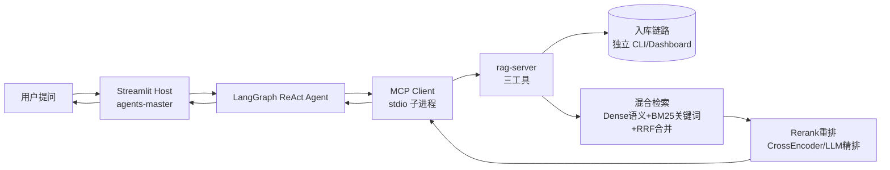

# ContextBridge 快速通读（全栈 3.5h）

> **定位**：阅读型路线图，在 3–4 小时内建立**可讲的主线地图**——看清主链路设计，能讲清 **12 个面试重亮点（◆）**。  
> **不替代** [knowledge-agents.md](knowledge-agents.md) / [knowledge-rag.md](knowledge-rag.md) / [knowledge-integration.md](knowledge-integration.md) 的 91 点深学与问答教练。  
> **推荐顺序**：**C（串联全景）→ A（Host）→ B（RAG）** — 先边界，再两侧实现。  
> **标识**：**◆** 必讲重亮点（本文 12 处）｜**★** 主链支撑｜**◇** 追问加分（时间紧可略读）。

### 导读输出规范

- **不设术语速查表**；写到专用技术词时，**括号内附简洁中文作用**（例：RRF（合并两种检索结果））。
- **每段通读结束后必出段末问答**（见各段「段末问答」）；等用户回答后**简单追问 1 轮** → 评价后向 [QA/fast-qa.md](../../../../QA/fast-qa.md) **追加**记录（仅含问、标准答案、综合评分、参考路径；用户说「跳过记录」时不写）。
- 导读与问答均用中文；路径与工具名保持英文原名。

---

## 时间预算

| 阶段 | 时长 | 读完应能回答 |
|------|------|--------------|
| **0. 全局主链路** | 10 min | 请求从 UI 到向量库再回 LLM 怎么走？谁检索、谁生成？ |
| **1. C 轨串联** | 40 min | 双项目为何分开？config 如何拉起 rag-server？三链路边界？ |
| **2. A 轨 Host** | 75 min | ReAct 怎么转？MCP 怎么配？三模式差在哪？ |
| **3. B 轨 RAG** | 90 min | 入库五阶段？混合检索+重排？MCP 暴露哪三工具？ |
| **4. 串讲 + 实操** | 25 min | 90 秒讲完全项目；跑通一条验证命令 |
| **合计** | **~3.5 h** | 主线清晰 + 12 个 ◆ 能口述 |

---

## 0. 全局主链路（10 min）

### 一张图串到底



### 四条设计原则（面试开场用）

| 原则 | 一句话 |
|------|--------|
| **MCP 解耦** | Host（承载 Agent 的应用）编排对话与工具；rag-server 负责入库与检索；**互不 import** |
| **双 venv** | 两个独立 Python 虚拟环境，依赖隔离（rag-server 侧重型包如 chromadb） |
| **双配置** | Host 对话 LLM → `.env`；RAG 侧 LLM/Embedding（向量化模型）→ `settings.yaml` |
| **三链路分离** | **入库**（写知识库）≠ **检索**（MCP 查知识）≠ **导出**（写 Markdown 文件） |

**先读**：根 [README.md](../../../../README.md)、[agents-master/README.md](../../../../agents-master/README.md)「完整 RAG 流程」。

### 段末问答 · 0 全局主链路

> **覆盖要点**：端到端主链路｜三链路分离｜检索 vs 生成边界（◆ C1.5 / C2.1 预习）

#### 主题目 1 · 端到端主链路

**问**：用户在「知识库问答」模式问「公司年假制度是什么？」——请串出 Streamlit → ReAct → MCP → rag-server → 谁生成最终自然语言回答？（须点明检索与生成各在哪一侧）

**考查**：能否一句话走通主链路，且不说「rag-server 生成答案」。

#### 主题目 2 · 三链路分离

**问**：「入库」「检索」「导出」三条链路各解决什么？为什么入库不能靠对话里调 MCP 完成？

**考查**：能各举本项目入口；理解 MCP 三工具是读库而非写库。

#### 简单追问 · 检索结果形态

**问**：`query_knowledge_hub` 返回的是最终答案还是中间证据？Host 拿到后做什么？

**考查**：证据 vs 答案；Host LLM 负责归纳生成。

---

## 12 个必讲重亮点（◆）

通读目标：**能按推荐顺序口述，每点 20–40 秒**。

| # | ID | 轨 | 一句话（面试版） |
|---|-----|-----|------------------|
| 1 | C1.1 | C | monorepo 双项目：Host 编排 + RAG 专责检索，MCP stdio 解耦、互不 import |
| 2 | C1.5 | C | 主链路：提问 → ReAct → MCP → 混合检索 → **Host LLM 生成**（rag-server 不生成） |
| 3 | C2.1 | C | 边界：rag-server 只返回检索证据（含 Citation 引用片段）；chromadb（向量库）仅 RAG 侧触及 |
| 4 | A2.1 | A | LangGraph ReAct：决策 → 调工具 → 结果回写上下文 → 再决策，直到可回答 |
| 5 | A3.2 | A | `resolve_mcp_config`：monorepo cwd 解析、rag-server venv 优先、密钥环境变量注入 |
| 6 | A4.1 | A | 三模式按场景裁剪工具与 Prompt：通用全量 / 旅行强流程 / 知识库 RAG 专注 |
| 7 | A6.1 | A | 旅行五阶段状态机：在 ReAct 之上叠加可预期流水线（POI→路线→天气→攻略→导出） |
| 8 | B2.1 | B | 入库五阶段：Load → Split → Transform → Embed → Upsert，配置驱动可插拔 |
| 9 | B3.3 | B | Dense（按语义查）+ BM25（按关键词查）双路召回，RRF（合并两路结果）融合 |
| 10 | B4.4 | B | 粗排后 Rerank（用更强模型重排，留最相关文档）；失败自动 Fallback（回退到粗排结果） |
| 11 | B5.2 | B | MCP 三工具：`list_collections` / `query_knowledge_hub` / `get_document_summary` |
| 12 | B6.1 | B | 五大工厂 + YAML：LLM / Embedding / Reranker 等零代码切换厂商 |

> **推荐讲述顺序（全栈 90 秒）**：见下表 #1→#2→#3→#4→#5→#6→#9→#10→#11（RAG 岗加深 #8、#12；旅行场景加 #7）。  
> **说明**：ID（如 C1.1）仅用于深学交叉引用；通读与面试口述**重亮点内容**，不必背 ID。

**追问加分（◇，非必背）**：C2.2 三链路分离｜C3.2 知识库三工具调用顺序｜A4.4 RAG 工具防误调｜A7.2 Embedding 长期记忆｜A8.2 工具结果截断｜B2.3 Transform 增强链｜B9.2 增量幂等入库。

---

## 1. C 轨串联（40 min · 8 节点）

> 深学地图：[knowledge-integration.md](knowledge-integration.md)（15 点）  
> 深学 C 轨记录：[QA/integration-qa.md](../../../../QA/integration-qa.md)

| 序 | 节点 | 标识 | 一句话 | 关键路径 | 深学 ID |
|----|------|------|--------|----------|---------|
| 1 | monorepo 职责划分 | ◆ | Host=对话+工具编排；rag-server=入库+检索 MCP；同级目录、无代码耦合 | 根 `README.md` | C1.1 |
| 2 | 双 venv 为何分开 | ★ | chromadb / mcp / 重型 ML 依赖与 Streamlit Host 隔离，各子项目独立 `pip install` | 根 `README.md` §快速开始 | C1.2 |
| 3 | 双配置分工 | ★ | Host 对话模型用 `.env`；RAG 的 LLM/Embedding/Rerank 用 `settings.yaml`，Key 可对齐百炼 | 根 `README.md`「两套主配置」 | C1.3 |
| 4 | config.json 拉起 rag-server | ★ | stdio 子进程：`cwd: ../rag-server`、`python -m src.mcp_server.server`；经 `resolve_mcp_config` 解析 | `config.json`, `config/mcp_config.py` | C1.4 |
| 5 | 端到端调用链 | ◆ | 用户问 → ReAct（边想边调工具）选 `query_knowledge_hub` → 检索证据进上下文 → **Host LLM 组织成回答** | `agents-master/README.md`「完整 RAG 流程」 | C1.5 |
| 6 | Host vs Server 边界 | ◆ | **检索在 rag-server，生成在 Host**；Host 禁止直接操作 chromadb（向量库） | `docs/project-design/MCP设计与管理.md` §1.5 | C2.1 |
| 7 | 入库/检索/导出三链路 | ◇ | 入库走 `scripts/ingest` 或 Dashboard；检索走 MCP；攻略导出走 `document-export`，不可混用 | `mcp_server_export.py`, `QA/integration-qa.md` | C2.2 |
| 8 | 三模式 × 工具策略 | ★ | 通用=全工具；知识库=仅 RAG 三工具；旅行=高德+时间+RAG+导出组合 | `docs/project-design/多模式Agent架构选型.md` | C3.1 |

### 段末问答 · 1 C 轨串联

> **覆盖要点**：◆ C1.1 / C1.5 / C2.1｜★ C1.4 / C2.2 / C3.1｜spawn / config / chromadb / 三模式

#### 主题目 1 · 职责、连接与 spawn

**问**：`agents-master` 与 `rag-server` 各自核心职责？如何连接（协议、配置文件、谁 spawn 子进程）？预置 MCP 有哪几个？

**考查**：Host vs RAG 分工；MCP Client spawn stdio；`config.json` + `resolve_mcp_config`；4 个预置 MCP 名称。

#### 主题目 2 · 边界与向量库

**问**：chromadb（向量库）在哪一侧？Host 能否直接查向量库？「检索在 rag-server、生成在 Host」具体指什么？

**考查**：向量库仅 RAG 侧；Host 必须经 MCP；生成在 Host LLM。

#### 主题目 3 · 三链路与三模式

**问**：入库、检索、导出各举一个本项目入口。三种对话模式如何裁剪工具集？

**考查**：ingest / query MCP / document-export；通用全量 vs 知识库三工具 vs 旅行组合。

#### 简单追问 · query 返回物

**问**：`query_knowledge_hub` 返回给 Host 的是最终答案还是中间证据？Host 下一步做什么？

**考查**：同 Fast-0 追问，巩固边界。

---

## 2. A 轨 Host（75 min · 12 节点）

> 深学地图：[knowledge-agents.md](knowledge-agents.md)（31 点）  
> 工作目录：`agents-master/`

| 序 | 节点 | 标识 | 一句话 | 关键路径 | 深学 ID |
|----|------|------|--------|----------|---------|
| 1 | 主应用定位 | ★ | MCP Host + Streamlit 工作台：ReAct Agent 统一入口，侧边栏管 MCP 与会话 | `README.md`, `app.py` | A1.1 |
| 2 | 启动链 | ★ | `streamlit run app.py` → 读配置 → 连 MCP → 按当前模式构建 Agent | `app.py`, `docs/project-design/app.py架构说明与拆分建议.md` | A1.2 |
| 3 | ReAct 闭环 | ◆ | ReAct（推理+行动循环）：LLM 决定调工具或结束；工具结果追加到 messages，循环直至可回答 | `app.py` | A2.1 |
| 4 | config.json 四类 MCP | ★ | 预置：时间、导出、rag-server、高德；增删 MCP 不改 Agent 核心 | `config.json`, `MCP设计与管理.md` | A3.1 |
| 5 | resolve_mcp_config | ◆ | 相对路径→绝对路径；rag-server 优先 `.venv/bin/python`；`.env` 密钥注入子进程 env | `config/mcp_config.py` | A3.2 |
| 6 | MCP Session 与重连 | ◇ | 侧边栏改 MCP 后热重连；断线可恢复，保障工具链可用 | `app.py`, `ui/sidebar.py` | A3.3 |
| 7 | 三模式职责 | ◆ | 通用开放问答；旅行强流程+地图；知识库收窄为三 RAG 工具 | `modes/general/`, `modes/travel/`, `modes/knowledge_qa/` | A4.1 |
| 8 | 模式注册与切换 | ★ | `AgentMode` 接口 + `registry`；切换触发 `on_enter`/`on_exit` 与 Agent 重建 | `modes/registry.py`, `modes/types.py` | A4.2 |
| 9 | 知识库 RAG 三工具策略 | ◇ | `system.md` 约束调用顺序：先 `list_collections` → 再 query/summary，防误调与 Token 浪费 | `modes/knowledge_qa/system.md`, `mode.py` | A4.4 |
| 10 | 旅行五阶段状态机 | ◆ | 状态机（按阶段推进的流程控制）驱动 pipeline，保证「查点→路线→天气→整合→导出」可预期 | `modes/travel/state_machine.py` | A6.1 |
| 11 | 长期记忆画像 | ◇ | Embedding（把文本变成向量）存用户画像，跨会话召回注入 Prompt；与 RAG 检索是两套系统 | `memory_store.py`, `memory_recall.py` | A7.2 |
| 12 | 工具结果截断 | ◇ | 超大 MCP 返回截断后再进上下文，控制 Token（上下文长度）消耗 | `tool_truncation.py` | A8.2 |

### 段末问答 · 2 A 轨 Host

> **覆盖要点**：◆ A2.1 / A3.2 / A4.1 / A6.1｜★ A1.2 / A3.1 / A4.2

#### 主题目 1 · ReAct 闭环

**问**：ReAct 一轮里 LLM 可能做哪两类决定？工具返回后 messages 怎么变？循环何时结束？

**考查**：tool call vs final answer；tool result 追加；终止条件。

#### 主题目 2 · resolve_mcp_config

**问**：`resolve_mcp_config()` 在 monorepo 下解决哪三个实际问题？对 rag-server 有何特殊处理？

**考查**：路径绝对化、venv 优先、密钥注入；rag-server 识别规则。

#### 主题目 3 · 三模式差异

**问**：通用 / 知识库 / 旅行在工具数量与流程控制上各有什么不同？知识库为何要裁工具？

**考查**：全量 vs 三工具 vs 地图+RAG+导出；防误调与 Token；旅行叠加状态机。

#### 简单追问 · 旅行状态机

**问**：旅行模式为何在 ReAct 之上再加状态机，而不全靠 LLM 决定下一步？

**考查**：步骤多、顺序敏感；状态机保证可预期流水线。

---

## 3. B 轨 RAG（90 min · 14 节点）

> 深学地图：[knowledge-rag.md](knowledge-rag.md)（45 点）  
> 规格概览：`rag-server/DEV_SPEC.md`  
> 工作目录：`rag-server/`

| 序 | 节点 | 标识 | 一句话 | 关键路径 | 深学 ID |
|----|------|------|--------|----------|---------|
| 1 | 端到端数据流 | ★ | 入库（ingest）与检索（query/MCP）两条链；Dashboard 可观测 | `DEV_SPEC.md`, `main.py` | B1.1 |
| 2 | 三层架构 | ★ | `core` 检索引擎 / `ingestion` 入库 / `libs` 可插拔适配器 | `src/core/`, `src/ingestion/`, `src/libs/` | B1.2 |
| 3 | 入库五阶段 | ◆ | Load 解析 → Split 切分 → Transform 增强 → Embed 双向量 → Upsert 写库 | `src/ingestion/pipeline.py` | B2.1 |
| 4 | 双路向量化 | ★ | Dense（语义向量）+ Sparse/BM25（关键词索引），为混合检索做准备 | `src/ingestion/embedding/` | B2.4 |
| 5 | Transform 增强链 | ◇ | 入库时增强 Chunk：重组、补元数据、图片描述，提升后续检索质量 | `src/ingestion/transform/` | B2.3 |
| 6 | 混合检索 RRF | ◆ | 查询预处理（整理用户问题便于检索）→ 两路 Top-K → RRF（合并两路排名） | `hybrid_search.py`, `fusion.py` | B3.3 |
| 7 | 重排序集成 | ◆ | 粗排候选 → Rerank（强模型重排，留最相关）→ 失败则 Fallback 用粗排结果 | `src/core/query_engine/reranker.py` | B4.4 |
| 8 | MCP 三工具 | ◆ | 对外仅暴露 list / query / summary；stdio JSON-RPC 与 Host 通信 | `src/mcp_server/tools/` | B5.2 |
| 9 | 五大工厂 | ◆ | LLM、Embedding、Reranker 等工厂 + `settings.yaml`，换厂商不改业务代码 | `src/libs/*/factory*.py` | B6.1 |
| 10 | settings 配置驱动 | ★ | 单一 YAML 装配整条 Pipeline：模型、切分、检索、重排参数 | `config/settings.yaml`, `src/core/settings.py` | B6.2 |
| 11 | 增量入库幂等 | ◇ | 文件 Hash + 内容 Hash 跳过未变文档，重复 ingest 安全 | `document_manager.py` | B9.2 |
| 12 | 多模态检索响应 | ◇ | 图片索引 + Citation（带来源的引用片段）组装，结果可含图文证据 | `multimodal_assembler.py` | B7.4 |
| 13 | Trace 可观测 | ◇ | Ingestion / Query 双链路追踪，白盒定位坏 Case | `src/core/trace/` | B8.1 |
| 14 | 测试分层 | ★ | Unit / Integration / E2E；`scripts/query.py` 可独立验检索 | `tests/`, `scripts/query.py` | B10.1 |

### 段末问答 · 3 B 轨 RAG

> **覆盖要点**：◆ B2.1 / B3.3 / B4.4 / B5.2 / B6.1｜★ B1.1 / B2.4 / B6.2

#### 主题目 1 · 入库五阶段

**问**：Load / Split / Transform / Embed / Upsert 五阶段各解决什么问题？（各一句话）

**考查**：解析 → 切分 → 增强 → 双向量 → 写库，顺序不能乱。

#### 主题目 2 · 检索四步链

**问**：一次 query 从用户问题到返回证据，依次经过哪四步？每步作用是什么？

**考查**：预处理 → 双路召回 → RRF（合并排名）→ Rerank（精排，失败 Fallback）。

#### 主题目 3 · MCP 三工具

**问**：rag-server 对外 MCP 哪三个工具？各自用途？知识库模式推荐调用顺序？

**考查**：list / query / summary 职责；先 list 再 query。

#### 简单追问 · 双路召回

**问**：为何 Dense（语义）与 BM25（关键词）两路一起用，而不是只留一路？

**考查**：语义 vs 精确词项互补；RRF 兼顾查准查全。

---

## 4. 串讲与实操（25 min）

### 90 秒全栈电梯陈述（模板）

> 「ContextBridge 是 LangGraph + MCP 的 monorepo：**agents-master** 做 Streamlit Host，用 ReAct（推理+行动循环）编排工具；**rag-server** 独立做 RAG，通过 stdio MCP 暴露三个检索工具，两边互不 import。用户提问后，ReAct 决定是否调 `query_knowledge_hub`；rag-server 内部：查询预处理 → Dense（语义）+ BM25（关键词）双路召回 → RRF（合并结果）→ Rerank（精排），把带 Citation（引用来源）的证据还给 Host，由 **Host LLM** 生成最终答案。入库走独立 ingest 五阶段；工厂+YAML 可换模型。Host 侧三模式裁剪工具集；旅行模式用状态机强流程。`resolve_mcp_config` 处理 monorepo 路径与双 venv。」

### 段末问答 · 4 串讲与实操

> **覆盖要点**：90 秒串讲｜开场重亮点串讲｜联调排障｜架构取舍

#### 主题目 1 · 60 秒口述

**问**：约 60 秒口述全栈主链路（须含双项目职责、MCP 连接、检索四步、谁生成答案、三模式）。

**考查**：逻辑通顺；覆盖双项目、MCP、检索四步、Host 生成、三模式。

#### 主题目 2 · 全栈开场重亮点串讲

**问**：全栈岗面试开场，请按「12 个必讲重亮点」的**推荐讲述顺序**，口述约 9 条重亮点，每条一句话说清技术/design 要点（**不需背知识点 ID**）。

**考查**：能按顺序讲清：双项目解耦、主链路、边界、ReAct、resolve_mcp_config、三模式、混合检索 RRF、Rerank、MCP 三工具。

#### 主题目 3 · 联调排障

**问**：知识库问答检索无结果或工具失败，按什么顺序排查？至少 4 项。

**考查**：Key → venv → 是否 ingest → embedding 一致 →（扩展）spawn/cwd。

#### 简单追问 · 为何 monorepo 不合并

**问**：「为什么不用一个 Python 项目搞定 Host + RAG」你怎么答？

**考查**：依赖隔离、职责边界、MCP 解耦、可独立测试部署。

---

### 最小 Hands-on（验证「地图」而非练调参）

```bash
# ① Host 起服务，侧边栏切「知识库问答」，观察工具调用面板
cd agents-master && source .venv/bin/activate && streamlit run app.py

# ② 确认 rag-server 子进程配置（对照 resolve 后的 command/cwd）
cat config.json    # 在 agents-master 目录

# ③ RAG 侧独立跑检索（理解 B 轨 query 链，不经过 Host）
cd ../rag-server && source .venv/bin/activate
python scripts/query.py "你的测试问题" --collection default
```

联调前快速检查（对应 C5.1）：Key 已填、双 venv 已装、rag-server 已 ingest 有 collection、embedding 模型与入库时一致。

---

## 深化索引（读完 fast 之后）

| 你想搞懂… | 去读 | 知识点 ID |
|-----------|------|-----------|
| MCP 传输、重连、Smithery 增删 | [knowledge-agents.md](knowledge-agents.md) | A3.3–A3.6 |
| Prompt 分层、意图路由 | 同上 | A5.1–A5.3 |
| 旅行 pipeline / facts / 证据 UI | 同上 | A6.2–A6.4 |
| 会话存储、记忆触发 | 同上 | A7.1, A7.3–A7.4 |
| 稀疏检索、Query 预处理、Citation | [knowledge-rag.md](knowledge-rag.md) | B3.1–B3.2, B3.4–B3.5 |
| Reranker 实现细节 | 同上 | B4.1–B4.3 |
| MCP ProtocolHandler、生命周期 | 同上 | B5.1, B5.3–B5.4 |
| 评估 RAGAS、Dashboard | 同上 | B8.2–B8.5 |
| 模式×工具、排障案例 | [knowledge-integration.md](knowledge-integration.md) | C3.2–C3.3, C4–C5 |
| 简历 bullet 话术 | [bridge-resume/references/](../../bridge-resume/references/) | highlights-*.md |

**进入深学**：对 Agent 说「bridge learn」+ 选轨 A/B/C + 指定上表 ID；进度记入 [LEARNING_PROGRESS.md](LEARNING_PROGRESS.md)。

---

## 与 bridge-learn Skill 的配合

| 用户说 | Agent 行为 |
|--------|------------|
| 「快速学习」「bridge learn fast」「3小时通读」「knowledge-fast」 | 读本文件分段导读 → 段末问答 → 评价后**追加** [QA/fast-qa.md](../../../../QA/fast-qa.md) |
| 用户说「跳过记录」 | 该段不写 `QA/fast-qa.md` |
| 用户中途说「考我 C1.5」 | 可替换为 spot-check；仍最多简单追问 1 轮；可不写 fast-qa 除非用户要求 |
| 「快速学完记一笔」 | 在 `LEARNING_PROGRESS.md` Detailed History 追加汇总行（与 fast-qa 独立） |
| 「深化 A3.2」 | 转入标准深学流程，读 `knowledge-agents.md` 全量五层 |
