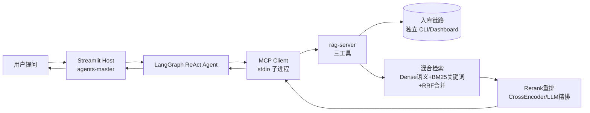
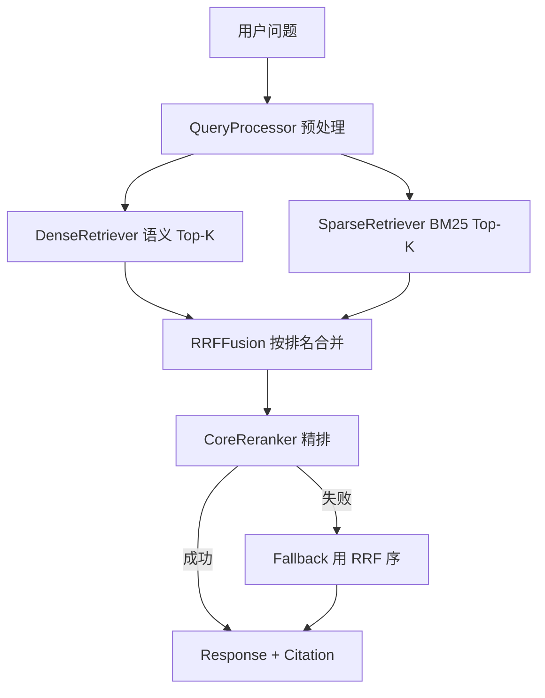

# ContextBridge 快速通读（主链路 + 面试亮点）

> **定位**：分两层的阅读型路线图——  
> **Part I 主链路**（~3.5h）：建立可讲的全栈地图，口述 12 个 ◆ 重亮点。  
> **Part II 亮点深读**（~2.5h）：讲清**设计决策 + 对应实现（类/模式/技术）+ 取舍**，支撑面试「怎么设计/怎么落地」追问。  
> **不替代** [knowledge-agents.md](knowledge-agents.md) / [knowledge-rag.md](knowledge-rag.md) / [knowledge-integration.md](knowledge-integration.md) 的 91 点深学与 4 轮追问教练。  
> **推荐顺序**：**Part I：C → A → B → 串讲**；**Part II：Agent 亮点 → RAG 检索亮点 → 工程化亮点**。  
> **标识**：**◆** 必讲重亮点｜**★** 主链支撑｜**◇** 追问加分｜**🔧** 亮点深读专题（Part II）。

### 导读输出规范

- **不设术语速查表**；写到专用技术词时，**括号内附简洁中文作用**（例：RRF（合并两种检索结果））。
- **Part I 导读**：段末问答 + 简单追问 → 追加 [QA/fast-qa.md](../../../../QA/fast-qa.md)（问、标准答案、评分、参考路径）
- **Part II 导读**：每专题 **①核心问题 → ②设计与实现（2–3 块连贯叙事）→ ③亮点 → ④读代码**；一次 **1 个专题**；② 每块先白话讲**为什么这样设计**，紧接**用什么类/文件落地**（见 Part II 文首规范）
- 术语括号附中文；用户说「跳过记录」时不写 fast-qa
- 导读与问答均用中文；路径与工具名保持英文原名。

## 目录

**Part I · 主链路**

- [0 全局主链路](#0-全局主链路)
- [12 个必讲重亮点](#12-个必讲重亮点)
- [1 C 轨串联](#1-c-轨串联)
- [2 A 轨 Host](#2-a-轨-host)
- [3 B 轨 RAG](#3-b-轨-rag)
- [4 串讲与实操](#4-串讲与实操)

**Part II · 面试亮点深读**

- [5A Agent 亮点深读](#5a-agent-亮点深读)
- [5B RAG 检索亮点深读](#5b-rag-检索亮点深读)
- [5C 工程化亮点深读](#5c-工程化亮点深读)
- [Part I 与 Part II 对照](#part-i-与-part-ii-对照)

---

## 时间预算

### Part I · 主链路（~3.5h）

| 阶段 | 时长 | 读完应能回答 |
|------|------|--------------|
| **0. 全局主链路** | 10 min | 请求从 UI 到向量库再回 LLM 怎么走？谁检索、谁生成？ |
| **1. C 轨串联** | 40 min | 双项目为何分开？config 如何拉起 rag-server？三链路边界？ |
| **2. A 轨 Host** | 75 min | ReAct 怎么转？MCP 怎么配？三模式差在哪？ |
| **3. B 轨 RAG** | 90 min | 入库五阶段？混合检索+重排？MCP 暴露哪三工具？ |
| **4. 串讲 + 实操** | 25 min | 90 秒讲完全项目；跑通一条验证命令 |
| **小计** | **~3.5 h** | 主线清晰 + 12 个 ◆ 能口述 |

### Part II · 面试亮点深读（~2.5h）

| 阶段 | 时长 | 读完应能回答 |
|------|------|--------------|
| **5A. Agent 亮点** | 75 min | 三模式/registry/旅行/工程化；**② 分块叙事讲清设计+落地** |
| **5B. RAG 检索亮点** | 75 min | 先全景 mermaid，再四环节各 **② 分块叙事** |
| **5C. 工程化亮点** | 30 min | 三专题各 **② 分块叙事** |
| **小计** | **~2.5 h** | 能用自己的话讲「问题→设计→代码怎么落地」 |

> 已完成 Part I 后，对 Agent 说「**亮点深读**」「**fast 亮点**」从 §5A 开始；也可「**快速学习 全流程**」一次走完 Part I + II。

---

## 0. 全局主链路（10 min）

### 一张图串到底



### 四条设计原则（面试开场用）

| 原则 | 一句话 |
|------|--------|
| **MCP 解耦** | Host（承载 Agent 的应用）编排对话与工具；rag-server 负责入库与检索；**互不 import** |
| **双 venv** | 两个独立 Python 虚拟环境，依赖隔离（rag-server 侧重型包如 chromadb） |
| **双配置** | Host 对话 LLM → `.env`；RAG 侧 LLM/Embedding（向量化模型）→ `settings.yaml` |
| **三链路分离** | **入库**（写知识库）≠ **检索**（MCP 查知识）≠ **导出**（写 Markdown 文件） |

**先读**：根 [README.md](../../../../README.md)、[agents-master/README.md](../../../../agents-master/README.md)「完整 RAG 流程」。

### 段末问答 · 0 全局主链路

> **覆盖要点**：端到端主链路｜三链路分离｜检索 vs 生成边界（◆ C1.5 / C2.1 预习）

#### 主题目 1 · 端到端主链路

**问**：用户在「知识库问答」模式问「公司年假制度是什么？」——请串出 Streamlit → ReAct → MCP → rag-server → 谁生成最终自然语言回答？（须点明检索与生成各在哪一侧）

**考查**：能否一句话走通主链路，且不说「rag-server 生成答案」。

#### 主题目 2 · 三链路分离

**问**：「入库」「检索」「导出」三条链路各解决什么？为什么入库不能靠对话里调 MCP 完成？

**考查**：能各举本项目入口；理解 MCP 三工具是读库而非写库。

#### 简单追问 · 检索结果形态

**问**：`query_knowledge_hub` 返回的是最终答案还是中间证据？Host 拿到后做什么？

**考查**：证据 vs 答案；Host LLM 负责归纳生成。

---

## 12 个必讲重亮点（◆）

通读目标：**能按推荐顺序口述，每点 20–40 秒**。

| # | ID | 轨 | 一句话（面试版） |
|---|-----|-----|------------------|
| 1 | C1.1 | C | monorepo 双项目：Host 编排 + RAG 专责检索，MCP stdio 解耦、互不 import |
| 2 | C1.5 | C | 主链路：提问 → ReAct → MCP → 混合检索 → **Host LLM 生成**（rag-server 不生成） |
| 3 | C2.1 | C | 边界：rag-server 只返回检索证据（含 Citation 引用片段）；chromadb（向量库）仅 RAG 侧触及 |
| 4 | A2.1 | A | LangGraph ReAct：决策 → 调工具 → 结果回写上下文 → 再决策，直到可回答 |
| 5 | A3.2 | A | `resolve_mcp_config`：monorepo cwd 解析、rag-server venv 优先、密钥环境变量注入 |
| 6 | A4.1 | A | 三模式按场景裁剪工具与 Prompt：通用全量 / 旅行强流程 / 知识库 RAG 专注 |
| 7 | A6.1 | A | 旅行五阶段状态机：在 ReAct 之上叠加可预期流水线（POI→路线→天气→攻略→导出） |
| 8 | B2.1 | B | 入库五阶段：Load → Split → Transform → Embed → Upsert，配置驱动可插拔 |
| 9 | B3.3 | B | Dense（按语义查）+ BM25（按关键词查）双路召回，RRF（合并两路结果）融合 |
| 10 | B4.4 | B | 粗排后 Rerank（用更强模型重排，留最相关文档）；失败自动 Fallback（回退到粗排结果） |
| 11 | B5.2 | B | MCP 三工具：`list_collections` / `query_knowledge_hub` / `get_document_summary` |
| 12 | B6.1 | B | 五大工厂 + YAML：LLM / Embedding / Reranker 等零代码切换厂商 |

> **推荐讲述顺序（全栈 90 秒）**：见下表 #1→#2→#3→#4→#5→#6→#9→#10→#11（RAG 岗加深 #8、#12；旅行场景加 #7）。  
> **说明**：ID（如 C1.1）仅用于深学交叉引用；通读与面试口述**重亮点内容**，不必背 ID。

**追问加分（◇，非必背）**：C2.2 三链路分离｜C3.2 知识库三工具调用顺序｜A4.4 RAG 工具防误调｜A7.2 Embedding 长期记忆｜A8.2 工具结果截断｜B2.3 Transform 增强链｜B9.2 增量幂等入库。

---

## 1. C 轨串联（40 min · 8 节点）

> 深学地图：[knowledge-integration.md](knowledge-integration.md)（15 点）  
> 深学 C 轨记录：[QA/integration-qa.md](../../../../QA/integration-qa.md)

| 序 | 节点 | 标识 | 一句话 | 关键路径 | 深学 ID |
|----|------|------|--------|----------|---------|
| 1 | monorepo 职责划分 | ◆ | Host=对话+工具编排；rag-server=入库+检索 MCP；同级目录、无代码耦合 | 根 `README.md` | C1.1 |
| 2 | 双 venv 为何分开 | ★ | chromadb / mcp / 重型 ML 依赖与 Streamlit Host 隔离，各子项目独立 `pip install` | 根 `README.md` §快速开始 | C1.2 |
| 3 | 双配置分工 | ★ | Host 对话模型用 `.env`；RAG 的 LLM/Embedding/Rerank 用 `settings.yaml`，Key 可对齐百炼 | 根 `README.md`「两套主配置」 | C1.3 |
| 4 | config.json 拉起 rag-server | ★ | stdio 子进程：`cwd: ../rag-server`、`python -m src.mcp_server.server`；经 `resolve_mcp_config` 解析 | `config.json`, `config/mcp_config.py` | C1.4 |
| 5 | 端到端调用链 | ◆ | 用户问 → ReAct（边想边调工具）选 `query_knowledge_hub` → 检索证据进上下文 → **Host LLM 组织成回答** | `agents-master/README.md`「完整 RAG 流程」 | C1.5 |
| 6 | Host vs Server 边界 | ◆ | **检索在 rag-server，生成在 Host**；Host 禁止直接操作 chromadb（向量库） | `docs/project-design/MCP设计与管理.md` §1.5 | C2.1 |
| 7 | 入库/检索/导出三链路 | ◇ | 入库走 `scripts/ingest` 或 Dashboard；检索走 MCP；攻略导出走 `document-export`，不可混用 | `mcp_server_export.py`, `QA/integration-qa.md` | C2.2 |
| 8 | 三模式 × 工具策略 | ★ | 通用=全工具；知识库=仅 RAG 三工具；旅行=高德+时间+RAG+导出组合 | `docs/project-design/多模式Agent架构选型.md` | C3.1 |

### 段末问答 · 1 C 轨串联

> **覆盖要点**：◆ C1.1 / C1.5 / C2.1｜★ C1.4 / C2.2 / C3.1｜spawn / config / chromadb / 三模式

#### 主题目 1 · 职责、连接与 spawn

**问**：`agents-master` 与 `rag-server` 各自核心职责？如何连接（协议、配置文件、谁 spawn 子进程）？预置 MCP 有哪几个？

**考查**：Host vs RAG 分工；MCP Client spawn stdio；`config.json` + `resolve_mcp_config`；4 个预置 MCP 名称。

#### 主题目 2 · 边界与向量库

**问**：chromadb（向量库）在哪一侧？Host 能否直接查向量库？「检索在 rag-server、生成在 Host」具体指什么？

**考查**：向量库仅 RAG 侧；Host 必须经 MCP；生成在 Host LLM。

#### 主题目 3 · 三链路与三模式

**问**：入库、检索、导出各举一个本项目入口。三种对话模式如何裁剪工具集？

**考查**：ingest / query MCP / document-export；通用全量 vs 知识库三工具 vs 旅行组合。

#### 简单追问 · query 返回物

**问**：`query_knowledge_hub` 返回给 Host 的是最终答案还是中间证据？Host 下一步做什么？

**考查**：同 Fast-0 追问，巩固边界。

---

## 2. A 轨 Host（75 min · 12 节点）

> 深学地图：[knowledge-agents.md](knowledge-agents.md)（31 点）  
> 工作目录：`agents-master/`

| 序 | 节点 | 标识 | 一句话 | 关键路径 | 深学 ID |
|----|------|------|--------|----------|---------|
| 1 | 主应用定位 | ★ | MCP Host + Streamlit 工作台：ReAct Agent 统一入口，侧边栏管 MCP 与会话 | `README.md`, `app.py` | A1.1 |
| 2 | 启动链 | ★ | `streamlit run app.py` → 读配置 → 连 MCP → 按当前模式构建 Agent | `app.py`, `docs/project-design/app.py架构说明与拆分建议.md` | A1.2 |
| 3 | ReAct 闭环 | ◆ | ReAct（推理+行动循环）：LLM 决定调工具或结束；工具结果追加到 messages，循环直至可回答 | `app.py` | A2.1 |
| 4 | config.json 四类 MCP | ★ | 预置：时间、导出、rag-server、高德；增删 MCP 不改 Agent 核心 | `config.json`, `MCP设计与管理.md` | A3.1 |
| 5 | resolve_mcp_config | ◆ | 相对路径→绝对路径；rag-server 优先 `.venv/bin/python`；`.env` 密钥注入子进程 env | `config/mcp_config.py` | A3.2 |
| 6 | MCP Session 与重连 | ◇ | 侧边栏改 MCP 后热重连；断线可恢复，保障工具链可用 | `app.py`, `ui/sidebar.py` | A3.3 |
| 7 | 三模式职责 | ◆ | 通用开放问答；旅行强流程+地图；知识库收窄为三 RAG 工具 | `modes/general/`, `modes/travel/`, `modes/knowledge_qa/` | A4.1 |
| 8 | 模式注册与切换 | ★ | `AgentMode` 接口 + `registry`；切换触发 `on_enter`/`on_exit` 与 Agent 重建 | `modes/registry.py`, `modes/types.py` | A4.2 |
| 9 | 知识库 RAG 三工具策略 | ◇ | `system.md` 约束调用顺序：先 `list_collections` → 再 query/summary，防误调与 Token 浪费 | `modes/knowledge_qa/system.md`, `mode.py` | A4.4 |
| 10 | 旅行五阶段状态机 | ◆ | 状态机（按阶段推进的流程控制）驱动 pipeline，保证「查点→路线→天气→整合→导出」可预期 | `modes/travel/state_machine.py` | A6.1 |
| 11 | 长期记忆画像 | ◇ | Embedding（把文本变成向量）存用户画像，跨会话召回注入 Prompt；与 RAG 检索是两套系统 | `memory_store.py`, `memory_recall.py` | A7.2 |
| 12 | 工具结果截断 | ◇ | 超大 MCP 返回截断后再进上下文，控制 Token（上下文长度）消耗 | `tool_truncation.py` | A8.2 |

### 段末问答 · 2 A 轨 Host

> **覆盖要点**：◆ A2.1 / A3.2 / A4.1 / A6.1｜★ A1.2 / A3.1 / A4.2

#### 主题目 1 · ReAct 闭环

**问**：ReAct 一轮里 LLM 可能做哪两类决定？工具返回后 messages 怎么变？循环何时结束？

**考查**：tool call vs final answer；tool result 追加；终止条件。

#### 主题目 2 · resolve_mcp_config

**问**：`resolve_mcp_config()` 在 monorepo 下解决哪三个实际问题？对 rag-server 有何特殊处理？

**考查**：路径绝对化、venv 优先、密钥注入；rag-server 识别规则。

#### 主题目 3 · 三模式差异

**问**：通用 / 知识库 / 旅行在工具数量与流程控制上各有什么不同？知识库为何要裁工具？

**考查**：全量 vs 三工具 vs 地图+RAG+导出；防误调与 Token；旅行叠加状态机。

#### 简单追问 · 旅行状态机

**问**：旅行模式为何在 ReAct 之上再加状态机，而不全靠 LLM 决定下一步？

**考查**：步骤多、顺序敏感；状态机保证可预期流水线。

---

## 3. B 轨 RAG（90 min · 14 节点）

> 深学地图：[knowledge-rag.md](knowledge-rag.md)（45 点）  
> 规格概览：`rag-server/DEV_SPEC.md`  
> 工作目录：`rag-server/`

| 序 | 节点 | 标识 | 一句话 | 关键路径 | 深学 ID |
|----|------|------|--------|----------|---------|
| 1 | 端到端数据流 | ★ | 入库（ingest）与检索（query/MCP）两条链；Dashboard 可观测 | `DEV_SPEC.md`, `main.py` | B1.1 |
| 2 | 三层架构 | ★ | `core` 检索引擎 / `ingestion` 入库 / `libs` 可插拔适配器 | `src/core/`, `src/ingestion/`, `src/libs/` | B1.2 |
| 3 | 入库五阶段 | ◆ | Load 解析 → Split 切分 → Transform 增强 → Embed 双向量 → Upsert 写库 | `src/ingestion/pipeline.py` | B2.1 |
| 4 | 双路向量化 | ★ | Dense（语义向量）+ Sparse/BM25（关键词索引），为混合检索做准备 | `src/ingestion/embedding/` | B2.4 |
| 5 | Transform 增强链 | ◇ | 入库时增强 Chunk：重组、补元数据、图片描述，提升后续检索质量 | `src/ingestion/transform/` | B2.3 |
| 6 | 混合检索 RRF | ◆ | 查询预处理（整理用户问题便于检索）→ 两路 Top-K → RRF（合并两路排名） | `hybrid_search.py`, `fusion.py` | B3.3 |
| 7 | 重排序集成 | ◆ | 粗排候选 → Rerank（强模型重排，留最相关）→ 失败则 Fallback 用粗排结果 | `src/core/query_engine/reranker.py` | B4.4 |
| 8 | MCP 三工具 | ◆ | 对外仅暴露 list / query / summary；stdio JSON-RPC 与 Host 通信 | `src/mcp_server/tools/` | B5.2 |
| 9 | 五大工厂 | ◆ | LLM、Embedding、Reranker 等工厂 + `settings.yaml`，换厂商不改业务代码 | `src/libs/*/factory*.py` | B6.1 |
| 10 | settings 配置驱动 | ★ | 单一 YAML 装配整条 Pipeline：模型、切分、检索、重排参数 | `config/settings.yaml`, `src/core/settings.py` | B6.2 |
| 11 | 增量入库幂等 | ◇ | 文件 Hash + 内容 Hash 跳过未变文档，重复 ingest 安全 | `document_manager.py` | B9.2 |
| 12 | 多模态检索响应 | ◇ | 图片索引 + Citation（带来源的引用片段）组装，结果可含图文证据 | `multimodal_assembler.py` | B7.4 |
| 13 | Trace 可观测 | ◇ | Ingestion / Query 双链路追踪，白盒定位坏 Case | `src/core/trace/` | B8.1 |
| 14 | 测试分层 | ★ | Unit / Integration / E2E；`scripts/query.py` 可独立验检索 | `tests/`, `scripts/query.py` | B10.1 |

### 段末问答 · 3 B 轨 RAG

> **覆盖要点**：◆ B2.1 / B3.3 / B4.4 / B5.2 / B6.1｜★ B1.1 / B2.4 / B6.2

#### 主题目 1 · 入库五阶段

**问**：Load / Split / Transform / Embed / Upsert 五阶段各解决什么问题？（各一句话）

**考查**：解析 → 切分 → 增强 → 双向量 → 写库，顺序不能乱。

#### 主题目 2 · 检索四步链

**问**：一次 query 从用户问题到返回证据，依次经过哪四步？每步作用是什么？

**考查**：预处理 → 双路召回 → RRF（合并排名）→ Rerank（精排，失败 Fallback）。

#### 主题目 3 · MCP 三工具

**问**：rag-server 对外 MCP 哪三个工具？各自用途？知识库模式推荐调用顺序？

**考查**：list / query / summary 职责；先 list 再 query。

#### 简单追问 · 双路召回

**问**：为何 Dense（语义）与 BM25（关键词）两路一起用，而不是只留一路？

**考查**：语义 vs 精确词项互补；RRF 兼顾查准查全。

---

## 4. 串讲与实操（25 min）

### 90 秒全栈电梯陈述（模板）

> 「ContextBridge 是 LangGraph + MCP 的 monorepo：**agents-master** 做 Streamlit Host，用 ReAct（推理+行动循环）编排工具；**rag-server** 独立做 RAG，通过 stdio MCP 暴露三个检索工具，两边互不 import。用户提问后，ReAct 决定是否调 `query_knowledge_hub`；rag-server 内部：查询预处理 → Dense（语义）+ BM25（关键词）双路召回 → RRF（合并结果）→ Rerank（精排），把带 Citation（引用来源）的证据还给 Host，由 **Host LLM** 生成最终答案。入库走独立 ingest 五阶段；工厂+YAML 可换模型。Host 侧三模式裁剪工具集；旅行模式用状态机强流程。`resolve_mcp_config` 处理 monorepo 路径与双 venv。」

### 段末问答 · 4 串讲与实操

> **覆盖要点**：90 秒串讲｜开场重亮点串讲｜联调排障｜架构取舍

#### 主题目 1 · 60 秒口述

**问**：约 60 秒口述全栈主链路（须含双项目职责、MCP 连接、检索四步、谁生成答案、三模式）。

**考查**：逻辑通顺；覆盖双项目、MCP、检索四步、Host 生成、三模式。

#### 主题目 2 · 全栈开场重亮点串讲

**问**：全栈岗面试开场，请按「12 个必讲重亮点」的**推荐讲述顺序**，口述约 9 条重亮点，每条一句话说清技术/design 要点（**不需背知识点 ID**）。

**考查**：能按顺序讲清：双项目解耦、主链路、边界、ReAct、resolve_mcp_config、三模式、混合检索 RRF、Rerank、MCP 三工具。

#### 主题目 3 · 联调排障

**问**：知识库问答检索无结果或工具失败，按什么顺序排查？至少 4 项。

**考查**：Key → venv → 是否 ingest → embedding 一致 →（扩展）spawn/cwd。

#### 简单追问 · 为何 monorepo 不合并

**问**：「为什么不用一个 Python 项目搞定 Host + RAG」你怎么答？

**考查**：依赖隔离、职责边界、MCP 解耦、可独立测试部署。

---

### 最小 Hands-on（验证「地图」而非练调参）

```bash
# ① Host 起服务，侧边栏切「知识库问答」，观察工具调用面板
cd agents-master && source .venv/bin/activate && streamlit run app.py

# ② 确认 rag-server 子进程配置（对照 resolve 后的 command/cwd）
cat config.json    # 在 agents-master 目录

# ③ RAG 侧独立跑检索（理解 B 轨 query 链，不经过 Host）
cd ../rag-server && source .venv/bin/activate
python scripts/query.py "你的测试问题" --collection default
```

联调前快速检查（对应 C5.1）：Key 已填、双 venv 已装、rag-server 已 ingest 有 collection、embedding 模型与入库时一致。

---

# Part II · 面试亮点深读

> **Part II 导读规范**（面向**第一次学亮点**的读者）  
> Agent **live 导读一次只讲 1 个专题**，讲完再出题。  
>
> | 步 | 写什么 | 怎么写才清楚 |
> |----|--------|--------------|
> | **① 核心问题** | 本专题的矛盾 | **1 句话** + 可选 ≤3 条后果 |
> | **② 设计与实现** | 亮点怎么设计、怎么落地 | 拆 **2–3 块**；每块固定三段：**块名（一句话）→ 设计（白话，为什么）→ 实现（紧接写用什么文件/类/技术）**。设计成段叙述，**禁止** D/I 双表、**禁止**「用户点击后…」操作链 |
> | **③ 亮点** | 面试怎么说 | 每条固定句式：**亮点名：机制/实现（锚关键类或函数）——价值或面试钩子**；2–3 条，可直接背 |
> | **④ 读代码** | 自学顺序 | 3–5 个路径 |
>
> **段末问答**：用自己的话复述「问题 + 设计理由 + 关键代码」，不考背表。

---

## 5A. Agent 亮点深读（75 min · 4 专题）

> 简历话术：[highlights-agents.md](../../bridge-resume/references/highlights-agents.md)

---

### 专题 1 🔧 三模式是怎么编排的？

#### ① 核心问题

**三种场景要共用一套 MCP 连接，但各自需要的工具策略与流程顺序完全不同**——只靠换 Prompt，控制不住误调工具和跳步。

- 知识库：LLM 仍可能调地图/导出 → 浪费 Token、答案跑偏  
- 旅行：步骤有先后依赖 → 纯 ReAct 易跳步、重复调同一工具  
- 工程：不能为每模式 spawn 一套 MCP → 切模式必须轻量

#### ② 设计与实现

**块 1 · 模式包：把三种模式的差异收到文件夹里**

通用、知识库、旅行共用一个 App，差别不能散落在 `app.py` 里到处 `if`。于是每种模式做成一个**模式包**——`modes/<name>/` 文件夹，像装插件。

- **设计**：加新模式 = 加文件夹 + 注册一行，主程序不用改一堆分支。  
- **实现**：每个包里有 `mode.py`（进出场、意图检测、组装 Prompt）和可选的 `system.md`（专用系统提示词）。`modes/types.py` 定义 `AgentMode` **协议**（Protocol），约定每个包必须实现 `build_system_prompt`、`on_enter` 等方法，**不必**继承同一父类。`modes/registry.py` 的 `_MODE_MODULES` 元组登记有哪些包，侧边栏和 Prompt 都从这里查。

**块 2 · 单 MCP + 轻量切换：换模式不重新 spawn 子进程**

连 MCP、spawn rag-server 子进程很慢。三种模式应共用**已经连上**的那套工具。

- **设计**：「换模式」和「改 MCP 配置」走两条路——前者只换 Prompt/Agent 图（轻），后者才重新连 MCP（重）。  
- **实现**：`app._build_agent_from_tools(tools)` 读 `session.app_mode`，调 `build_system_prompt()` 换 system 文本，再用**同一批** `tools` 创建 `create_react_agent`。`rebuild_agent_only()` 复用 `session_state.mcp_tools` 调上面的逻辑；只有改 `config.json` 时才 `reconnect_agent()` 重新 `get_tools()` 和 spawn。

**块 3 · 分层约束：知识库用 Prompt 管行为，旅行用状态机管顺序**

三种场景「管得紧」的程度不同，不能一刀切。

- **设计**：知识库主要是「别乱调工具、按 RAG 链走」——用专用 Prompt **软约束** LLM 即可；旅行要「先问目的地再查路线」——必须 **硬编排** 阶段顺序，光靠 Prompt 管不住。  
- **实现**：**知识库**：`modes/knowledge_qa/system.md` 写清 list→query→summary 与禁止编造，`mode.build_system_prompt()` 直读该文件；`ToolNode` 仍挂全部 `mcp_tools`（当前未物理裁工具）。**旅行**：`modes/travel/state_machine.py` 定义阶段与合法跳转；`handler.prepare_before_agent()` 在 `ui/chat.py` 里、调用 LangGraph **之前**介入，决定本轮能给 Agent 什么输入——编排发生在 ReAct 图**外面**。

#### ③ 亮点

- **单连接多模式**：`rebuild_agent_only` 只重建 Agent 图和 Prompt，MCP 子进程与 `mcp_tools` 缓存复用——切模式成本低，不用每换一次侧边栏就 spawn 一遍 rag-server（A2）  
- **分层约束**：知识库用 `system.md` Prompt 软收窄工具使用，旅行用 `state_machine` + `handler` 在 LangGraph 外硬保阶段顺序——按场景选约束强度，旅行不能只靠 Prompt 叮嘱  
- **模式包可扩展**：差异收口到 `modes/<name>/` + `AgentMode` 协议 + registry 注册——加第四种模式是新文件夹加一行，不散落 `if app_mode`

#### ④ 读代码

1. `modes/types.py` — 协议长什么样  
2. `modes/knowledge_qa/system.md`、`mode.py` — Prompt 软约束  
3. `app.py` — `rebuild_agent_only`、`_build_agent_from_tools`  
4. `modes/travel/handler.py`、`state_machine.py` — 硬编排  

**深学 ID**：A4.1、A4.4

---

### 专题 2 🔧 AgentMode + registry 怎么实现？

#### ① 核心问题

**模式越来越多时，若切换逻辑散落在 `app.py` 和 UI 各处，每加一种模式就要改一堆 if-else，且切模式容易误触发 MCP 重连。**

#### ② 设计与实现

**块 1 · AgentMode 协议：统一每个模式包必须会什么**

侧边栏文案、占位符、Prompt、进出场——每个模式都要做，但实现细节不同。

- **设计**：用 **Protocol**（接口约定）统一「外壳能力」，各模式独立实现，避免复制粘贴和漏改。  
- **实现**：`modes/types.py` 的 `AgentMode` 列出 `id`、`build_system_prompt`、`detect_intent`、`on_enter`/`on_exit` 等；`ModeBranding` dataclass 管页面标题/icon。各 `mode.py` 只要实现这些方法即可，无需继承基类。

**块 2 · registry：所有「找模式」只走注册表**

UI 切换、自动意图路由、拼 Prompt——如果各写一套 `if mode == "travel"`，一定乱。

- **设计**：注册表是**唯一入口**；注册顺序还可以表达优先级（如旅行意图优先于知识库）。  
- **实现**：`registry._MODE_MODULES` 元组 → `_BY_ID` 字典；`get_mode` / `get_active_mode` 供侧边栏用；`route_by_intent` **仅在通用模式**下按注册顺序调各包 `detect_intent()`（travel 排在 knowledge_qa 前）。`prompts.build_system_prompt(app_mode)` 委托 `registry.build_system_prompt`，Prompt 构建也走同一条路。

**块 3 · 双通道重建：变模式 ≠ 变 MCP**

容易犯的错误：一切换侧边栏就 `get_tools()` 一遍，把 rag-server 又 spawn 一次。

- **设计**：`on_enter` 只表示「Prompt/模式状态变了」；MCP 连接列表变了才值得重连。  
- **实现**：`on_enter` 返回 `bool`（要不要重建 Agent）→ 侧边栏调 `rebuild_agent_only()`。`reconnect_agent(reload_mcp=True)` 才走 `initialize_session` 重新 spawn；`reload_mcp=False` 时等同 `rebuild_agent_only`。

#### ③ 亮点

- **协议 + 注册表**：`AgentMode` Protocol 统一 Prompt/意图/进出场，`registry._MODE_MODULES` 作唯一路由入口——新模式只加模块和注册项，符合开闭原则（A2）  
- **双通道重建**：`on_enter` 走 `rebuild_agent_only` 复用工具，改 MCP 配置才 `reconnect_agent` 重新 spawn——避免一切换侧边栏就 `get_tools()` 一遍  
- **意图与手动同路径**：`route_by_intent` 命中后同样 `enter_mode` + rebuild——自动切换和侧边栏切换行为一致，无特殊分支（A5.2）

#### ④ 读代码

1. `modes/types.py`  
2. `modes/registry.py` — 重点看 `route_by_intent`  
3. `app.py` — `rebuild_agent_only` vs `reconnect_agent`  
4. `ui/sidebar.py`  

**深学 ID**：A4.2、A4.5、A5.2

---

### 专题 3 🔧 旅行模式有哪些亮点？

#### ① 核心问题

**旅行规划是多步、强顺序、多工具协作的长流程**——纯 ReAct 无法保证「先采集需求再查路线」，还容易重复调 MCP、把整篇攻略塞进对话导致 Token 爆炸。

#### ② 设计与实现

**块 1 · 双层编排：状态机定顺序，pipeline 定工具**

旅行不能指望 LLM 自己记得「下一步该干嘛」。

- **设计**：**外层**状态机保证阶段只能按顺序走；**内层** handler/pipeline 在每个阶段里决定调高德、RAG 还是导出。复杂度放在 LangGraph **外的 Python**，图仍是单个 ReAct，不堆节点。  
- **实现**：`state_machine.py` 定义 `poi_selection` → `intake_1/2` → `generating` → `revision` 及转移函数。`handler.prepare_before_agent()` 返回 `TurnBeforeAgent`（含本轮 `agent_query`、当前 `phase`）；`pipeline.py` 按 phase 组装工具调用；`ui/chat.py` 在 `agent.invoke` **之前**调 handler。

**块 2 · facts + tool_memory：把「需求」变成结构化字段**

纯聊天记录里「北京、3天、预算」不好可靠解析。

- **设计**：从对话抽出结构化 **facts**，写入 **tool_memory**，跨回合注入 `[TRAVEL_CONTEXT]`，比自然语言历史稳定。  
- **实现**：`facts.py` 抽 intake 字段；`tool_memory.py` 缓存 RAG 集合名与近期工具结论摘要，`TOOL_MEMORY_INJECT_TURNS` 控制注入深度。

**块 3 · 导出与证据外置：别让 LLM 在聊天里贴整篇攻略**

成稿上万字，全进 messages 会 Token 爆炸，用户也看不到依据。

- **设计**：成稿由**服务端写文件**，对话只给摘要/下载；工具返回用 **evidence UI** 展示依据。  
- **实现**：`export_service.py` 写 `data/outputs/*.md`；`ui/travel_evidence.py` 展示工具返回摘要。

#### ③ 亮点

- **状态机在图外**：`state_machine` 定五阶段顺序，`handler`/`pipeline` 在 `agent.invoke` 前介入——不增 LangGraph 节点却拿到硬顺序（A5）  
- **结构化 facts**：`facts.py` 抽字段写入 `tool_memory`，跨回合注入 `[TRAVEL_CONTEXT]`——比纯对话历史更好驱动阶段门禁与预取  
- **导出与证据外置**：`export_service` 写盘成稿，`travel_evidence` UI 展示工具依据——对话不贴全文，Token 可控且用户可见依据链

#### ④ 读代码

1. `modes/travel/state_machine.py`  
2. `modes/travel/handler.py`、`pipeline.py`  
3. `modes/travel/facts.py`、`tool_memory.py`  
4. `export_service.py`、`ui/travel_evidence.py`  

**深学 ID**：A6.1–A6.4

---

### 专题 4 🔧 Agent 侧还有哪些工程化亮点？

#### ① 核心问题

**monorepo 下 MCP 子进程路径/venv/密钥难配；工具返回动辄上万字撑爆上下文；用户画像与公司文档是两种知识源，不能混用。**

#### ② 设计与实现

**块 1 · resolve_mcp_config：声明式配置 + 一层解析**

`config.json` 里写相对路径，换机器就 spawn 失败；密钥也不能进 Git。

- **设计**：配置只写「意图」；解析层负责绝对路径、选对 venv 的 Python、从 `.env` 注 Key。  
- **实现**：`config/mcp_config.py` 的 `resolve_mcp_config()` 读 `config.json` → 解析 cwd/python/env → `MultiServerMCPClient` 用结果 spawn stdio 子进程。

**块 2 · tool_truncation：Host 统一截断工具返回**

地图、RAG 一次返回几万字，ReAct 上下文立刻爆。

- **设计**：在 **Host 侧**统一截断/摘要，不指望每个 MCP 自己控制长度。  
- **实现**：`tool_truncation.py` 在 tool result 写入 messages 前按上限处理，与具体 MCP 无关。

**块 3 · 记忆与 RAG 分源**

「用户喜欢川菜」和「公司年假制度」不是一类知识。

- **设计**：用户画像是 Host 本地 embedding；公司文档是 rag-server chromadb——存储、触发点、链路全分开。  
- **实现**：`memory_store.py` + `memory_recall.py` 对话前召回画像；`query_knowledge_hub` 走 MCP 查文档库。

#### ③ 亮点

- **声明式 MCP 解析**：`resolve_mcp_config` 把 `config.json` 变成绝对路径 + 子项目 venv + `.env` 注 Key——monorepo 下一层解析即可稳定 spawn（A4）  
- **Host 侧 Token 截断**：`tool_truncation` 在 tool result 进 messages 前统一截断——不依赖每个 MCP 自律，生产级上下文治理  
- **记忆与 RAG 分源**：`memory_recall` 走本地 embedding 画像，`query_knowledge_hub` 走 MCP 文档库——存储、触发点、数据源三者分离，面试有标准答法

#### ④ 读代码

`config/mcp_config.py`、`tool_truncation.py`、`memory_store.py`、`memory_recall.py`

**深学 ID**：A3.2、A7.2、A8.2

---

### 段末问答 · 5A Agent 亮点

> **覆盖要点**：模式包｜轻量切换｜分层约束｜registry｜旅行编排｜MCP/记忆

#### 主题目 1 · 三模式编排

**问**：用你自己的话说明：什么是「模式包」？为什么切模式用 `rebuild_agent_only` 而不是每次都重连 MCP？知识库和旅行分别靠什么机制约束 Agent——各对应哪个文件？

**考查**：模式包 = `modes/<name>/`；复用 `mcp_tools`；`system.md` 软约束 vs `state_machine`+`handler` 硬编排。

#### 主题目 2 · registry 与切换

**问**：`AgentMode` 协议和 `registry` 分别解决什么麻烦？「换侧边栏模式」和「改 config.json 里的 MCP」在代码里走哪两个不同函数？意图路由为什么只在通用模式跑？

**考查**：Protocol 统一外壳；注册表唯一入口；`rebuild_agent_only` vs `reconnect_agent`；`route_by_intent` 条件。

#### 主题目 3 · 旅行工程化

**问**：旅行模式「状态机」和「handler/pipeline」各管什么？facts、export_service 分别解决 Token/流程里的什么问题？为什么这套逻辑放在 LangGraph 外面？

**考查**：顺序 vs 阶段内工具；结构化字段与写盘外置；保持单 ReAct 图。

#### 简单追问 · 知识库约束

**问**：知识库模式现在有没有在代码里删掉地图/导出工具？实际靠什么让 Agent 优先走 RAG？若以后要更硬隔离，文档建议怎么做？

**考查**：未物理过滤；`system.md`；按模式 filter 或 多 Agent。

---

## 5B. RAG 检索亮点深读（75 min · 一条链 + 四个环节）

> 简历话术：[highlights-rag.md](../../bridge-resume/references/highlights-rag.md)  
> **学习建议**：先建立「一次 query 从头到尾」的全景，再拆四个环节。

### 全景：一次 `query_knowledge_hub` 内部怎么走



Host 通过 MCP 拿到的是 **OUT**（证据片段），不是最终自然语言答案。

---

### 环节 1 🔧 查询预处理（QueryProcessor）

#### ① 核心问题

**用户问句口语化、带停用词，有时还带 `collection:hr_docs` 筛选意图**——原句直接喂 BM25 噪声大，两路检索也无法共用同一套「干净输入」。

#### ② 设计与实现

**块 1 · 规则链清洗，不用 LLM 改写 query**

口语问句直接检索，BM25 会被「请问一下」之类词干扰；用 LLM 改写 query 又慢、难测、有随机性。

- **设计**：用**确定性规则**做预处理——快、可单测、结果稳定。  
- **实现**：`QueryProcessor.process()` 依次：归一化空白 → 正则解析 `key:value` 写入 `filters` → jieba 分词 + 停用词表得到 `keywords`。

**块 2 · 一个结构，两路各取所需**

Dense（向量）和 Sparse（BM25）需要的输入不一样，不能各写一套预处理。

- **设计**：输出统一对象 `ProcessedQuery`，里面同时带好 `original`、`keywords`、`filters`。  
- **实现**：`DenseRetriever` 用 `original` 做 embedding；`SparseRetriever` 用 `keywords` 做 BM25——`HybridSearch.search()` 第一步调 `process()`，后面两路共用这一结果。

#### ③ 亮点

- **规则预处理可测**：`QueryProcessor` 用 jieba + 停用词 + filter 解析，不用 LLM 改写——确定性、可写 unit test、零额外 Token 与延迟  
- **一结构两路复用**：`ProcessedQuery` 同时带 `original` 与 `keywords`——Dense 取向量句、Sparse 取关键词，一套预处理两路共用  
- **过滤器解耦**：`collection:` 等从 query 抽出写入 `filters`——检索层直接筛库，不必让 Host LLM 猜 collection 名

#### ④ 读代码

`rag-server/src/core/query_engine/query_processor.py`

**深学 ID**：B3.4

---

### 环节 2 🔧 混合检索（HybridSearch）

#### ① 核心问题

**单向量漏专名/编号，单 BM25 漏同义换说法**——需要互补召回，且任一路挂掉不能拖死整次查询。

#### ② 设计与实现

**块 1 · HybridSearch 只当「指挥」，不算分**

如果把 Dense、Sparse、融合全写进一个巨型类，换一路检索就要改核心逻辑。

- **设计**：`HybridSearch` 是**编排器**——负责调用顺序，不算相似度。  
- **实现**：`search()` 里：`QueryProcessor` → 调 `DenseRetriever`（`dense_retriever.py`，chromadb 余弦）和 `SparseRetriever`（`sparse_retriever.py`，BM25）→ 把两路列表交给 `RRFFusion`。

**块 2 · 并行 + 一路挂了用另一路**

串行跑两路太慢；生产上 embedding 或 BM25 任一超时，整次查询不能白屏。

- **设计**：`ThreadPoolExecutor` 并行双路；**Graceful Degradation**——一路失败，标记 `used_fallback`，用另一路结果继续。  
- **实现**：`_run_parallel_retrieval()` 开 2 个 worker 并行；异常时 `hybrid_search.py` 里走 fallback 分支，不抛到 MCP 层。

**块 3 · Top-K 写在 YAML 里**

调 `dense_top_k`、`fusion_top_k` 不应改 Python。

- **设计**：检索参数配置化。  
- **实现**：`settings.yaml` → `Settings` → 注入 `HybridSearch.__init__`。

#### ③ 亮点

- **编排器不算分**：`HybridSearch` 只负责调用 Dense/Sparse/RRF，相似度在各 Retriever——换一路检索不改核心编排逻辑  
- **并行 + 降级**：`ThreadPoolExecutor` 双路并行，一路失败 `used_fallback` 用另一路——延迟≈max(两路)，单点故障查询不白屏（亮点 1）  
- **参数配置化**：Top-K 从 `settings.yaml` 注入 `HybridSearch`——调召回宽度只改配置不改代码

#### ④ 读代码

`hybrid_search.py`、`dense_retriever.py`、`sparse_retriever.py`

**深学 ID**：B3.1、B3.2、B3.3

---

### 环节 3 🔧 RRF 融合（RRFFusion）

#### ① 核心问题

**Dense 分 0~1、BM25 分无上界，不能直接加权平均**——需要只比「排名」、不比原始分的合并方式。

#### ② 设计与实现

**块 1 · RRF：只比名次，不比分数**

两路分数尺度不同，加权平均会偏向某一路或丢信息。

- **设计**：RRF（Reciprocal Rank Fusion）——每个 chunk 按在各路的**排名**累加 `1/(k+rank)`，默认 `k=60`；两路都靠前的自然排更前。  
- **实现**：`fusion.py` 的 `RRFFusion.fuse()` 实现上述公式，输出按融合分排序的 chunk 列表。

**块 2 · 融合单独成类，方便单测**

公式写在 `search()` 里难以单独测。

- **设计**：融合与 HybridSearch 解耦。  
- **实现**：`HybridSearch.search()` 在并行召回后调 `self.fusion.fuse(dense_results, sparse_results)`；`tests/unit` 可只测 RRF 合并序。

#### ③ 亮点

- **RRF 解分数不可比**：`RRFFusion.fuse()` 按排名累加 `1/(k+rank)`，不看 Dense/BM25 原始分——两路分数尺度不同也能公平合并  
- **融合类可单测**：`fusion.py` 独立于 `HybridSearch.search()`——RRF 公式可放 `tests/unit` 快速回归，面试能口述公式与 `k` 的含义

#### ④ 读代码

`fusion.py`

**深学 ID**：B3.3

---

### 环节 4 🔧 精排与 Fallback（CoreReranker）

#### ① 核心问题

**粗排 Top-K 里仍有「语义沾边但不对题」的 chunk**——需要更强模型精排，但精排超时/异常不能拖死整条查询。

#### ② 设计与实现

**块 1 · 两段式：粗排求广，精排求准**

HybridSearch 召回 Top-20 里仍可能有沾边不对的；需要 query+文档对级别的重打分。

- **设计**：**粗排**（HybridSearch）负责召回；**精排**（CoreReranker）负责把最相关的挪到前面。  
- **实现**：`CoreReranker.rerank()` 接收 RRF 后的 `RetrievalResult` 列表，构造 query-doc 对送后端模型打分重排。

**块 2 · Factory 换精排后端，core 不碰厂商**

Cross-Encoder 本地快，LLM Rerank 灵活但贵，有时还要关掉精排——不应改 `hybrid_search.py`。

- **设计**：`RerankerFactory` + YAML 的 `reranker.provider`。  
- **实现**：`libs/reranker/reranker_factory.py` 的 `create()` 按配置返回 `CrossEncoderReranker` / `LLMReranker` / 跳过；`CoreReranker` 只依赖 `BaseReranker` 接口。

**块 3 · 精排挂了 → 回退 RRF 顺序**

精排超时若直接 500，整条 RAG 不可用。

- **设计**：`fallback_on_error=True` 时，失败就用粗排顺序顶上。  
- **实现**：`reranker.py` 里 `try/except`；失败时 `RerankResult.used_fallback=True`、`fallback_reason` 记入 Trace，仍返回带 Citation 的证据。

#### ③ 亮点

- **两段式检索**：HybridSearch 粗排求召回，`CoreReranker` 对 query-doc 对精排——宽召回 + 准排序，提升 Top-1（亮点 1）  
- **精排 Factory 可插拔**：`RerankerFactory` 按 YAML 切换 Cross-Encoder/LLM/None，core 只依赖 `BaseReranker`——改成本曲线不动 `hybrid_search.py`  
- **Fallback 保可用**：精排异常时 `used_fallback=True`，回退 RRF 序仍返回 Citation——提质与 SLA 兼得，Trace 能区分「没召回」还是「精排挂了」

#### ④ 读代码

`core/query_engine/reranker.py`、`libs/reranker/reranker_factory.py`

**深学 ID**：B4.1–B4.4

---

### 段末问答 · 5B RAG 检索亮点

> **覆盖要点**：预处理｜HybridSearch 编排+降级｜RRF｜精排+Fallback

#### 主题目 1 · 预处理

**问**：为什么 QueryProcessor 用规则而不是 LLM 改写？它输出什么结构？Dense 和 Sparse 分别用里面的哪个字段？

**考查**：确定性/可测；`ProcessedQuery`；`original` vs `keywords`。

#### 主题目 2 · 混合检索

**问**：HybridSearch 在整条链里扮演什么角色（不算分意味着什么）？一路检索失败时系统怎么处理？Top-K 参数从哪读？

**考查**：编排器；`used_fallback` 降级；`settings.yaml`。

#### 主题目 3 · RRF 与精排

**问**：RRF 解决什么问题？公式大致是什么？精排失败时用户还能拿到结果吗——靠哪段代码保证？

**考查**：分数不可比；`1/(k+rank)`；`fallback_on_error`、`used_fallback`。

#### 简单追问 · 分层

**问**：`core/query_engine` 和 `libs/reranker` 分工是什么？改 `reranker.provider` 要不要改 `hybrid_search.py`？

**考查**：core 编排、libs 实现；Factory 解耦。

---

## 5C. 工程化亮点深读（30 min）

> 简历话术：highlights-rag 亮点 2、6、9；highlights-agents A4

### 一条线看懂「工程化」

```
改 settings.yaml 选厂商
  → Factory 按配置 new 出 LLM/Embedding/Reranker 实例
  → core 层 Pipeline 注入这些实例，业务代码不 if-else 厂商
  → 运行中 Trace 记下每阶段输入输出
  → Dashboard / evaluate.py 用 Trace + 指标定位坏 Case
  → tests/ 三层保证改配置不回归
```

---

### 专题 1 🔧 可插拔：工厂 + YAML

#### ① 核心问题

**换 Embedding 厂商、关 Rerank、换 LLM 若写满业务层 if-else，组件不可替换、联调不可维护。**

#### ② 设计与实现

**块 1 · Base 接口 + Factory 造具体类**

业务代码里写 `if openai elif ollama`，每加一个厂商改一片。

- **设计**：**抽象接口**（Base）+ **工厂**（Factory）按配置 `new` 出实例——开闭原则。  
- **实现**：`libs/reranker/base_reranker.py` 定义 `BaseReranker`；`reranker_factory.py` 的 `create()` 读 `provider` 字段，返回对应实现类。

**块 2 · core 编排、libs 实现**

检索主流程不应 `import` 某个厂商的 SDK。

- **设计**：`HybridSearch`、`CoreReranker` 构造函数只接收**接口类型**。  
- **实现**：启动时 Factory 建好实例注入；`hybrid_search.py` 不出现 `CrossEncoderReranker` 字样。

**块 3 · settings.yaml 驱动一切**

换环境、关精排，应改配置不改代码。

- **设计**：Pydantic/dataclass 加载 YAML，Factory 读 Settings。  
- **实现**：`config/settings.yaml` 里 `reranker.provider: none` → 精排跳过，**零改**检索编排代码。

#### ③ 亮点

- **改配置不改代码**：Base 接口 + Factory 读 `settings.yaml` 的 `provider` 造实例——换 Embedding/关 Rerank 零改业务编排（亮点 2）  
- **core/libs 分层**：`HybridSearch` 只注入抽象类型，具体厂商在 `libs/`——六大组件同一套可插拔模式，面试可举一反三

#### ④ 读代码

`config/settings.yaml`、`src/core/settings.py`、`src/libs/reranker/reranker_factory.py`

**深学 ID**：B6.1、B6.2

---

### 专题 2 🔧 monorepo + MCP + 双 venv

#### ① 核心问题

**Host 与 RAG 依赖冲突，却要一起联调；生产上又要能拆开单独验检索。**

#### ② 设计与实现

**块 1 · 代码同仓，运行两进程**

两个项目依赖版本可能冲突，但接口要经常一起改。

- **设计**：monorepo 放一起；**运行时** Host 与 rag-server 各用各的 `.venv`，各跑各的进程。  
- **实现**：仓库根下 `agents-master/` 与 `rag-server/`；Host `initialize_session` 时 spawn rag-server 子进程。

**块 2 · stdio MCP 当边界**

进程之间用标准 MCP 协议说话，本地不用起 HTTP 服务。

- **设计**：`config.json` 只声明「要连谁」；解析层变成可执行的 command + cwd + env。  
- **实现**：`resolve_mcp_config()` → `MultiServerMCPClient` stdio 连接。

**块 3 · 脚本直调 RAG，不经过 Host**

排障时要能判断「是 Host 问题还是 RAG 问题」。

- **设计**：保留不启 Streamlit 的检索入口。  
- **实现**：`rag-server/scripts/query.py` 直接实例化 `HybridSearch` 跑 query。

#### ③ 亮点

- **同仓两进程双 venv**：代码 monorepo，运行时 Host 与 rag-server 各进程各 venv——依赖隔离又能一起改接口（C1.1）  
- **双通道验证**：MCP 端到端联调 + `scripts/query.py` 直调 `HybridSearch`——排障可二分是 Host 问题还是 RAG 问题

#### ④ 读代码

`agents-master/config/mcp_config.py`、`rag-server/scripts/query.py`

**深学 ID**：C1.1、A3.2

---

### 专题 3 🔧 可观测 + 测试 + 幂等

#### ① 核心问题

**RAG 坏 Case 难定位：是预处理、Dense 没召回、RRF 合并问题，还是 Rerank 把对的挤下去了？重复 ingest 还不能写脏数据。**

#### ② 设计与实现

**块 1 · 分阶段 Trace，检索可白盒**

只看最终答案，不知道是哪个环节坏了。

- **设计**：Ingestion / Query 各阶段写 **Trace** 事件，Dashboard 画瀑布图。  
- **实现**：`core/trace/` 输出 JSON Lines；`observability/dashboard/` 对比 Dense/Sparse、Rerank 前后。

**块 2 · 测试金字塔**

全走 MCP e2e 太慢；RRF 公式不需要真数据库。

- **设计**：unit 测纯逻辑 → integration 测组件 → e2e 测 MCP。  
- **实现**：`tests/unit` 测 `RRFFusion.fuse`；`tests/e2e` 走协议端到端。

**块 3 · 双 Hash 增量入库**

重复 ingest 同一文件不应重复烧 embedding API。

- **设计**：文件 Hash + 内容 Hash；未变则 skip，变则幂等 Upsert。  
- **实现**：`document_manager` 比对 Hash 后决定跳过或写入 chromadb。

#### ③ 亮点

- **分阶段 Trace**：Query/Ingestion 各阶段 JSON Lines + Dashboard 瀑布图——坏 Case 能定位是召回、融合还是精排问题（亮点 6）  
- **测试金字塔**：unit 测 RRF 等纯逻辑，integration/e2e 测联调与 MCP——改配置不依赖慢 e2e 全覆盖  
- **双 Hash 幂等 ingest**：文件 Hash + 内容 Hash，未变 skip、变则 Upsert——重复 ingest 不烧 API、不写脏数据（B9.2）

#### ④ 读代码

`src/core/trace/`、`src/observability/dashboard/`、`tests/`、`document_manager.py`

**深学 ID**：B8.1、B10.1、B9.2

---

### 段末问答 · 5C 工程化亮点

> **覆盖要点**：Factory｜monorepo｜Trace+测试+幂等

#### 主题目 1 · 可插拔

**问**：用 Reranker 举例：从 `settings.yaml` 到真正跑精排，中间经过哪几层（配置、工厂、接口、编排）？为什么 `HybridSearch` 不用 import 具体厂商类？

**考查**：Settings → Factory → Base 接口 → 注入；core/libs 分层。

#### 主题目 2 · monorepo

**问**：「同仓两进程、双 venv」具体是什么意思？`resolve_mcp_config` 帮你解决哪三件麻烦事？不启 Host 怎么测检索？

**考查**：monorepo 布局；路径/python/密钥；`scripts/query.py`。

#### 主题目 3 · 可观测与幂等

**问**：Query Trace 能帮你回答「坏在召回还是坏在精排」吗——靠什么？重复 ingest 同一文件为什么不会写脏数据？

**考查**：分阶段 Trace；双 Hash skip；幂等 Upsert。

#### 简单追问 · 测试

**问**：RRF 公式为什么放 unit test 而不是只写 e2e？三层测试各防什么？

**考查**：纯逻辑快测；integration/e2e 分工。

---

## Part I 与 Part II 对照

| 你已学完… | 建议接着学… |
|-----------|-------------|
| Part I 主链路（0–4） | Part II §5A–5C 亮点深读 |
| Part II §5A | 深学 A4/A5/A6 域；`highlights-agents.md` |
| Part II §5B | 深学 B3/B4 域；`highlights-rag.md` |
| Part II §5C | 深学 B6/B8/B9/B10；`highlights-rag.md` 亮点 6/9 |

---

## 深化索引（读完 fast 之后）

| 你想搞懂… | 去读 | 知识点 ID |
|-----------|------|-----------|
| MCP 传输、重连、Smithery 增删 | [knowledge-agents.md](knowledge-agents.md) | A3.3–A3.6 |
| Prompt 分层、意图路由 | 同上 | A5.1–A5.3 |
| 旅行 pipeline / facts / 证据 UI | 同上 | A6.2–A6.4 |
| 会话存储、记忆触发 | 同上 | A7.1, A7.3–A7.4 |
| 稀疏检索、Query 预处理、Citation | [knowledge-rag.md](knowledge-rag.md) | B3.1–B3.2, B3.4–B3.5 |
| Reranker 实现细节 | 同上 | B4.1–B4.3 |
| MCP ProtocolHandler、生命周期 | 同上 | B5.1, B5.3–B5.4 |
| 评估 RAGAS、Dashboard | 同上 | B8.2–B8.5 |
| 模式×工具、排障案例 | [knowledge-integration.md](knowledge-integration.md) | C3.2–C3.3, C4–C5 |
| 简历 bullet 话术 | [bridge-resume/references/](../../bridge-resume/references/) | highlights-*.md |

**进入深学**：对 Agent 说「bridge learn」+ 选轨 A/B/C + 指定上表 ID；进度记入 [LEARNING_PROGRESS.md](LEARNING_PROGRESS.md)。

---

## 与 bridge-learn Skill 的配合

| 用户说 | Agent 行为 |
|--------|------------|
| 「快速学习」「bridge learn fast」「3小时通读」「knowledge-fast」 | 默认 Part I（§0–4）分段导读 + 段末问答；完成后可继续 Part II |
| 「亮点深读」「fast 亮点」「fast part2」 | 从 §5A 开始 Part II 导读 + 段末问答 |
| 「快速学习全流程」 | Part I → Part II 连续导读 |
| 用户说「跳过记录」 | 该段不写 `QA/fast-qa.md` |
| 用户中途说「考我 C1.5」 | 可替换为 spot-check；仍最多简单追问 1 轮；可不写 fast-qa 除非用户要求 |
| 「快速学完记一笔」 | 在 `LEARNING_PROGRESS.md` Detailed History 追加汇总行（与 fast-qa 独立） |
| 「深化 A3.2」 | 转入标准深学流程，读 `knowledge-agents.md` 全量五层 |
