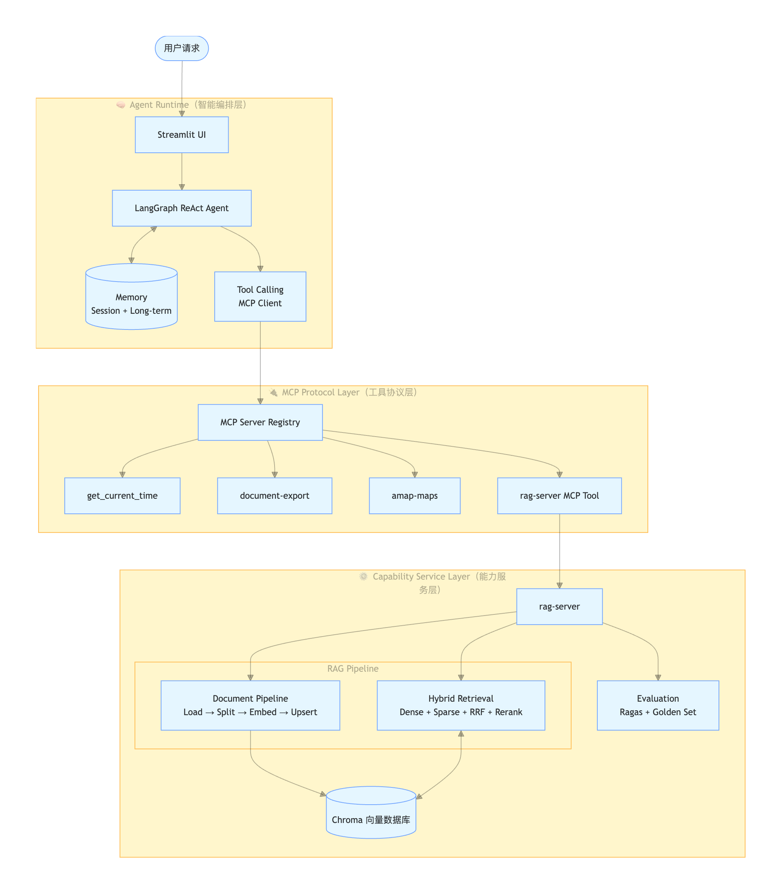
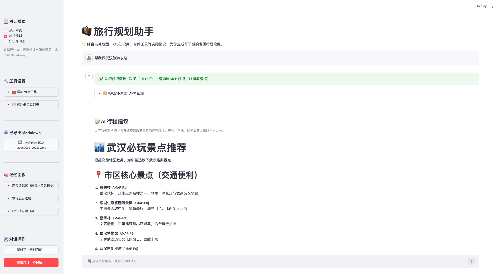
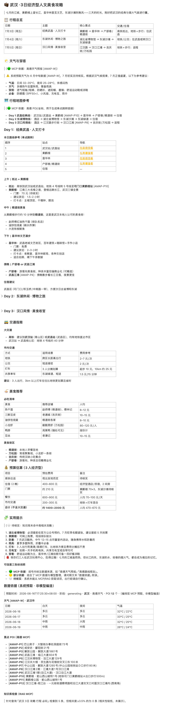
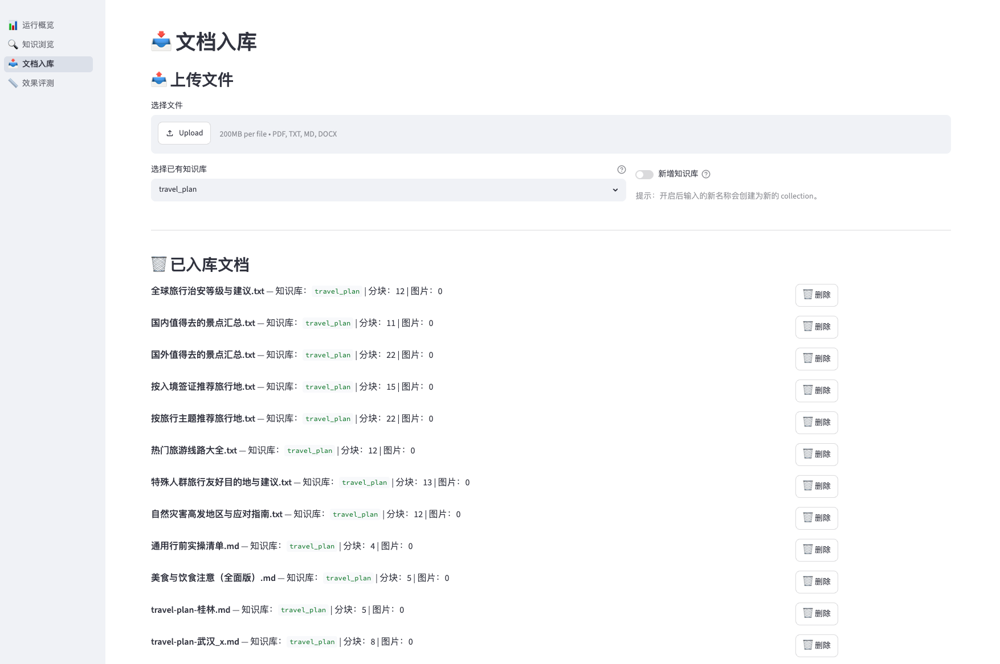
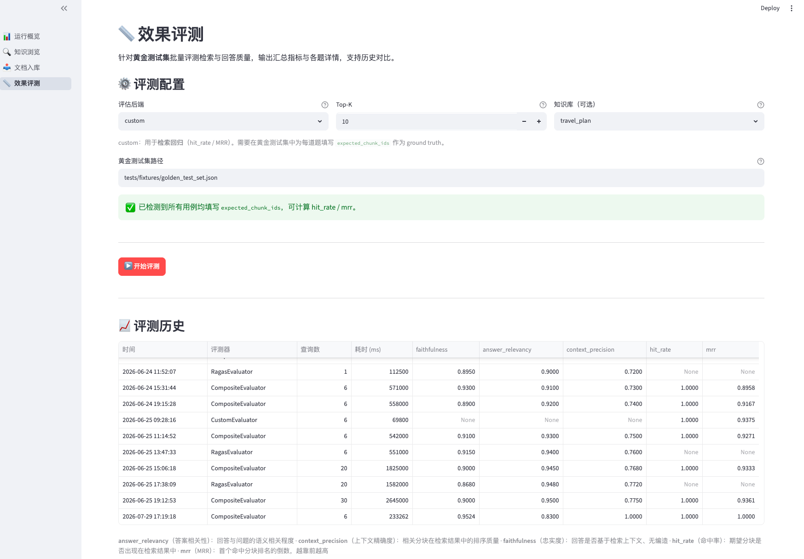
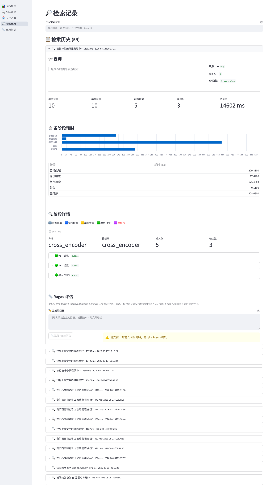

# ContextBridge Agent

**ContextBridge Agent** 是一个基于 **LangGraph + MCP** 的多模式智能体工作台，集成了 Streamlit 聊天界面、MCP 工具动态接入、RAG 检索与旅行规划能力。该仓库采用 monorepo 结构，包含主应用和 RAG 服务两个子项目。

## 目录

- [项目架构](#项目架构-🏗️)
- [项目亮点](#项目亮点)
- [核心能力](#核心能力)
- [仓库结构](#仓库结构)
- [快速开始](#快速开始)
- [配置说明](#配置说明)
- [开发与文档资源](#开发与文档资源)

## 项目架构 🏗️

本项目由两大子系统构成：

- `agents-master/`：主应用负责 Agent 运行时、Streamlit UI、MCP 客户端管理与多模式调度。
- `rag-server/`：RAG 服务负责知识库摄取、向量检索、混合检索与评估，并通过 MCP 对外暴露工具。

两者通过 MCP 协议联动，形成一个既支持前端交互又支持后端检索的完整智能体体系。

## 项目亮点 🚀

- **Agent 编排与多模式工作台**：基于 LangGraph ReAct Agent 的调度引擎，支持通用聊天、旅行规划、知识库问答三种工作模式，并通过 `modes` 注册表实现可扩展模式插件。
- **MCP 全链路集成**：主应用支持 stdio MCP 客户端与服务器，自动发现工具、动态注册、热重连，并允许通过 Smithery JSON 直接接入外部 MCP 服务，形成开放工具生态。
- **会话与记忆体系**：内置会话归档、历史记忆面板、长期记忆 Embedding 与短期对话状态，增强连续性思路、上下文保持与历史内容复用。
- **可观测交互体验**：Streamlit UI 实时展示工具调用链路、模型响应、RAG 结果与导出内容，支持用户直观审查智能体决策过程。
- **RAG 模块化架构**：`rag-server` 采用 Factory + YAML 驱动设计，可插拔数据源、检索后端、评估组件与输出策略，适配多种业务场景与扩展需求。
- **混合检索能力**：支持 Dense Embedding + Sparse BM25 双路召回、RRF 融合以及可选 reranker 精排，兼顾语义理解与精确匹配，提升 Top-K 检索效果。
- **文档摄取与索引**：支持文档分块、Embedding 生成、Chroma 向量库管理与知识库 Collection 管理，适配多格式文档与知识库迭代。
- **评估与测试体系**：集成回归验证、Ragas 评估与效果监控流程，便于持续迭代、性能监控与质量保障。
- **旅行规划能力**：支持高德地图 POI 查询、路线规划、行程生成与 Markdown 导出，构建可执行的旅行方案交互体验。

## 核心能力 💡

| 核心能力 | 内容 | 体现 |
| --- | --- | --- |
| Agent 编排与多模式 | LangGraph ReAct Agent 提供智能调度与工具调用，支持通用聊天、旅行规划、知识库问答，且可通过 `modes` 注册表扩展业务模式 | 多模式切换、插件式模式扩展、统一对话入口 |
| MCP 工具联动 | 支持动态发现、加载与调用 MCP 工具，兼容 stdio 子进程与外部 MCP 集成 | 运行时自动注册、工具调用链可视化、热重连与扩展能力 |
| 记忆与会话管理 | 支持短期对话状态、历史会话归档、长期记忆 Embedding 与检索 | 连续对话衔接、历史上下文复用、跨会话知识保留 |
| 交互可视化 | Streamlit 界面实时展示对话、工具调用、模型响应与结果导出 | 流程透明、用户感知友好、操作即见效果 |
| 旅行规划能力 | 高德地图 MCP 与内置行程生成逻辑联合输出规划结果 | POI 搜索、景点推荐、行程导出与可视化支持 |
| 文档摄取 | 支持文档分块、Embedding 生成、向量入库与 collection 管理 | 多格式支持、自动 Chunk、知识库迭代管理 |
| 混合检索 | Dense Embedding + Sparse BM25 双路召回，支持 RRF 融合与 reranker 精排 | 提高检索覆盖、提升 Top-K 准确率、兼顾语义与精确匹配 |
| RAG 集成 | `rag-server` 采用 Factory + YAML 驱动，实现可插拔检索与评估组件、外部 MCP 暴露 | 灵活配置检索后端、快速切换模型、可扩展数据源 |
| 评估与监控 | 支持回归测试、Ragas 评估与效果监控，提供持续迭代能力 | 可量化质量变化、提升改动可控性、保障迭代效果 |






## 仓库结构 📁

```
ContextBridge Agent/
├── agents-master/     # 主应用：Streamlit UI + Agent 运行时
│   ├── app.py          # 主入口
│   ├── config.json     # MCP 工具与模式配置
│   ├── .env.example    # 本地环境变量模板
│   ├── docs/           # 主应用设计与测试文档
│   ├── data/           # 运行时数据与输出
│   └── modes/          # Agent 模式注册表与扩展
├── rag-server/        # RAG 服务：知识摄取、检索、评估
│   ├── main.py         # RAG MCP Server 启动入口
│   ├── dashboard.py    # Streamlit 控制台入口
│   ├── config/         # RAG 模型与 collection 配置
│   ├── docs/           # RAG 设计与管理文档
│   └── src/            # RAG 服务核心实现代码
├── dockers/           # Docker 运行与配置（可选）
└── README.md          # 顶层项目说明
```

- `agents-master/`：主应用（Streamlit + LangGraph），负责前端界面、Agent 调度、MCP 工具接入与会话管理。
- `rag-server/`：RAG 服务，负责文档摄取、向量索引、混合检索、评估与 MCP 工具暴露。

## 快速开始 🚀

### 1. agents-master 本地运行

```bash
cd agents-master
python3.12 -m venv .venv
source .venv/bin/activate
pip install -r requirements.txt
cp .env.example .env
```

编辑 `agents-master/.env`，至少配置：

- `DASHSCOPE_API_KEY`
- `AMAP_MAPS_API_KEY`（旅行模式需要）

启动应用：

```bash
streamlit run app.py
```

默认访问：`http://localhost:8501`

### 2. rag-server 本地运行

```bash
cd rag-server
python3.12 -m venv .venv
source .venv/bin/activate
pip install -e ".[dev]"
cp config/settings.dashscope.example.yaml config/settings.yaml
```

编辑 `config/settings.yaml`，配置：

- `llm.api_key`
- `embedding.api_key`
- `llm.model`
- `embedding.model`

启动 RAG 控制台：

```bash
streamlit run dashboard.py
```

如需更换端口：

```bash
python scripts/start_dashboard.py --port 8502
```

### 3. 旅行模式 / 高德地图 MCP

在 `agents-master/` 执行：

```bash
npm install
```

确保 `.env` 中存在：

- `AMAP_MAPS_API_KEY`

`config.json` 已注册 `amap-maps` MCP，运行时会从环境变量注入密钥。

## 配置说明 ⚙️

### agents-master

- `agents-master/.env`：API Key、模型端点、环境变量配置
- `agents-master/config.json`：MCP 服务定义与工具注册
- `agents-master/data/`：运行时输出与会话数据

### rag-server

- `rag-server/config/settings.yaml`：RAG 服务模型与嵌入配置
- `rag-server/config/collections.yaml`：知识库 collection 定义
- `rag-server/data/`：向量数据库与中间数据

### 密钥关系

| 目的 | 配置位置 |
| ---- | ---- |
| 聊天模型 | `agents-master/.env` + `agents-master/config/models.py` |
| 长期记忆 Embedding | `agents-master/.env`（`DASHSCOPE_*`） |
| 知识库检索 | `rag-server/config/settings.yaml` |
| 旅行 POI / 地图 | `agents-master/.env`（`AMAP_MAPS_API_KEY`） |

> 注意：请勿将真实密钥提交到 Git。

## 开发与文档资源 📚

- `agents-master/` 文档：
  - `agents-master/docs/project-design/多模式Agent架构选型.md` — 多模式 Agent 架构选型与设计
  - `agents-master/docs/project-design/MCP设计与管理.md` — MCP 配置与管理说明
  - `agents-master/docs/project-design/旅行规划-需求与架构(产品).md` — 旅行规划需求与产品架构说明
  - `agents-master/docs/project-design/旅行规划-职责分层与步骤依据(实现).md` — 旅行规划业务职责与实现步骤
  - `agents-master/docs/test-analysis/记忆系统现状与优化.md` — 记忆系统分析与改进建议
  - `agents-master/docs/test-analysis/Token消耗分析与优化.md` — Token 使用分析与优化方法
  - `agents-master/docs/test-analysis/MCP初始化性能分析与优化.md` — MCP 初始化性能分析与优化
  - `agents-master/docs/test-analysis/工具调用失败案例与处理准则.md` — MCP 工具调用异常处理总结
  - `agents-master/docs/test-analysis/测试问题与优化总结（2026-06）.md` — 测试问题与优化总结
  - `agents-master/docs/project-design/GitHub推送模式目标分析.md` — 推送与交付目标分析

- `rag-server/` 文档：
  - `rag-server/README.md` — RAG 服务总览与快速使用说明
  - `rag-server/docs/整体设计和流程.md` — RAG 总体架构与流程说明
  - `rag-server/docs/project-design/需求目标与模块设计.md` — 需求目标与模块设计说明
  - `rag-server/docs/project-design/系统架构与模块选型.md` — 系统架构与模块选型说明
  - `rag-server/docs/project-design/外接集成设计.md` — 外部系统与 MCP 面向集成设计
  - `rag-server/docs/project-design/评估体系设计.md` — RAG 评估体系与指标设计
  - `rag-server/docs/管理面板指南.md` — Dashboard 操作与管理说明
  - `rag-server/docs/知识库扩展计划.md` — 知识库扩展与 collection 设计建议
  - `rag-server/docs/test-analysis/RAG测试问题与优化记录.md` — RAG 测试问题与优化总结
  - `rag-server/docs/test-analysis/RAG评估调优专题.md` — RAG 评估与调优专题分析
  - `rag-server/docs/test-analysis/端到端性能测试.md` — 端到端 RAG 性能测试记录

- `.cursor/skills/` 项目级 Skills（Agent 对话中自然语言触发）：
  - `.cursor/skills/README.md` — Skills 一览与维护入口
  - `.cursor/skills/agent-development/` — Agent 开发规范与方法论（设计/Tool/State/Prompt/评估）
