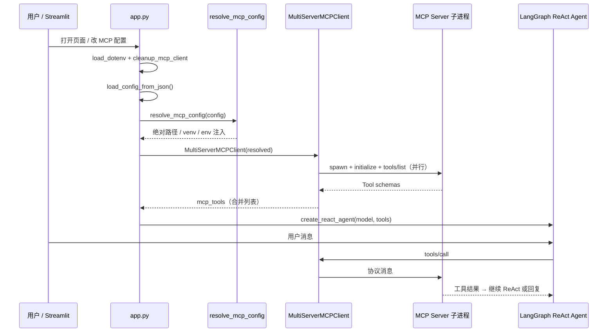

# MCP 设计与管理

> 文档版本：v1.0  
> 适用：`agents-master`（Streamlit + LangGraph ReAct + `MultiServerMCPClient`）  
> 定位：**MCP 设计说明 + `config.json` 注册表权威来源**；上手命令见 [README.md](../../README.md)。

## 目录

- [TL;DR（面试 30 秒）](#tldr面试-30-秒)
- [1. MCP 流程设计](#1-mcp-流程设计)
- [2. MCP Server 注册表](#2-mcp-server-注册表)
- [3. MCP 配置方式](#3-mcp-配置方式)
- [4. stdio 与 HTTP/SSE](#4-stdio-与-httpsse)
- [5. 对话模式与 MCP 关系](#5-对话模式与-mcp-关系)
- [6. 性能与排障（简要）](#6-性能与排障简要)
- [7. 安全与禁区](#7-安全与禁区)
- [8. 相关文档](#8-相关文档)

---

## TL;DR（面试 30 秒）

ContextBridge 的 `agents-master` 是 **MCP Host**：`app.py` 承载 Streamlit UI 与 LangGraph ReAct Agent；**MCP Client** 使用 `langchain-mcp-adapters` 的 `MultiServerMCPClient`，按 `config.json` 连接多个 **MCP Server**，合并工具列表供 Agent 在对话中 `tools/call`。

- **配置权威**：`config.json`（注册表）+ `config/mcp_config.py`（`resolve_mcp_config` 运行时解析）
- **生产传输**：全部为 **stdio**（Client 拉起子进程，管道通信）
- **默认 4 个 Server**：时间、文档导出、rag-server、高德地图
- **与 rag-server 解耦**：不 `import` rag-server 代码，只通过 MCP 协议调用；rag API 细节见 [rag-server 外接集成设计](../../../rag-server/docs/project-design/外接集成设计.md)

---

## 1. MCP 流程设计

### 1.1 三角色

| 角色 | 在本项目中的体现 | 类比 |
|------|------------------|------|
| **MCP Host** | `app.py` / Streamlit 应用 | Cursor、Claude Desktop |
| **MCP Client** | `MultiServerMCPClient` | 连接 Server、拉取工具、转发 `tools/call` |
| **MCP Server** | `config.json` 中每个条目对应的子进程或服务 | `mcp_server_time.py`、`../rag-server`、npm 包 `mcp-amap` |

**Tool** 是 Server 对外暴露的能力单元；LangGraph ReAct Agent 把 Tool 当作 LangChain `BaseTool`，由模型在推理中决定是否调用。

### 1.2 端到端时序（agents-master 编排）



**关键代码路径**：

| 步骤 | 函数 / 模块 |
|------|-------------|
| 加载配置 | `config/mcp_config.py` → `load_config_from_json()` |
| 运行时解析 | `resolve_mcp_config()` |
| 连接与拉工具 | `app.py` → `initialize_session()` → `client.get_tools()` |
| 构建 Agent | `app.py` → `_build_agent_from_tools(tools)` |
| UI 增删 MCP | `ui/sidebar.py` → `reconnect_agent()` |

### 1.3 Session 状态

| `st.session_state` 键 | 含义 |
|----------------------|------|
| `pending_mcp_config` | 当前生效的 MCP 配置（可能与磁盘 `config.json` 同步） |
| `mcp_client` | `MultiServerMCPClient` 实例 |
| `mcp_tools` | 已拉取的合并工具列表（缓存） |
| `tool_count` | 工具数量（侧边栏展示） |
| `applied_mcp_config_sig` | 已应用配置的签名，用于判断是否需要重连 |
| `session_initialized` | 是否已完成 MCP + Agent 初始化 |

### 1.4 重连策略

| 操作 | 函数 | 是否重连 MCP | 说明 |
|------|------|:------------:|------|
| 首次打开页面 | `ensure_session_ready()` → `reconnect_agent()` | ✅ | 全量 `get_tools()` |
| 侧边栏增删/改 MCP | `reconnect_agent()` | ✅ | 配置变化时写回 `config.json` |
| 切换对话模式 | `rebuild_agent_only()` | ❌ | 只换 System Prompt / handler，复用 `mcp_tools` |
| 切换 LLM 模型（应用模型） | `rebuild_agent_only()` | ❌ | 同上 |
| MCP 配置未变但 Agent 需重建 | `rebuild_agent_only()` | ❌ | 无 `mcp_tools` 时回退全量重连 |

`cleanup_mcp_client()` 仅清空 session 中的 client 引用；`langchain-mcp-adapters` 新版本不支持 `async with client`，每次工具调用由库自行建连。

### 1.5 与 rag-server 的边界

- agents-master **不嵌入** RAG 检索代码；`rag-server` 以独立子进程运行（`cwd: ../rag-server`）。
- 编排发生在 agents-master：**何时** `get_tools`、**哪些** Tool 进入 Agent、旅行模式 **pipeline 预取** vs Agent 自选——均在本仓库。
- rag-server 三件套语义、返回格式、CLI 分工 → [外接集成设计.md](../../../rag-server/docs/project-design/外接集成设计.md)。

---

## 2. MCP Server 注册表

### 2.1 结构约定

- **顶层 key** = MCP Server 的逻辑 id（如 `rag-server`），传给 `MultiServerMCPClient` 作 server 名。
- 每个 value 描述**如何连接**该 Server（stdio 用 `command`/`args`，远程用 `url`）。
- Agent 侧看到的是**扁平工具名**（如 `query_knowledge_hub`），由各 Server 在 `tools/list` 中注册。

### 2.2 通用字段

| 字段 | 适用传输 | 含义 |
|------|----------|------|
| `command` | stdio | 可执行文件；写 `python` 时由 `resolve_mcp_config` 替换为实际解释器 |
| `args` | stdio | 命令行参数数组；支持 `${ENV_VAR}` 占位符 |
| `cwd` | stdio | 子进程工作目录；相对路径基于 `agents-master/` 转绝对路径 |
| `transport` | 全部 | `stdio`（默认）或 `sse` 等；与 `url` 配合用于远程 |
| `url` | 远程 | HTTP/SSE 端点；有 `url` 时侧边栏会自动设 `transport: sse` |
| `env` | stdio | 子进程环境变量；未写时由 `resolve_mcp_config` 按需从 `.env` 注入 |

### 2.3 `resolve_mcp_config()` 解析规则（摘要）

| 场景 | 行为 |
|------|------|
| `command` 为 `python` / `python3` | 非 rag-server → `sys.executable`；rag-server → 优先 `rag-server/.venv/bin/python` |
| `cwd` 相对路径 | 转为基于 `APP_DIR` 的绝对路径 |
| `amap-maps` | `mcp-amap` → 解析 `node_modules/.bin/mcp-amap` 或 npx 缓存；找不到则回退 `npx -y @amap/amap-maps-mcp-server` |
| 高德 `env` | 若未配置 `AMAP_MAPS_API_KEY`，从进程环境变量注入 |
| 飞书类 MCP | `feishu-doc` / `lark-mcp` 等可从 `.env` 注入 `FEISHU_APP_ID` / `FEISHU_APP_SECRET` |
| `args` / `env` 字符串 | `${VAR}` 替换为 `os.environ` |

实现：`config/mcp_config.py`。

### 2.4 已注册 Server（默认 4 个）

| Server id | 实现位置 | 主要工具 | 典型场景 | 密钥 / 依赖 |
|-----------|----------|----------|----------|-------------|
| `get_current_time` | `mcp_server_time.py` | `get_current_time` | 解析相对日期；旅行模式 | 无 |
| `document-export` | `mcp_server_export.py` | `write_markdown_document` | 通用模式长文导出 | 无 |
| `rag-server` | `../rag-server` 子进程 | `list_collections`、`query_knowledge_hub`、`get_document_summary` | 知识库问答、旅行贴士 | `rag-server/config/settings.yaml` |
| `amap-maps` | `@amap/amap-maps-mcp-server` | `maps_geo`、`maps_weather`、`maps_direction_*` 等 | 旅行 POI / 路线 / 天气 | `agents-master/.env` → `AMAP_MAPS_API_KEY`；需 `npm install` |

### 2.5 当前 `config.json` 示例

```json
{
  "get_current_time": {
    "command": "python",
    "args": ["./mcp_server_time.py"],
    "transport": "stdio"
  },
  "document-export": {
    "command": "python",
    "args": ["./mcp_server_export.py"],
    "transport": "stdio"
  },
  "rag-server": {
    "command": "python",
    "args": ["-m", "src.mcp_server.server"],
    "cwd": "../rag-server",
    "transport": "stdio"
  },
  "amap-maps": {
    "command": "mcp-amap",
    "args": [],
    "transport": "stdio"
  }
}
```

权威文件：`agents-master/config.json`。

---

## 3. MCP 配置方式

### 3.1 文件配置（默认）

- 路径：`agents-master/config.json`
- 加载：`load_config_from_json()`；文件不存在时创建仅含 `get_current_time` 的默认配置。
- 持久化：`save_config_to_json()`；`reconnect_agent()` 在内存配置与磁盘不一致时写回。

### 3.2 运行时与 UI

| 机制 | 说明 |
|------|------|
| `pending_mcp_config` | 侧边栏编辑的「待应用」配置；重连后成为生效配置 |
| 侧边栏「添加 MCP 工具」 | 粘贴 JSON；支持 Smithery 的 `mcpServers` 外层自动剥离 |
| 含 `url` 的条目 | 自动设 `transport: sse`（`ui/sidebar.py`） |
| 增删工具后 | 立即 `reconnect_agent()` 全量重连 |

### 3.3 环境变量

- `agents-master/.env`：LLM Key、`AMAP_MAPS_API_KEY`、可选飞书 Key 等。
- 启动时 `load_dotenv(override=True)`；`resolve_mcp_config` 将 Key 注入对应 Server 子进程的 `env`，**不要求**写在 `config.json` 明文。

---

## 4. stdio 与 HTTP/SSE

> 本节为**技术对比与面试讲解**；本项目生产路径为 **stdio**，无 HTTP 改造计划。

| 维度 | stdio（本项目） | HTTP / SSE（概念） |
|------|-----------------|---------------------|
| 谁启动 Server | Client（`MultiServerMCPClient` spawn 子进程） | 运维或开发者**事先**启动独立服务 |
| 配置字段 | `command` + `args` + `cwd` | `url` + `transport`（如 `sse`） |
| 进程生命周期 | 与 Host 会话绑定，重连时重新握手 | Server 可长期驻留，Client 重启不影响 Server |
| 部署 | 单体/monorepo 本地联调简单 | 适合多 Client 共享、容器/K8s 拆分 |
| 网络 | 无端口，本机管道 | 需端口、健康检查、生产常加 TLS/鉴权 |
| 日志 | rag-server stdio 要求 stdout 仅协议消息 | HTTP 下日志约束更宽松 |

**本项目选型理由（面试可讲）**：monorepo 本地一键 `streamlit run app.py` 即可拉起 4 个 MCP；`cwd` 指向同级 `rag-server`，`resolve_mcp_config` 自动选 venv，联调成本最低。

远程 MCP 实验见 `MCP-HandsOn-ENG.ipynb`（SSE + Smithery 示例，非默认部署）。

---

## 5. 对话模式与 MCP 关系

三种模式共用**同一套** `mcp_tools`（全量注册）；差异在 **System Prompt、路由与编排**，见 [多模式Agent架构选型.md](./多模式Agent架构选型.md)。

| 模式 | id | MCP 使用方式 | 常用 Tool / Server |
|------|-----|--------------|-------------------|
| **通用** | `general` | Agent 从全工具池按需调用 | 全部 4 个 Server；长文可 `write_markdown_document` |
| **旅行规划** | `travel` | **双层**：编排层预取 + Agent ReAct 补调 | `get_current_time`；`amap-maps`（天气/路线/POI）；`rag-server`（贴士）；导出走 `export_service` 服务端写盘，**不必**再调 `document-export` |
| **知识库问答** | `knowledge_qa` | Agent 聚焦 RAG 三件套 | `list_collections` → `query_knowledge_hub` / `get_document_summary` |

**旅行模式两层编排**（面试亮点）：

1. **编排层预取**（`modes/travel/pipeline.py`）：进入生成阶段前，Python 直接 `tool.ainvoke` 拉 RAG/高德，写入 `travel_facts`，减少模型乱序调工具。
2. **Agent ReAct**：对话中仍可补调 MCP；Prompt 约束工具顺序与可信度标注。

切换模式调用 `rebuild_agent_only()`，**不重连 MCP**，只换 Prompt 与 `modes/*/handler`。

---

## 6. 性能与排障（简要）

### 6.1 性能要点

- `get_tools()` **并行**连接各 Server，总耗时 ≈ **最慢的一个**。
- 历史瓶颈多在 **高德**：`npx -y` 冷启动约 15s；已通过本地 `mcp-amap`（`npm install`）降至毫秒级。
- 切换模式/模型**不应**全量重连 MCP；若仍很慢，检查是否误触 MCP 配置变更。

详见：[MCP初始化性能分析与优化.md](../test-analysis/MCP初始化性能分析与优化.md)。

### 6.2 连接失败快速检查

| 现象 | 优先检查 |
|------|----------|
| 初始化失败 / 无法连接 MCP | `config.json` 语法；`cwd` 是否指向 `rag-server` 根目录 |
| `No module named chromadb` | rag-server 是否 `pip install -e ".[dev]"` 且 `resolve` 是否用到其 `.venv` |
| 高德工具不可用 | `npm install`；`.env` 中 `AMAP_MAPS_API_KEY` |
| RAG 无结果 | 是否 ingest；`collection` 是否与入库一致（可先 `list_collections`） |
| Embedding / LLM 报错 | `rag-server/config/settings.yaml` 中 Key 与模型名 |

工具失败分类与处理原则：[工具调用失败案例与处理准则.md](../test-analysis/工具调用失败案例与处理准则.md)。

---

## 7. 安全与禁区

| 规则 | 说明 |
|------|------|
| **禁止**在 `config.json` 明文长期存放生产 API Key | Key 放 `.env` 或 rag-server `settings.yaml`，由 `resolve_mcp_config` 注入 |
| **禁止**提交 `rag-server/config/settings.yaml`（含真实 Key 时） | 使用 example 模板复制 |
| 提交前扫描 `config.json` 的 MCP `env` | 不得含明文 Key（项目 Git 工作流约定） |
| rag-server stdio | stdout 仅协议消息；日志走 stderr，避免破坏管道 |

---

## 8. 相关文档

| 文档 | 说明 |
|------|------|
| [agents-master/README.md](../../README.md) | 安装、启动、RAG 四步联调 |
| [根 README.md](../../../README.md) | monorepo 结构与密钥约定 |
| [rag-server/外接集成设计.md](../../../rag-server/docs/project-design/外接集成设计.md) | rag-server MCP API、三件套、CLI 分工 |
| [多模式Agent架构选型.md](./多模式Agent架构选型.md) | 三模式 + registry |
| [app.py架构说明与拆分建议.md](./app.py架构说明与拆分建议.md) | MCP 生命周期在 app 中的位置 |
| [旅行规划-需求与架构(产品).md](./旅行规划-需求与架构(产品).md) | 旅行模式工具与可信度要求 |
| [MCP初始化性能分析与优化.md](../test-analysis/MCP初始化性能分析与优化.md) | 初始化耗时与优化 |
| [工具调用失败案例与处理准则.md](../test-analysis/工具调用失败案例与处理准则.md) | 工具失败分类 |
| [MCP-HandsOn-ENG.ipynb](../../MCP-HandsOn-ENG.ipynb) | SSE / Smithery 实验 |
| [QA/integration-qa.md](../../../QA/integration-qa.md) | 全栈串联（C 轨） |
