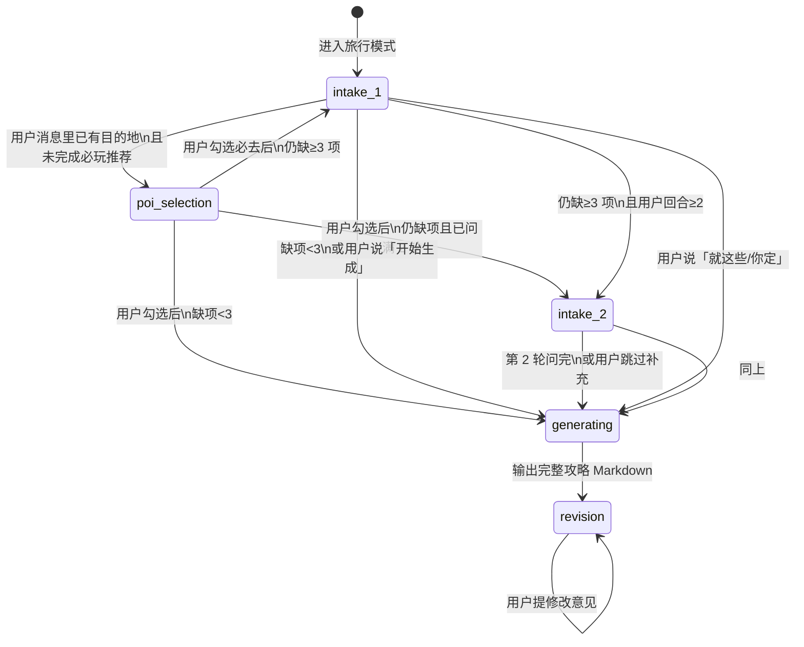

# 旅行规划：职责分层与步骤依据

> 说明「旅行规划 Agent 到底干什么」以及「每一步依据什么操作」。  
> 配套文档：[旅行规划模式-需求与架构.md](./旅行规划模式-需求与架构.md)

---

## 1. 旅行规划里，谁真正在「干活」？

可以分成 **三层**，职责不同：

| 层级 | 所在位置 | 干什么 | 旅行模式中的具体负责 |
|------|----------|--------|----------------------|
| **编排层（Orchestrator）** | `travel_mode.py` + `app.py` 中少量包装函数 | 状态机、字段解析、消息包装、交付校验 | **决定当前 phase**、拼接 `[TRAVEL_CONTEXT]`、合并 intake |
| **Agent 运行时** | LangGraph `create_react_agent` | LLM ↔ 工具多轮循环（ReAct） | **理解上下文、选择工具、生成回复** |
| **Prompt 层** | `SYSTEM_PROMPT` + `travel-planner.md` + 每轮 `[TRAVEL_CONTEXT]` | 告诉模型「该怎么想、该调什么」 | **静态能力说明 + 本回合阶段指令** |

### 关键结论

- **「这一步走 intake 还是 generating」** → 主要由 **Python 编排层**（`prepare_phase_before_agent`）按规则计算，不是 LLM 自行维护状态。
- **「这一步调 maps_weather 还是 RAG」** → 主要由 **LLM + Prompt** 在 `[TRAVEL_CONTEXT]` 与 `travel-planner.md` 指引下决定。
- **Agent 不会**自己维护 `travel_phase` 字典；它每轮只看到编排层注入的上下文。

### 架构关系（简图）

```mermaid
flowchart TB
    subgraph UI["Streamlit UI（app.py）"]
        A[侧边栏切「旅行规划」]
        B[用户 chat_input]
        C[展示 Markdown + 下载按钮]
    end

    subgraph Orch["编排层 travel_mode.py + app.py"]
        D[travel_phase 状态机]
        E[travel_intake 九字段]
        F[包装 [TRAVEL_CONTEXT] 注入 Agent]
    end

    subgraph Agent["LangGraph ReAct Agent"]
        G[travel-planner.md + SYSTEM_PROMPT]
        H[多轮 LLM ↔ 工具调用]
    end

    subgraph MCP["MCP 工具"]
        I[高德 amap-maps]
        J[RAG rag-server]
        K[时间 / 文档导出]
    end

    A --> D
    B --> F --> G --> H
    H --> I & J & K
    H --> C
    D --> F
```

---

## 2. 状态机：五个阶段（流程线）



| 阶段 | 代码常量 | 编排层目标 | Agent 本回合应做 |
|------|----------|------------|------------------|
| 必玩推荐 | `poi_selection` | 有目的地、尚未确认必去 | 高德 + RAG 列景点，让用户勾选；不导出 |
| 信息收集 1 | `intake_1` | 缺 ≥3 项时第一轮提问 | 只提问，不生成攻略 |
| 信息收集 2 | `intake_2` | 仍缺项时的最后一问 | 提问 + 兜底话术；不生成攻略 |
| 生成 | `generating` | 信息足够或用户跳过补充 | 完整工具链 + 全文 MD + 导出 |
| 改稿 | `revision` | 已有攻略且用户要改 | 基于上一版修订 + 按需重查工具 |

**Intake 九字段**：`destination`、`dates`、`duration_days`、`companions`、`preferences`、`budget`、`transport`、`must_visit`、`constraints`。

---

## 3. 单轮对话：每一步依据什么操作？

```text
用户输入
    │
    ├─【依据 1】app_mode == travel？ 否则走通用流程
    │
    ▼
handle_travel_user_message()                    ← app.py
    │
    ├─【依据 2】正则 extract_intake_from_user_message（目的地、X日游等）
    ├─【依据 3】当前 session 状态：
    │              travel_phase、travel_intake、travel_intake_user_turns、
    │              must_visit_confirmed、last_travel_plan_md
    ├─【依据 4】prepare_phase_before_agent() 规则：
    │              · 有目的地且未必玩确认 → poi_selection
    │              · 缺项≥3 且轮次 → intake_1 / intake_2
    │              · 缺项<3 或「开始生成」→ generating
    │              · 已有攻略 + 改稿意图 → revision
    │
    ▼
拼 agent_query = [TRAVEL_CONTEXT] JSON + 阶段指令 + 用户原文
    │
    ▼
ReAct Agent
    System Prompt = SYSTEM_PROMPT + travel-planner.md
    │
    ├─【依据 5】System Prompt：角色、工具说明、Markdown 模板
    ├─【依据 6】[TRAVEL_CONTEXT]：本回合 phase、missing_fields、工具 checklist
    ├─【依据 7】对话历史（LangGraph MemorySaver + thread_id）
    │
    ▼
LLM 决定：提问 / 调 maps_* / 调 RAG / 写攻略 / write_markdown_document
    │
    ▼
finalize_travel_assistant_text()                ← app.py
    │
    ├─【依据 8】解析 <!--TRAVEL_INTAKE:{...}--> 合并 intake
    ├─【依据 9】looks_like_travel_plan() → 进入 revision、存 last_travel_plan_md
    └─【依据 10】check_travel_delivery() → 缺导出则 warning
    │
    ▼
写入 history，rerun 展示；有导出则显示下载按钮
```

**界面展示**：用户看到的是**原始输入**；模型收到的是**带阶段指令的包装消息**。

---

## 4. 各阶段 Agent 工具与输出（编排层写入 [TRAVEL_CONTEXT]）

### `poi_selection`

1. `maps_text_search` — 目的地 + 必玩/景点关键词  
2. `list_collections` → `query_knowledge_hub` — RAG 攻略  
3. 可选 `maps_search_detail`  

**禁止**：完整攻略、`write_markdown_document`。

### `generating` / `revision`（需重查时）

1. `get_current_time`  
2. RAG：`list_collections` → `query_knowledge_hub`  
3. `maps_weather`  
4. `maps_text_search` / `maps_search_detail`  
5. `maps_geo` + `maps_direction_*`（Prompt 要求节制调用，避免 CUQPS 超限）  
6. `write_markdown_document`  

---

## 5. 与通用模式的对比

| 维度 | 通用模式 | 旅行规划 |
|------|----------|----------|
| Prompt | 仅 `SYSTEM_PROMPT` | `SYSTEM_PROMPT` + `travel-planner.md` |
| 流程 | 无状态机，自由 ReAct | `travel_phase` 门控：该问时不许导出 |
| 上下文 | 仅对话历史 | 每轮注入 `[TRAVEL_CONTEXT]` + intake 快照 |
| 工具策略 | 按需 | 分阶段 checklist（必玩 / 生成 / 改稿） |
| 超时 | 侧边栏默认 | 生成/改稿/必玩阶段自动加长（`travel_timeout_seconds`） |

---

## 6. 入口与重置

| 事件 | 行为 |
|------|------|
| 侧边栏选「旅行规划」 | `enter_travel_mode()`，重置 intake，切换 System Prompt |
| 通用模式说「帮我做攻略」 | `detect_travel_intent()`，自动切模式并合并已解析字段 |
| 重置对话 | 新 `thread_id` + `reset_travel_session()`，phase 回 `intake_1` |
| 目的地变更 | `reset_poi_selection_state()`，重新走必玩推荐 |

---

## 7. 一句话总结

> 编排层管 **状态与门控**（该问还是该生成）；Prompt 管 **能力与格式**；LLM 管 **具体工具调用与文案**；`app.py` 管 **UI 与运行时装配**。

相关代码入口：

- 状态机与上下文：`travel_mode.py` — `prepare_phase_before_agent`、`build_travel_context`、`wrap_user_query_for_agent`
- 回合 hook：`app.py` — `handle_travel_user_message`、`finalize_travel_assistant_text`
- 静态 Prompt：`data/prompt/travel-planner.md`
