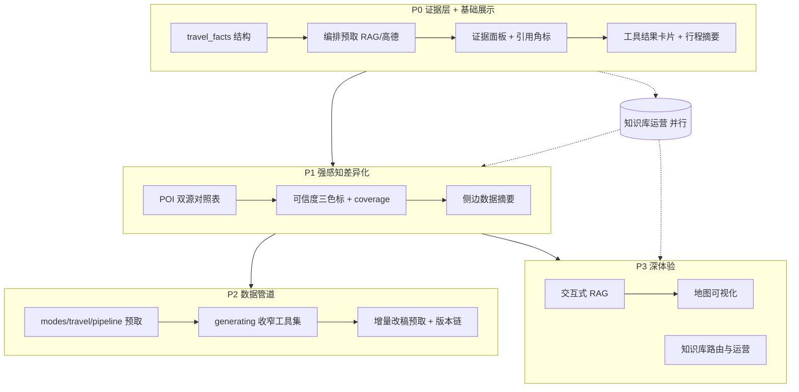

# 旅行模式 MCP 与 RAG 能力展示优化建议

> 文档版本：v1.2  
> 更新日期：2026-06-16  
> 适用项目：`agents-master`（Streamlit + LangGraph ReAct + 旅行规划工作流）  
> 关联文档：[Token 消耗分析与优化](./Token消耗分析与优化.md)、[多模式 Agent 架构选型](../project-design/多模式Agent架构选型.md)  
> **2026-07 注**：下文 P0 项（`travel_facts`、`pipeline` 预取、`ui/travel_evidence`）**已 largely 落地**；未勾选项为后续增强。

---

## 1. 背景与问题

旅行模式在工程上已是一套完整工作流（阶段机、intake、Token 优化、自动导出），但**产品感知**上更像「一个会调工具的聊天 Agent」，**MCP 与 RAG 的差异化价值未充分外显**。

用户实际感受到的与通用模式差别，主要是「多问几轮 + 输出更长」，而非「有真实数据支撑的可信规划」。

---

## 2. 现状：能力在，展示不在

### 2.1 三层分工

```text
Python 编排（`modes/travel/state_machine.py` + `modes/travel/pipeline.py`）→ 算阶段、预取、注入 `[TRAVEL_CONTEXT]`
Prompt checklist            → 建议 LLM 按序调 RAG / 高德
ReAct Agent                 → 实际调 MCP，把结果写进 Markdown
```

### 2.2 用户实际看到什么


| 环节     | 当前展示（以最新实现为准）                                 |
| ------ | ------------------------------------ |
| POI 推荐 | 证据区展示 **双源对照**（高德 POI × 知识库命中） + 可折叠原文摘要 |
| 生成攻略   | 正文与证据分层：上方「系统预取数据（MCP 直出）」默认收起；下方为 AI 行程建议 |
| 数据依据   | 导出 `.md` 末尾自动追加 `## 数据依据（系统预取 · 非模型编造）`（结构化表格/列表） |
| RAG    | 命中片段可见；低相关/过滤后为空时显示明确说明（`rag_meta.notice`） |
| 高德     | 天气卡片 + POI 列表；路线以「逐站点单点跳转表」落到每个 Day 下（不依赖酒店/住宿） |


### 2.3 结论

**串联做到了，差异化没做出来。** MCP/RAG 仍是实现细节，而非用户可感知、可点击、可信任的产品能力。

---

## 3. 优化方向总览


| #   | 方向              | 核心目标                  | 投入  | 收益     |
| --- | --------------- | --------------------- | --- | ------ |
| 3.1 | 证据层（RAG 可见）     | 用户能回答「这句话从哪来」         | 低   | 高      |
| 3.2 | MCP 结果卡片化       | 工具输出可扫读，非 JSON 墙      | 中   | 高      |
| 3.3 | 数据管道 + 写作 Agent | MCP/RAG 成为一等公民数据层     | 中高  | 高      |
| 3.4 | 交互式 RAG         | 用户主动探索知识库             | 中   | 中      |
| 3.5 | 可信度 UI          | 与纯 LLM 拉开差距           | 低   | 高      |
| 3.6 | 知识库运营           | RAG 有料才显得强            | 持续  | 高      |
| 3.7 | 对比演示模式          | 展示 Agent+MCP+RAG 组合价值 | 低   | 中（演示向） |


---

## 4. 分项建议

> **落地细节见 [§5 推荐落地顺序](#5-推荐落地顺序)**。本节为各方向的设计说明；§5 按阶段列出具体操作、改动文件、效果与验收点。

### 4.1 证据层——让 RAG 可见（P0，性价比最高）

**做法：**

1. **编排层预取 RAG**：在 `poi_selection` / `generating` 阶段，Python 直接调 `query_knowledge_hub`，结果写入 `travel_facts`（或 `st.session_state.rag_evidence`），再注入 Agent。RAG 调用确定发生，且 UI 可复用。
2. **攻略正文加可点击引用**：如 `故宫建议早到 [RAG-1]`，侧边栏或文末展开对应 chunk（文档名、collection、原文摘要）。
3. **POI 阶段双源对照表**：

  | 景点  | 高德检索 | 知识库经典线路 | 用户选择 |
  | --- | ---- | ------- | ---- |
  | 西湖  | ✓ 热门 | ✓ 必玩    | 必去   |


**与现有代码衔接：** 可沿用 `modes/travel/tool_memory` 的跨回合摘要思路，升级为结构化 `travel_facts`，而非仅 500 字规则截断。

---

### 4.2 MCP 工具结果卡片化（P0～P1）

**做法：**

在流式回调或生成结束后，按工具类型渲染：


| 工具                                        | 卡片内容             |
| ----------------------------------------- | ---------------- |
| `maps_weather`                            | 城市、日期、温度区间       |
| `maps_direction_`*                        | 起点→终点、距离、时长、交通方式 |
| `maps_text_search` / `maps_search_detail` | POI 名称、地址、评分（若有） |


生成完成后，攻略上方增加 **「本行程数据摘要」** 折叠区：多日天气 + 关键路段 2～3 条。

**进阶：** 高德静态图 API 或 embed 链接，在「逐日详情」旁放当日动线示意图。

**改动点：** `app.py`（`get_streaming_callback`）或新增 `ui/travel_evidence.py`；解析已有 `timing_log` / tool 输出 JSON。

---

### 4.3 数据管道 + 写作 Agent（P2，架构演进）

从「Agent 全程自主调工具」演进为：

```text
intake 齐全
  → 编排层：RAG 预检索 + 高德 POI/天气/路线
  → travel_facts.json（结构化中间产物）
  → 写作 Agent：编排成 Markdown + 引用
  → 证据面板 UI（与正文并行展示）
```


| 模式                 | 优点                     | 缺点                     |
| ------------------ | ---------------------- | ---------------------- |
| 现状：ReAct 全程自主      | 灵活、实现简单                | 工具顺序不稳定、难结构化、用户看不见中间产物 |
| 演进：编排预取 + Agent 写作 | MCP/RAG 可测、可展示、省 Token | 需 Python 直调 MCP        |


**建议：** `generating` 阶段由编排层拉齐 `travel_facts`，Agent 专注「可读攻略 + 可行性自检」。与《多模式 Agent 架构选型》中「单 Agent + Skill + handler」方向一致。

---

### 4.4 交互式 RAG（P3）

- 景点旁 **「查攻略详情」**：对该 POI 单独 `query_knowledge_hub`，侧边弹出片段。
- 侧边栏 **「本目的地可用知识库」**：展示 O10 已缓存的 `list_collections` 结果，用户可勾选优先 collection。
- 改稿 **「用知识库替换这一段」**：用户指出「第 2 天下午太赶」→ 定向重查 RAG + 重算路线。

RAG 从「生成时偷偷调一次」变为**用户可感知、可操控**的能力。

---

### 4.5 可信度 UI（P1）

对攻略内容打标（由编排层根据 `travel_facts` 是否有对应字段决定，**不靠 LLM 自说自话**）：


| 标记       | 含义              |
| -------- | --------------- |
| 🟢 有工具依据 | 天气、路线、RAG 片段已命中 |
| 🟡 经验推荐  | RAG 弱相关或仅常识推断   |
| ⚪ 待核实    | 工具失败或未查到        |


侧边栏汇总示例：**12 处有高德数据 / 8 处来自知识库 / 3 处待核实**。

---

### 4.6 知识库运营（持续）

MCP 能力 = 工具 + 数据。RAG showcase 一半在 UI，一半在库质量。

- 按目的地建 collection（如 `travel_杭州`、`travel_大理`）。
- POI 阶段默认路由到对应 collection（编排层决定，不全靠 LLM 猜）。
- UI 提示：**「知识库覆盖：杭州 ✓ / 小众县城 ✗ → 将更多依赖高德」**。

---

### 4.7 对比演示模式（可选）

一次生成两个折叠版本：

- **仅 LLM**（禁用工具）
- **工具增强版**（完整流程）

并排对比天气是否瞎编、路线是否可执行。适合演示 ContextBridge「Agent + MCP + RAG」组合价值，可不作为常驻产品功能。

---

## 5. 推荐落地顺序

### 5.0 总览

```text
P0  打地基：结构化事实 + 预取 + 基础展示     → 用户能「看见」RAG/高德参与了规划
P1  强感知：对照表 + 可信度 + 数据摘要       → 与通用聊天拉开明显差距
P2  稳架构：编排管道取代纯 ReAct 拉数        → 调用可测、Token 更稳、质量更一致
P3  深体验：地图 + 交互 RAG + 知识库运营     → 完整「数据驱动行程编辑器」
并行  知识库建设（§4.6）贯穿 P0～P3；对比演示（§4.7）可在 P1 后择机做
```


| 阶段     | 核心动作（一句话）                                 | 阶段完成后的用户感受                 | 主要改动范围                                                                       |
| ------ | ----------------------------------------- | -------------------------- | ---------------------------------------------------------------------------- |
| **P0** | 建 `travel_facts`，编排预取 RAG/高德，UI 展示引用与工具卡片 | 「这篇攻略不是瞎编的，我能看到知识库和高德查过什么」 | ✅ `modes/travel/facts.py`、`ui/travel_evidence.py`、`modes/travel/pipeline.py`、`ui/chat.py` |
| **P1** | POI 双源表、可信度三色标、侧边数据摘要                     | 「旅行模式和普通聊天不一样，数据来源一目了然」    | `ui/sidebar.py`、`ui/travel_evidence.py`、Prompt 引用规范                          |
| **P2** | `generating` 改为「编排预取 → 写作 Agent」管道        | 「每次生成都会查天气和路线，不会漏工具」       | 🔄 部分落地：`modes/travel/pipeline.py` 已预取；ReAct 工具集收窄待做 |
| **P3** | 地图可视化、交互式 RAG、目的地知识库路由                    | 「我能自己点景点查攻略、看动线地图」         | `ui/` 交互组件、rag-server collection、高德静态图                                       |


**依赖关系：** P0 是 P1/P2 的前置（可信度与管道都依赖 `travel_facts`）；P3 可与 P2 部分并行，但交互 RAG 建议在 P0 证据面板稳定后再做。

---

### 5.1 P0：证据层 + 基础展示（约 1～2 周）

**阶段目标：** MCP/RAG 从「藏在折叠 JSON 里」变为「生成结果旁可见的结构化证据」。对应 §4.1、§4.2 的主体能力。

#### 5.1.1 任务清单


| #    | 实行操作                                                                  | 改动文件 / 模块                                             | 对应效果（用户侧）                                 | 对应分项         | 验收点                                                             |
| ---- | --------------------------------------------------------------------- | ----------------------------------------------------- | ----------------------------------------- | ------------ | --------------------------------------------------------------- |
| P0-1 | 定义 `travel_facts` 数据结构（`rag[]`、`amap.weather/pois/routes`、`coverage`） | 新建 `modes/travel/facts.py`；`session_store` 快照字段可选纳入         | 会话可恢复「已查到的证据」，不只靠 LLM 记忆                  | §4.1         | 结构有类型注释或 schema；能 `json.dumps` 注入 context                       |
| P0-2 | **POI 阶段**：编排层直调 `query_knowledge_hub`（必玩/经典线路）+ `maps_text_search`   | `modes/travel/state_machine.py` 或 `modes/travel/pipeline.py`；复用 MCP client | POI 列表**必定**含 RAG 与高德两路结果，不依赖 LLM 是否记得调工具 | §4.1         | `poi_selection` 结束 `travel_facts.rag` 与 `amap.pois` 非空（有 Key 时） |
| P0-3 | **生成阶段**：编排层预取 RAG 攻略片段 + `maps_weather` + 2～3 段代表路线                  | 同上；写入 `st.session_state.travel_facts`                 | 天气、路线在写作前已落库；正文可引用固定 id                   | §4.1、§4.2    | `generating` 开始前 `travel_facts` 含 weather + ≥1 route            |
| P0-4 | 将 `travel_facts` 摘要注入 `[TRAVEL_CONTEXT]`，替代部分「请记得调工具」式 Prompt         | `modes/travel/state_machine.build_travel_context`                    | Agent 写作时直接消费结构化事实，减少 ReAct 盲目探索          | §4.1、§4.3 前置 | context 中含 `travel_facts` JSON；Token 对比见 §7.4                   |
| P0-5 | 新建 **证据折叠面板**：展示 RAG 片段列表（id、collection、excerpt、来源文档）                 | `ui/travel_evidence.py`；`ui/chat.py` 助手消息下渲染          | 用户无需点开「工具调用详情」即可浏览知识库命中内容                 | §4.1         | 生成完成后面板 ≥1 条 RAG excerpt 可展开                                    |
| P0-6 | 攻略正文 **引用角标** 规范：`[RAG-1]`、`[AMAP-W]`、`[AMAP-R1]`；面板内 id 可跳转          | `modes/travel/travel-planner.md`；证据面板锚点                    | 用户能回答「这句话从哪来」                             | §4.1         | 正文 ≥3 处角标；点击/展开可看到对应 excerpt                                    |
| P0-7 | **工具结果卡片**（优先读 `travel_facts` 渲染）                                          | `ui/travel_evidence.py`                                     | 天气、POI 以卡片/列表展示，告别 JSON 墙                 | §4.2         | 天气 1 卡 + POI 列表可展开                                           |
| P0-8 | 攻略上方 **「本行程数据摘要」** 折叠区（多日天气 + 关键路段）                                   | `ui/chat.py` 或 `travel_evidence.py`                   | 打开攻略先看到「硬数据摘要」，再读叙述正文                     | §4.2         | 摘要与 `travel_facts` 一致，不依赖 LLM 复述                                |


#### 5.1.2 P0 完成后的整体效果


| 维度    | P0 前                     | P0 后                           |
| ----- | ------------------------ | ------------------------------ |
| RAG   | 仅工具折叠里有大段 JSON           | 证据面板 + 正文角标，知识库参与可见            |
| 高德    | 正文里「约 X 分钟」一句话           | 天气/路线/POI 卡片 + 摘要区             |
| 稳定性   | LLM 可能跳过某工具              | 核心检索由编排层保证（POI + generating）   |
| Token | 多跳 ReAct 带完整 ToolMessage | `travel_facts` 注入有望减少重复拉数（需实测） |


#### 5.1.3 P0 不建议做（避免 scope 膨胀）

- 地图静态图（留 P3）
- 可信度三色标（留 P1，依赖 P0 的 `coverage` 统计）
- 完全去掉 ReAct 自主调工具（留 P2）

---

### 5.2 P1：强感知差异化（约 1 周，依赖 P0）

**阶段目标：** 让用户一眼区分「旅行模式 vs 通用聊天」。对应 §4.1 POI 对照表、§4.5 可信度 UI、§4.2 侧边摘要。

#### 5.2.1 任务清单


| #    | 实行操作                                                    | 改动文件 / 模块                                     | 对应效果（用户侧）               | 对应分项      | 验收点                        |
| ---- | ------------------------------------------------------- | --------------------------------------------- | ----------------------- | --------- | -------------------------- |
| P1-1 | **POI 双源对照表** UI：列「景点 / 高德 / 知识库 / 用户选择」                | `ui/travel_evidence.py`；`poi_selection` 回合后渲染 | 必玩推荐阶段即展示「双源融合」，而非纯文字列表 | §4.1      | 表格行数 ≥5；高德与 RAG 列有 ✓/— 标记  |
| P1-2 | 编排层计算 **coverage**（`rag_hits`、`amap_hits`、`unverified`） | `modes/travel/facts.py`；写作后或预取后更新                   | 有量化「依据覆盖率」，不靠 LLM 自报    | §4.5      | `coverage` 与面板统计一致         |
| P1-3 | 攻略段落/章节 **可信度三色标**（🟢🟡⚪），规则由 `travel_facts` 字段映射       | `travel_evidence` 或 Markdown 后处理              | 一眼看出哪些是工具证实、哪些待核实       | §4.5      | 至少行程总览、交通、天气块有标            |
| P1-4 | 侧边栏 **「本行程数据摘要」** 常驻（天气一行 + 路线条数 + 依据统计）                | `ui/sidebar.py` `get_mode_sidebar_caption` 下方 | 规划全程侧边即可扫一眼数据健康度        | §4.2、§4.5 | 旅行模式且 `travel_facts` 存在时显示 |
| P1-5 | 弱化默认展示：工具 JSON 折叠改为「原始调用（高级）」且默认收起                      | `ui/chat.py`、`app.py`                         | 普通用户看证据面板即可，专家仍可查原始调用   | §4.2      | 新用户路径不强制展开 tool 详情         |
| P1-6 | 文案：模式介绍改为「知识库 + 高德驱动的行程编辑」                              | `ui/sidebar.py` `MODE_SIDEBAR_INTRO`          | 进入模式即建立正确预期             | §6 定位     | 与产品定位一致                    |


#### 5.2.2 P1 完成后的整体效果


| 维度      | P0 后     | P1 后                  |
| ------- | -------- | --------------------- |
| POI 阶段  | 有证据但未表格化 | 双源对照表，勾选感更强           |
| 可信度     | 仅有引用     | 三色标 + 侧边统计，「待核实」可量化   |
| 与通用模式差异 | 有面板      | 侧边 + 表格 + 标签，差异「一眼可见」 |


---

### 5.3 P2：数据管道 + 写作 Agent（约 2 周，依赖 P0）

**阶段目标：** `generating` 从「LLM 自己决定何时调 MCP」变为「编排层拉齐数据 → Agent 专注写作与自检」。对应 §4.3 全节。

#### 5.3.1 任务清单


| #    | 实行操作                                                                      | 改动文件 / 模块                                                        | 对应效果（用户侧）                           | 对应分项         | 验收点                                                     |
| ---- | ------------------------------------------------------------------------- | ---------------------------------------------------------------- | ----------------------------------- | ------------ | ------------------------------------------------------- |
| P2-1 | 新建 `modes/travel/pipeline.py`：`fetch_facts_for_generating(intake)` 串行调 RAG + 高德 | 新模块；从 `app.py` / `ui/chat.py` 在 `generating` 前 `await`           | 每次生成前自动拉齐天气/POI/路线/RAG，用户无感但结果稳定    | §4.3         | 单元测试或日志证明调用序列固定                                         |
| P2-2 | `generating` 回合 **禁用或收窄** Agent 工具集（仅保留 `get_current_time` 或只读类）          | Agent 构建处按 `travel_phase` 过滤 tools                               | 避免 LLM 重复拉数、乱序调用、CUQPS 浪费           | §4.3         | generating 阶段 tool 调用次数 ≤ 约定上限                          |
| P2-3 | Prompt 调整为 **「基于 [TRAVEL_FACTS] 写作」**，删除长工具 checklist                     | `modes/travel/state_machine.py` `GENERATING_TOOL_CHECKLIST`；`modes/travel/travel-planner.md` | System/context 更短；模型专注排版与可行性叙述      | §4.3         | Token 较 P0 再降（用 `estimate_travel_token_savings.py` 记一笔） |
| P2-4 | `revision` **增量预取**：解析用户改稿意图，仅重查受影响 POI/路线/RAG                            | `modes/travel/pipeline.py` + `modes/travel/handler.prepare_before_agent`  | 改稿更快、更省配额，且新证据进入 `travel_facts` 版本链 | §4.3、§4.4 前置 | 改「第 2 天交通」只触发路线类重查                                      |
| P2-5 | `travel_facts` **版本字段**（`revision_no` / `parent_facts_id`）便于对比改稿前后依据      | `modes/travel/facts.py`、`session_store`                                | 可追溯「改稿换了哪些数据依据」                     | §4.3         | 连续改稿 2 次保留 2 版 facts 摘要                                 |
| P2-6 | 耗时面板区分 **「编排预取」vs「LLM 写作」**                                               | `timing_log.py`                                                  | 性能分析可看到 MCP 确定性成本 vs 模型成本           | §4.3         | timing 报告含 `pipeline_fetch_ms`                          |


#### 5.3.2 P2 完成后的整体效果


| 维度    | P1 后（ReAct 拉数）       | P2 后（管道拉数）                          |
| ----- | -------------------- | ----------------------------------- |
| 工具调用  | 每轮步数不固定              | 预取序列固定，可测试、可 mock                   |
| Token | 多跳 ToolMessage 仍可能膨胀 | 预取结果进 `travel_facts`，ReAct 历史更短     |
| 失败处理  | LLM 可能静默跳过           | 管道失败 → 明确写入 `unverified` + UI 提示    |
| 工程定位  | Agent 串工具            | **编排层 = 数据层，Agent = 写作层**（对齐架构选型文档） |


#### 5.3.3 P2 迁移策略（降低风险）

1. **灰度开关**：`st.session_state.travel_use_pipeline`，默认 False → True。
2. 先只对 `generating` 启用管道，`poi_selection` 仍半自动。
3. 对比同一 intake 下「旧 ReAct」与「管道」的输出质量 + Token + 耗时，记入 `docs/test-analysis/`。

---

### 5.4 P3：深体验与运营（约 2～4 周，依赖 P1，可与 P2 并行）

**阶段目标：** 从「能看证据」到「能交互、能看图、知识库有料」。对应 §4.4、§4.2 进阶、§4.6、§4.7。

#### 5.4.1 任务清单


| #    | 实行操作                                                    | 改动文件 / 模块                                         | 对应效果（用户侧）                   | 对应分项      | 验收点                           |
| ---- | ------------------------------------------------------- | ------------------------------------------------- | --------------------------- | --------- | ----------------------------- |
| P3-1 | 景点旁 **「查攻略详情」** 按钮 → 单 POI `query_knowledge_hub` → 侧边弹出 | `ui/travel_evidence.py`                           | 用户主动深挖 RAG，不限于生成时一次性检索      | §4.4      | 点击后 3s 内展示新 excerpt           |
| P3-2 | 侧边栏 **知识库选择器**：展示 O10 缓存 collections，可勾选优先库             | `ui/sidebar.py`；写入 intake 或 `travel_facts`        | 用户可指定「用我的杭州私藏库」             | §4.4、§4.6 | 勾选后下次预取带 `collection` 参数      |
| P3-3 | 改稿 **「用知识库优化这段」** 快捷意图 → 定向 RAG + 可选重算路线                | `modes/travel/state_machine` 意图 regex + `modes/travel/pipeline`        | 改稿与 RAG 联动，而非纯 LLM 重写       | §4.4      | 触发后 `travel_facts` 有新增 rag 条目 |
| P3-4 | **高德静态图 / 动线示意图**（逐日详情旁）                                | `travel_evidence` + 高德静态图 API                     | 地图能力可视化，MCP 价值最直观           | §4.2 进阶   | 至少 1 日行程配图（可选）                    |
| P3-5 | **目的地 → collection 路由表**（如 `杭州 → travel_杭州`）            | `travel_facts` 或 `config/travel_collections.yaml` | 小众城市场景下降级提示更准               | §4.6      | 有路由目的地预取命中率明显提升               |
| P3-6 | 侧边 **知识库覆盖提示**：「杭州 ✓ 已覆盖 / 某某县 ✗ 将依赖高德」                 | `ui/sidebar.py`                                   | 管理用户预期，避免 RAG 空结果被误解为产品 bug | §4.6      | 无 collection 时显示明确文案          |
| P3-7 | （可选）**对比演示模式**：同 intake 生成「无工具 / 全工具」两版折叠               | 独立 demo 开关或 `docs` 演示脚本                           | 路演/demo 时一眼看出 MCP+RAG 价值    | §4.7      | 并排可见天气/路线差异                   |


#### 5.4.2 P3 完成后的整体效果


| 维度   | P2 后    | P3 后               |
| ---- | ------- | ------------------ |
| RAG  | 被动展示证据  | 可点查、可选库、改稿可触发      |
| 高德   | 卡片 + 摘要 | 可选动线地图             |
| 知识库  | 有就用     | 按目的地运营 + 覆盖提示      |
| 产品形态 | 可信规划工具  | **数据驱动行程编辑器**（完整态） |


---

### 5.5 并行轨：知识库运营（§4.6，贯穿全程）

不与 P0～P3 互斥，但 **RAG 展示效果高度依赖内容质量**。建议与 P0 同步启动最小集：


| 时机    | 实行操作                                                        | 对应效果                   |
| ----- | ----------------------------------------------------------- | ---------------------- |
| P0 同期 | 为 1～2 个试点城市建 `travel_<城市>` collection，灌入 5～10 篇攻略 MD/PDF    | P0 证据面板「有料可展示」，demo 不空 |
| P1 同期 | 建立「目的地 → collection」映射表；无库城市走通用 `knowledge_hub` + 侧边「未覆盖」提示 | 用户理解 RAG 边界，不误以为坏了     |
| P3    | 扩展至 5～10 城；标注文档 freshness、来源                                | 交互式 RAG 越深，库越值得点       |


---

### 5.6 阶段里程碑与 Go/No-Go


| 里程碑       | 完成定义（Go）                                           | 未达成则暂缓下一阶段                |
| --------- | -------------------------------------------------- | ------------------------- |
| **M0→P1** | P0 全部验收通过；至少 1 个试点城市有 RAG 内容                       | 证据面板常为空 → 先补库再做强感知        |
| **P1→P2** | 用户测试：无需展开 tool 详情即可说清「数据从哪来」                       | 仍依赖 JSON 折叠 → 补 P1-3/P1-5 |
| **P2→P3** | 管道模式 Token/耗时不差于 ReAct，且 `coverage.unverified` 不恶化 | 管道更贵或更不准 → 调预取范围再灰度       |
| **P3 完成** | 交互 RAG +（可选）地图 + 3 城以上知识库覆盖                        | 可作为对外演示的「旅行模式 2.0」        |


---

### 5.7 落地顺序一览图




---

## 6. 产品定位建议

**从：**

> 一个会帮你规划旅行的 Agent

**到：**

> **知识库 + 地图数据驱动的行程编辑器**——Agent 负责理解和排版，每一句重要结论都能追溯到 RAG 片段或高德查询。

---

## 7. P0 实施草图（与 §5.1 对照）

> 任务拆分与验收以 **§5.1** 为准；本节保留数据结构速查。

### 7.1 数据结构（示意）

```python
# modes/travel/facts.py（新建）或并入 modes/travel/tool_memory.py
{
  "destination": "杭州",
  "phase": "generating",
  "rag": [
    {"id": "RAG-1", "collection": "travel_杭州", "query": "西湖 必玩", "excerpt": "...", "source_doc": "..."}
  ],
  "amap": {
    "weather": {...},
    "pois": [...],
    "routes": [...]
  },
  "coverage": {"rag_hits": 8, "amap_hits": 12, "unverified": 3}
}
```

### 7.2 调用时机


| phase           | 编排层预取                                          |
| --------------- | ---------------------------------------------- |
| `poi_selection` | RAG 必玩/经典线路 + 高德 `maps_text_search`            |
| `generating`    | RAG 攻略片段 + `maps_weather` + 核心 POI + 2～3 段代表路线 |
| `revision`      | 按用户修改项增量重查                                     |


### 7.3 UI 落点


| 组件     | 位置                                     |
| ------ | -------------------------------------- |
| 证据折叠面板 | 助手消息下方（与 `render_export_downloads` 并列） |
| 数据摘要   | 侧边栏旅行模式 caption 下方                     |
| 引用角标   | 正文 Markdown 后处理或生成时由 Prompt 约束 + 编排层校验 |


### 7.4 与 Token 优化的关系

- 编排层预取可减少 ReAct 多跳与重复 `list_collections`（与 O10 协同）。
- `travel_facts` 注入 `[TRAVEL_CONTEXT]` 替代部分冗长 ToolMessage 复述（与 O7/O4 方向一致）。
- 需实测：预取是否增加固定 MCP 调用 vs 减少 LLM 自主探索步数——见 `scripts/estimate_travel_token_savings.py` 扩展场景。

---

## 8. 验收标准（建议）

> 各阶段分项验收见 **§5.1～§5.4 任务清单「验收点」列** 与 **§5.6 里程碑**。下表为全项目收官标准。


| 项       | 标准                                                      |
| ------- | ------------------------------------------------------- |
| RAG 可见性 | 生成攻略中 ≥3 处可展开查看 RAG 原文摘要（P0-6）                          |
| 高德可见性   | 天气与 ≥2 条路线以卡片或摘要展示，非仅正文叙述（P0-7/P0-8）                    |
| 可信度     | 侧边栏或文末有依据/待核实统计，与 `travel_facts.coverage` 一致（P1-2/P1-3） |
| 差异化     | 用户无需展开「工具调用详情」即可感知「非纯 LLM 编造」（P1-5）                     |
| 稳定性     | `generating` 阶段核心 MCP 由编排层/管道保证执行（P0-2/P0-3 或 P2-1）     |
| 交互（P3）  | 至少 1 个「查攻略详情」入口可用；1 个试点城市知识库有实质内容                       |


---

## 9. 相关文档

- [旅行规划-需求与架构(产品)](../project-design/旅行规划-需求与架构(产品).md)
- [旅行规划-职责分层与步骤依据(实现)](../project-design/旅行规划-职责分层与步骤依据(实现).md)
- [多模式 Agent 架构选型](../project-design/多模式Agent架构选型.md)
- [记忆系统现状与优化](./记忆系统现状与优化.md)（L4 用户记忆 vs RAG 领域知识边界）

