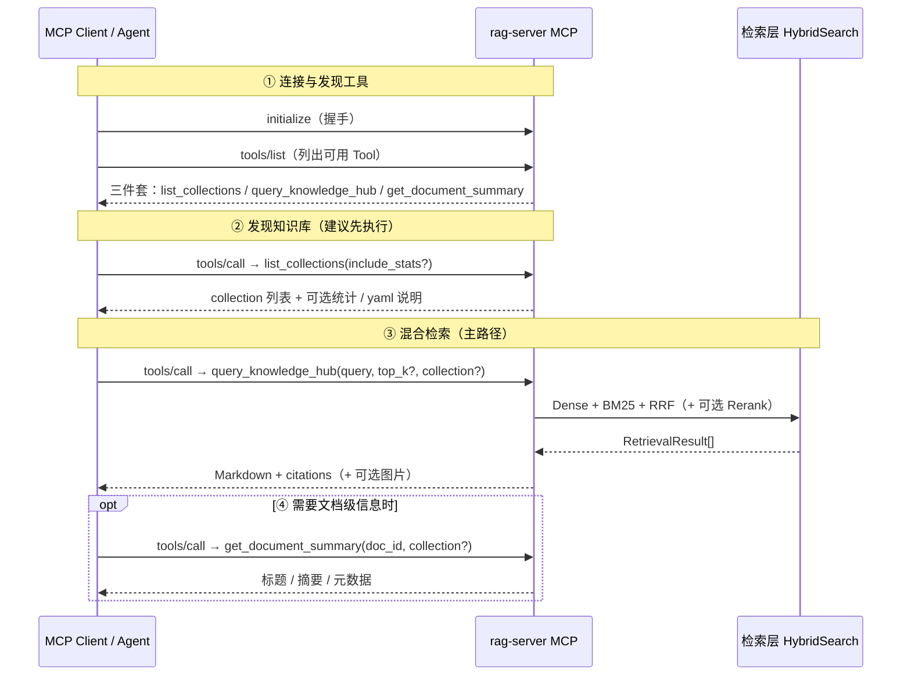

# rag-server 外接集成设计

> 内部设计笔记 · 说明外部系统如何通过 MCP 与 CLI 使用 rag-server 的检索与运维能力。

## 目录

- [TL;DR](#tldr)
- [1. 外接集成目标](#1-外接集成目标)
- [2. 外接设计原则](#2-外接设计原则)
- [3. 接入方式一：MCP](#3-接入方式一mcp)
  - [3.1 如何接入（Client 注册）](#31-如何接入client-注册)
  - [3.2 调用时序](#32-调用时序)
  - [3.3 三件套 Tool 概要](#33-三件套-tool-概要)
  - [3.4 返回格式](#34-返回格式)
  - [3.5 多 collection 策略](#35-多-collection-策略)
- [4. 接入方式二：CLI 脚本](#4-接入方式二cli-脚本)
  - [4.1 如何接入与使用](#41-如何接入与使用)
  - [4.2 接入后能干什么](#42-接入后能干什么)
  - [4.3 脚本速查](#43-脚本速查)
- [5. 接入案例：agents-master](#5-接入案例agents-master)
  - [5.1 注册方式](#51-注册方式)
  - [5.2 连接与调用流程](#52-连接与调用流程)
  - [5.3 相关路径](#53-相关路径)
- [6. 联调要点](#6-联调要点)

---

## TL;DR

rag-server 对外提供两条程序级接入路径：**MCP stdio**（Agent 运行时查库，生产主路径）与 **CLI 脚本**（本地入库、调试检索、批量评估）。二者与 Dashboard 共用同一套 Core 与 `config/settings.yaml`。ContextBridge 中 agents-master 通过 `config.json` 拉起 rag-server 子进程，Agent ReAct 循环里经 MCP 调用 rag-server 注册的三件套 Tool（自定义，非 MCP 协议内置）。

---

## 1. 外接集成目标


| 方式      | 服务谁                                              | 解决什么                                        | 典型能力                               |
| ------- | ------------------------------------------------ | ------------------------------------------- | ---------------------------------- |
| **MCP** | Copilot、Claude Desktop、自研 Agent（如 agents-master） | 对话/任务执行中**按需检索**私有知识库（返回 chunk；**不生成最终回答**） | 经 rag-server 自定义 Tool：列库、混合检索、文档摘要 |
| **CLI** | 开发者本机运维与调试                                       | **建库、验检索、跑评估**，不依赖 GUI                      | ingest、query --verbose、evaluate    |


架构背景见 [系统架构与模块选型.md](./系统架构与模块选型.md)；模块级目标见 [需求目标与模块设计.md](./需求目标与模块设计.md)。

---

## 2. 外接设计原则

1. **共享 Core**：MCP Tools、`scripts/query.py`、Dashboard 检索均走本项目 `HybridSearch` + 可选 `Reranker`，避免多套检索逻辑分叉。
2. **配置单一来源**：`rag-server/config/settings.yaml` 控制 Provider、top_k、默认 `collection_name`、重排开关等；Client 侧只负责拉起进程，不在 MCP 参数里重复一份密钥（Key 配在 rag-server 内）。**注意**：部分 MCP Tool 的默认 `collection`（如 `query_knowledge_hub` → `travel_plan`）与 yaml 的 `collection_name` 可能**不是同一配置项**，多库场景应显式传参（见 §3.5）。
3. **先发现再查询**：Agent 应先 `list_collections` 确认库名，再带 `collection` 调用 `query_knowledge_hub`。
4. **返回可核对**：检索结果经本项目 `CitationGenerator` 组装——Markdown 正文、`[1][2]` 引用标记及结构化 `citations`（来源路径、chunk_id、分数）；**非 MCP 协议规定的标准格式**。
5. **stdio 纪律**：MCP 协议要求 stdio 传输下 **stdout 仅输出协议消息**；日志与调试信息走 stderr（见 `src/mcp_server/server.py`）。

---

## 3. 接入方式一：MCP

MCP 接入 = 在 Client 侧**注册子进程**（command + args + cwd），由 Client 通过 stdio 拉起 `python -m src.mcp_server.server`，再调用 rag-server 注册的三件套 Tool。无 HTTP 端口；Key 与模型配置在 rag-server 的 `settings.yaml`，不在 Client 配置里重复一份。

### 3.1 如何接入（Client 注册）

在 Copilot / Cursor / Claude Desktop / 自研 Agent 的 MCP 配置中，增加 rag-server 子进程条目。**你需要配置的只有下面三项语义**（各 Client 配置文件路径与字段名不同）：

| 配置项 | 含义 |
|--------|------|
| `command` | Python 解释器，推荐 `rag-server/.venv/bin/python` |
| `args` | `["-m", "src.mcp_server.server"]` |
| `cwd` | **rag-server 工程根目录**（含 `src/`、`config/settings.yaml`） |

**独立 Client 示例**（路径按实际修改）：

```json
{
  "rag-server": {
    "command": "python",
    "args": ["-m", "src.mcp_server.server"],
    "cwd": "/path/to/rag-server",
    "transport": "stdio"
  }
}
```

接入后 Client 启动时会：`initialize` → `tools/list` 发现三件套 → 对话中 `tools/call` 调用（时序见 §3.2）。入库、评估等运维**不走 MCP**，用 §4 CLI 或 Dashboard。

### 3.2 调用时序

典型一次「发现库 → 检索 → 可选摘要」的 MCP 交互如下（协议方法 + 业务含义）：




| 阶段  | 协议动作                        | 业务含义                                      |
| --- | --------------------------- | ----------------------------------------- |
| ①   | `initialize` + `tools/list` | 建立会话，拿到 rag-server 注册的三个自定义 Tool          |
| ②   | `list_collections`          | 确认有哪些库、chunk 数量；多库时供 Agent 选 `collection` |
| ③   | `query_knowledge_hub`       | 对**单个** collection 做混合检索，返回可引用 chunk      |
| ④   | `get_document_summary`      | 可选；按 `doc_id` 拉整篇文档摘要，非每次必调               |


### 3.3 三件套 Tool 概要

> MCP 协议只规定 `tools/list`、`tools/call`；下表 Tool 名与语义由 **rag-server 自定义**（项目内称「三件套」）。实现：`src/mcp_server/tools/`。

| 工具 | 主要参数 | 能力与说明 |
|------|----------|------------|
| `list_collections` | `include_stats`（默认 true） | **发现知识库**：合并 Chroma 实库 + `config/collections.yaml` 说明（≠ Chroma API 直出）；可选 chunk 计数 |
| `query_knowledge_hub` | `query`（必填）、`top_k`（默认 5，最大 20）、`collection`（可选） | **混合检索**：Dense + BM25 + RRF（+ 可选 Rerank）；**只返回 Top-K chunk，不生成回答**；每次只查**一个** collection |
| `get_document_summary` | `doc_id`（必填）、`collection`（可选） | **文档摘要**：`doc_id` 为文件 SHA256 或哈希片段；取标题、摘要、标签、来源路径 |
| （检索命中） | — | 含图片的 chunk 可在响应中带 MCP 标准 `ImageContent` |

### 3.4 返回格式

`query_knowledge_hub` 经本项目 `ResponseBuilder` / `CitationGenerator` 组装为 **`MCPToolResponse`（项目内类型，非 MCP SDK 标准 schema）**：

- **TextContent**：人类可读的 Markdown，片段带 `[1]`、`[2]` 引用标号。  
- **可选 ImageContent**：检索结果关联图片时追加。  
- **结构化 JSON 文本块**：含 `citations`（`chunk_id`、`source`、`score`、`text_snippet`、`page` 等）与 `metadata`（query、result_count 等）。

Agent 侧通常直接把 TextContent 注入上下文；需要程序解析来源时可读 citations JSON。

### 3.5 多 collection 策略

**术语**：`collection` 借用 Chroma 命名空间概念；在本项目中指**一套隔离的索引单元**（Chroma 向量 + `data/db/bm25/{collection}/` + 图片目录等同步按名分目录）。具体库名如 `travel_plan`、`agent_notes` 为**本仓库业务约定**，非 RAG/Chroma 通用默认值。

扩展多领域库时，采用 **「先发现、再单库查询」**；选库信息由 **注册表 + 调用方** 共同完成：

1. **一库一 collection**（如 `travel_plan`、`agent_notes`）；入库时用 `-c` / Dashboard 指定。
2. **注册表**：`config/collections.yaml` 为每个库维护 `description`、`use_when`、`topics`；`list_collections` 合并 Chroma 实库列表与上述说明，供 Agent **按语义选库**（不再只靠库名猜测）。维护流程见 [知识库扩展计划.md](../知识库扩展计划.md) §8。
3. **通用流程（知识库问答等）**：`list_collections` → 根据说明与用户意图选一个库 → `query_knowledge_hub(..., collection="xxx")`。
4. **一次调用只打一个库**；跨库问题由 Agent **多次 query**（每次不同 `collection`），在上下文合并结果。
5. **垂直场景（旅行模式，集成方 agents-master）**：`pick_rag_collection()` 优先 `travel_plan` 等，**显式传** `collection`——属 **agents-master 集成逻辑**，非 rag-server MCP 协议行为。
6. **未传 `collection` 时（rag-server Tool 默认值）**：`query_knowledge_hub` 回退工具内默认 `travel_plan`；`get_document_summary` 回退 `settings.yaml` 的 `collection_name`——多库下应**显式传参**；后续宜统一为同一配置源。

当前不提供「一次 query 搜全部 collection」。若注册表 + prompt 仍不足（库很多、选错率仍高），再考虑 **LLM Router**（根据用户问题自动选库）或扩展 MCP API；`collections.yaml` 的 `topics` 可视为轻量「主题 → 库」提示，而非自动路由。

踩坑记录（[RAG测试问题与优化记录.md](../test-analysis/RAG测试问题与优化记录.md)）：

- **collection 不一致**：[文档 ingest 到 `travel_plan`，查询 `default`，怎么搜都是 0](../test-analysis/RAG测试问题与优化记录.md#2026-06-12-文档-ingest-到-travel_plan查询-default怎么搜都是-0)
- **选库与注册表**：[Agent 选库只靠 collection 名不靠谱 → 注册表 + 分场景定库](../test-analysis/RAG测试问题与优化记录.md#2026-06-27-agent-选库只靠-collection-名不靠谱--注册表--分场景定库)

---

## 4. 接入方式二：CLI 脚本

### 4.1 如何接入与使用

**接入方式**：无子进程注册、无 JSON-RPC。在 **rag-server 工程根目录** 用已安装依赖的 Python（推荐 `rag-server/.venv`）**直接执行** `scripts/` 下脚本；默认读 `config/settings.yaml`（可用 `--config` 覆盖）。

**典型命令**：

```bash
# 入库：文件或目录 → 指定 collection
python scripts/ingest.py -p data/sources/travel_plan/food -c travel_plan

# 检索调试：与 MCP 同源 HybridSearch，--verbose 看各 stage
python scripts/query.py -q "北京美食" -c travel_plan --verbose

# 批量评估：backend 读 settings.yaml 的 evaluation.provider（CLI 无 --backend）；须 -c 与 Golden Set 一致
python scripts/evaluate.py --test-set tests/fixtures/golden_test_set_20.json -c travel_plan

# collection 重命名（向量 + BM25 + 图片 + 入库历史联动）
python scripts/rename_collection.py --old default --new travel_plan
```

**注意**：

- `query.py` / `evaluate.py` 未传 `-c` 时默认 collection 为 **`default`**，联调时应显式传 `-c`（如 `travel_plan`）。
- `evaluate.py` 的 backend（`custom` / `ragas` / `composite`）由 `settings.yaml` → `evaluation.provider` 决定，命令行不能覆盖。

与 MCP 的分工：CLI 面向**本机**建库、冒烟检索、跑评估；Agent 在线检索走 §3。二者共用 Core；`query.py` 写 Trace，评估写 `eval_history`，可与 Dashboard 对照。

### 4.2 接入后能干什么

| 能力 | 说明 |
|------|------|
| 文档入库 | 单文件或目录批量写入指定 collection |
| 检索调试 | 命令行跑 HybridSearch，`--verbose` 打印 Dense / Sparse / Fusion / Rerank 各阶段 |
| 批量评估 | 对 Golden Test Set 跑 Custom / Ragas / Composite，输出报告 |
| collection 运维 | 重命名 collection（向量 + BM25 + 图片目录 + 入库历史联动） |

### 4.3 脚本速查

均在 `rag-server/` 根目录执行。`query.py` 会把 Trace 写入 `logs/traces.jsonl`。

| 脚本 | 用途 | 常用参数 |
|------|------|----------|
| `scripts/ingest.py` | 文档入库 | `-p` / `--path`、`-c` / `--collection`、`--force` |
| `scripts/query.py` | 检索调试（同 MCP Core） | `-q`、`-c`、`--top-k`、`--verbose`、`--no-rerank` |
| `scripts/evaluate.py` | Golden Set 批量评估 | `--test-set`、`--collection`、`--json` |
| `scripts/rename_collection.py` | collection 重命名迁移 | `--old`、`--new` |

---

## 5. 接入案例：agents-master

> 本节描述 **ContextBridge 集成方**（agents-master）如何拉起 rag-server；ReAct 循环、`pick_rag_collection()`、`MultiServerMCPClient` 等属 agents-master / LangChain 侧，**不是 rag-server 对外 API 的一部分**。

ContextBridge 单体仓库中，`agents-master` 与 `rag-server` 为**同级目录**。Agent 不内嵌 RAG 代码，而是通过 MCP 调用 rag-server，与调用高德、时间等 Server 相同。

### 5.1 注册方式

`agents-master/config.json` 片段：

```json
"rag-server": {
  "command": "python",
  "args": ["-m", "src.mcp_server.server"],
  "cwd": "../rag-server",
  "transport": "stdio"
}
```

`config/mcp_config.py` 中 `resolve_mcp_config()` 会：

1. 将相对 `cwd` 解析为基于 `agents-master` 目录的绝对路径；
2. 识别 rag-server 条目，优先将 `command` 替换为 `rag-server/.venv/bin/python`（若存在）；
3. 对其余 `python` 条目使用 agents-master 当前解释器。

rag-server 的 LLM / Embedding Key 配置在 `rag-server/config/settings.yaml`，与 agents-master 侧 `.env` 分离（百炼场景下两者 Key 通常相同，但配置文件独立）。

### 5.2 连接与调用流程

1. 用户启动 `agents-master` Streamlit 应用。
2. `initialize_session()` 读取 `config.json` → `resolve_mcp_config()` → 构造 `MultiServerMCPClient`。
3. `await client.get_tools()` 并行连接各 MCP Server（含 rag-server），合并为 LangGraph ReAct Agent 的工具列表。
4. 对话中模型按需调用 rag-server 三件套 Tool；检索到的 chunk 由 **agents-master Agent** 用于生成攻略等最终回答。

Agent 初始化与工具列表构建见 `agents-master/app.py` 中 `initialize_session`、`_build_agent_from_tools`。

### 5.3 相关路径

**集成时你需要改的配置**主要是 `agents-master/config.json` 中的 rag-server 条目（§5.1）。下表其余路径为**代码已实现**的解析与入口，一般**无需再配置**，仅供查阅或排障：

| 路径 | 是否需你配置 | 说明 |
|------|--------------|------|
| `agents-master/config.json` | **是** | 注册 rag-server 子进程：`command` / `args` / `cwd` |
| `agents-master/config/mcp_config.py` | 否 | 启动时解析 `cwd`、优先选用 `rag-server/.venv` 的 Python |
| `agents-master/config/paths.py` | 否 | 常量 `DEFAULT_RAG_SERVER_DIR` → `../rag-server` |
| `rag-server/src/mcp_server/server.py` | 否 | MCP 进程入口 |
| `rag-server/config/settings.yaml` | 在 **rag-server 侧**配置 | LLM / Embedding / 检索参数（与 agents-master `.env` 独立） |


更完整的 Agent 侧联调说明见 `agents-master/README.md` 中「完整 RAG 流程」一节。

---

## 6. 联调要点

MCP / CLI / Dashboard 接通过程中的**上线前自检清单**——按顺序排除「环境、配置、数据、库名不一致」等常见问题，确认 Agent 能稳定调到 rag-server。不是功能说明，而是**集成验收与排障入口**；细项踩坑见 [RAG测试问题与优化记录.md](../test-analysis/RAG测试问题与优化记录.md)。

按推荐顺序自检：

- [ ] **rag-server 依赖**：在 `rag-server` 目录 `pip install -e ".[dev]"`（或项目约定方式），`python -m src.mcp_server.server` 能常驻无报错。  
- [ ] **配置有效**：`config/settings.yaml` 中 LLM / Embedding Key、默认 `collection_name` 正确。  
- [ ] **已有数据**：对目标 collection 跑过 ingest（CLI 或 Dashboard），Chroma 与 `data/db/bm25/{collection}/` 均有数据。  
- [ ] **cwd 正确**：Client `config.json` 的 `cwd` 指向 rag-server 根目录；agents-master 相对路径为 `../rag-server`。  
- [ ] **Python 环境**：rag-server 使用含 chromadb 的 venv；`No module named chromadb` 多为解释器选错。  
- [ ] **collection 一致**：MCP 查询的 `collection` 与入库一致（如 `travel_plan`）；可先 `list_collections` 核对。  
- [ ] **CLI 冒烟**：`python scripts/query.py -q "测试" -c <collection> --verbose` 各阶段有命中。  
- [ ] **Trace 对照**：MCP 查询后检查 `logs/traces.jsonl` 与 Dashboard「检索记录」是否一致。  
- [ ] **stdout 纪律**：调试时不要向 stdout `print`，避免破坏 MCP 协议（日志用 stderr / `logging`）。