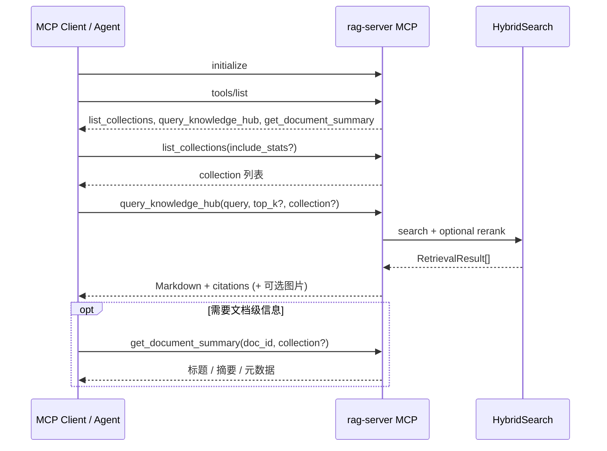

# rag-server 外接集成设计

> 内部设计笔记 · 说明外部系统如何通过 MCP 与 CLI 使用 rag-server 的检索与运维能力。

## 目录

- [TL;DR](#tldr)
- [1. 外接集成目标](#1-外接集成目标)
- [2. 外接设计原则](#2-外接设计原则)
- [3. 接入方式一：MCP](#3-接入方式一mcp)
  - [3.1 接入后能干什么](#31-接入后能干什么)
  - [3.2 设计原则](#32-设计原则)
  - [3.3 启动与 Client 注册](#33-启动与-client-注册)
  - [3.4 调用时序](#34-调用时序)
  - [3.5 工具概要](#35-工具概要)
  - [3.6 返回格式](#36-返回格式)
  - [3.7 多 collection 策略](#37-多-collection-策略)
- [4. 接入方式二：CLI 脚本](#4-接入方式二cli-脚本)
  - [4.1 接入后能干什么](#41-接入后能干什么)
  - [4.2 脚本能力概要](#42-脚本能力概要)
- [5. 接入案例：agents-master](#5-接入案例agents-master)
  - [5.1 注册方式](#51-注册方式)
  - [5.2 连接与调用流程](#52-连接与调用流程)
  - [5.3 相关路径](#53-相关路径)
- [6. 联调要点](#6-联调要点)

---

## TL;DR

rag-server 对外提供两条程序级接入路径：**MCP stdio**（Agent 运行时查库，生产主路径）与 **CLI 脚本**（本地入库、调试检索、批量评估）。二者与 Dashboard 共用同一套 Core 与 `config/settings.yaml`。ContextBridge 中 agents-master 通过 `config.json` 拉起 rag-server 子进程，Agent ReAct 循环里调用三件套 MCP Tools。

---

## 1. 外接集成目标

| 方式 | 服务谁 | 解决什么 | 典型能力 |
|------|--------|----------|----------|
| **MCP** | Copilot、Claude Desktop、自研 Agent（如 agents-master） | 对话/任务执行中**按需检索**私有知识库 | 列举 collection、混合检索、文档摘要 |
| **CLI** | 开发者本机运维与调试 | **建库、验检索、跑评估**，不依赖 GUI | ingest、query --verbose、evaluate |

架构背景见 [系统架构与模块选型.md](./系统架构与模块选型.md)；模块级目标见 [需求目标与模块设计.md](./需求目标与模块设计.md)。

---

## 2. 外接设计原则

1. **共享 Core**：MCP Tools、`scripts/query.py`、Dashboard 检索均走 `HybridSearch` + 可选 `Reranker`，避免多套检索逻辑分叉。  
2. **配置单一来源**：`rag-server/config/settings.yaml` 控制 Provider、top_k、默认 collection、重排开关等；Client 侧只负责拉起进程，不在 MCP 参数里重复一份密钥（Key 配在 rag-server 内）。  
3. **先发现再查询**：Agent 应先 `list_collections` 确认库名，再带 `collection` 调用 `query_knowledge_hub`。  
4. **返回可核对**：检索结果含 Markdown 正文、`[1][2]` 引用标记及结构化 `citations`（来源路径、chunk_id、分数），便于上层生成时标注依据。  
5. **stdio 纪律**：MCP 进程 stdout 仅输出协议消息；日志与调试信息走 stderr（见 `src/mcp_server/server.py`）。

---

## 3. 接入方式一：MCP

### 3.1 接入后能干什么

| 能力 | 说明 |
|------|------|
| 发现知识库 | 列出 Chroma 中已有 collection 及文档量 |
| 混合检索 | 对自然语言 query 做 Dense + BM25 + RRF（+ 可选 Rerank），返回 Top-K chunk |
| 文档摘要 | 按 `doc_id` 取标题、摘要预览、标签、来源路径 |
| 多模态片段 | 命中含图片的 chunk 时，响应可带 `ImageContent` 块 |

入库、批量评估、改配置等运维动作通过 **CLI 或 Dashboard** 完成，不通过 MCP Tools 暴露。

### 3.2 设计原则

- **传输**：stdio（子进程），无 HTTP 端口。  
- **SDK**：官方 Python `mcp` 包 + `ProtocolHandler` 注册 `tools/list`、`tools/call`。  
- **入口**：`python -m src.mcp_server.server`（工作目录为 `rag-server` 根目录）。  
- **重依赖预加载**：主线程预 import chromadb 等，降低工具线程首次调用卡死概率。

### 3.3 启动与 Client 注册

**独立 Client 最小注册示例**（路径按实际仓库位置修改）：

```json
{
  "rag-server": {
    "command": "python",
    "args": ["-m", "src.mcp_server.server"],
    "cwd": "/path/to/rag-server",
    "transport": "stdio"
  }
}
```

要点：

- `cwd` 必须指向 **rag-server 工程根**（含 `src/`、`config/settings.yaml`）。  
- 推荐使用 rag-server 自身虚拟环境中的 Python（如 `rag-server/.venv/bin/python`），确保已安装 `chromadb`、`mcp` 等依赖。  
- 各 MCP Client 的配置文件路径与字段名不同（VS Code Copilot、Cursor、Claude Desktop 等），但语义均为：command + args + cwd。

### 3.4 调用时序



### 3.5 工具概要

| 工具 | 主要参数 | 作用 |
|------|----------|------|
| `list_collections` | `include_stats`（默认 true） | 返回各 collection 名称；可选 chunk/文档计数 |
| `query_knowledge_hub` | `query`（必填）、`top_k`（默认 5，最大 20）、`collection`（可选） | 主检索入口；**每次调用只查一个 collection** |
| `get_document_summary` | `doc_id`（必填）、`collection`（可选） | 返回文档级摘要与元数据；`doc_id` 可为完整 ID 或哈希片段 |

实现位置：`src/mcp_server/tools/`。

### 3.6 返回格式

`query_knowledge_hub` 经 `ResponseBuilder` / `CitationGenerator` 组装为 `MCPToolResponse`：

- **TextContent**：人类可读的 Markdown，片段带 `[1]`、`[2]` 引用标号。  
- **可选 ImageContent**：检索结果关联图片时追加。  
- **结构化 JSON 文本块**：含 `citations`（`chunk_id`、`source`、`score`、`text_snippet`、`page` 等）与 `metadata`（query、result_count 等）。

Agent 侧通常直接把 TextContent 注入上下文；需要程序解析来源时可读 citations JSON。

### 3.7 多 collection 策略

扩展多领域库时，采用 **「先发现、再单库查询」**；选库信息由 **注册表 + 调用方** 共同完成：

1. **一库一 collection**（如 `travel_plan`、`agent_notes`）；入库时用 `-c` / Dashboard 指定。  
2. **注册表**：`config/collections.yaml` 为每个库维护 `description`、`use_when`、`topics`；`list_collections` 合并 Chroma 实库列表与上述说明，供 Agent **按语义选库**（不再只靠库名猜测）。维护流程见 [知识库扩展计划.md](../知识库扩展计划.md) §8。  
3. **通用流程（知识库问答等）**：`list_collections` → 根据说明与用户意图选一个库 → `query_knowledge_hub(..., collection="xxx")`。  
4. **一次调用只打一个库**；跨库问题由 Agent **多次 query**（每次不同 `collection`），在上下文合并结果。  
5. **垂直场景（旅行模式）**：agents-master 代码 `pick_rag_collection()` 优先 `travel_plan` 等，**显式传** `collection`，可不依赖模型自选。  
6. **未传 `collection` 时**：`query_knowledge_hub` 回退工具默认 `travel_plan`；`get_document_summary` 回退 `settings.yaml` 的 `collection_name`——多库下应**显式传参**；后续宜统一为同一配置源。

当前不提供「一次 query 搜全部 collection」。若注册表 + prompt 仍不足（库很多、选错率仍高），再考虑 **LLM Router**（根据用户问题自动选库）或扩展 MCP API；`collections.yaml` 的 `topics` 可视为轻量「主题 → 库」提示，而非自动路由。

踩坑记录见 [RAG测试问题与优化记录.md](../test-analysis/RAG测试问题与优化记录.md)（检索 §6/12 collection 不一致、MCP §6/27 选库注册表）。

---

## 4. 接入方式二：CLI 脚本

### 4.1 接入后能干什么

| 能力 | 说明 |
|------|------|
| 文档入库 | 单文件或目录批量写入指定 collection |
| 检索调试 | 命令行跑 HybridSearch，`--verbose` 打印 Dense / Sparse / Fusion / Rerank 各阶段 |
| 批量评估 | 对 Golden Test Set 跑 Custom / Ragas / Composite，输出报告 |
| collection 运维 | 重命名 collection（向量 + BM25 + 图片目录 + 入库历史联动） |

### 4.2 脚本能力概要

均在 **rag-server 根目录**、已安装依赖的 Python 环境下执行。

| 脚本 | 核心用途 | 常用参数 |
|------|----------|----------|
| `scripts/ingest.py` | `IngestionPipeline` 入库 | `--path`、`--collection`、`--force`、`--config` |
| `scripts/query.py` | 与 MCP 同源的检索链路 | `--query`、`--collection`、`--top-k`、`--verbose`、`--no-rerank` |
| `scripts/evaluate.py` | `EvalRunner` 批量评估 | `--test-set`、`--collection`、`--json` |
| `scripts/rename_collection.py` | collection 重命名迁移 | `--old`、`--new` |

检索脚本会把 Trace 写入 `logs/traces.jsonl`，便于与 Dashboard「检索记录」对照。

---

## 5. 接入案例：agents-master

ContextBridge 单体仓库中，`agents-master` 与 `rag-server` 为**同级目录**。Agent 不内嵌 RAG 代码，而是通过 MCP 调用 rag-server，与调用高德、时间等 Server 相同。

### 5.1 注册方式

`agents-master/config.json` 片段：

```json
"rag-server": {
  "command": "python",
  "args": ["-m", "src.mcp_server.server"],
  "cwd": "../rag-server",
  "transport": "stdio"
}
```

`config/mcp_config.py` 中 `resolve_mcp_config()` 会：

1. 将相对 `cwd` 解析为基于 `agents-master` 目录的绝对路径；  
2. 识别 rag-server 条目，优先将 `command` 替换为 `rag-server/.venv/bin/python`（若存在）；  
3. 对其余 `python` 条目使用 agents-master 当前解释器。

rag-server 的 LLM / Embedding Key 配置在 `rag-server/config/settings.yaml`，与 agents-master 侧 `.env` 分离（百炼场景下两者 Key 通常相同，但配置文件独立）。

### 5.2 连接与调用流程

1. 用户启动 `agents-master` Streamlit 应用。  
2. `initialize_session()` 读取 `config.json` → `resolve_mcp_config()` → 构造 `MultiServerMCPClient`。  
3. `await client.get_tools()` 并行连接各 MCP Server（含 rag-server），合并为 LangGraph ReAct Agent 的工具列表。  
4. 对话中模型按需调用 `list_collections`、`query_knowledge_hub`、`get_document_summary`；旅行等场景下 RAG 结果作为攻略依据之一。

Agent 初始化与工具列表构建见 `agents-master/app.py` 中 `initialize_session`、`_build_agent_from_tools`。

### 5.3 相关路径

| 路径 | 说明 |
|------|------|
| `agents-master/config.json` | MCP Server 注册表 |
| `agents-master/config/mcp_config.py` | `resolve_mcp_config`、Python 路径解析 |
| `agents-master/config/paths.py` | `DEFAULT_RAG_SERVER_DIR` 指向 `../rag-server` |
| `rag-server/src/mcp_server/server.py` | MCP 进程入口 |
| `rag-server/config/settings.yaml` | 检索与模型配置 |

更完整的 Agent 侧联调说明见 `agents-master/README.md` 中「完整 RAG 流程」一节。

---

## 6. 联调要点

按推荐顺序自检：

- [ ] **rag-server 依赖**：在 `rag-server` 目录 `pip install -e ".[dev]"`（或项目约定方式），`python -m src.mcp_server.server` 能常驻无报错。  
- [ ] **配置有效**：`config/settings.yaml` 中 LLM / Embedding Key、默认 `collection_name` 正确。  
- [ ] **已有数据**：对目标 collection 跑过 ingest（CLI 或 Dashboard），Chroma 与 `data/db/bm25/{collection}/` 均有数据。  
- [ ] **cwd 正确**：Client `config.json` 的 `cwd` 指向 rag-server 根目录；agents-master 相对路径为 `../rag-server`。  
- [ ] **Python 环境**：rag-server 使用含 chromadb 的 venv；`No module named chromadb` 多为解释器选错。  
- [ ] **collection 一致**：MCP 查询的 `collection` 与入库一致（如 `travel_plan`）；可先 `list_collections` 核对。  
- [ ] **CLI 冒烟**：`python scripts/query.py -q "测试" -c <collection> --verbose` 各阶段有命中。  
- [ ] **Trace 对照**：MCP 查询后检查 `logs/traces.jsonl` 与 Dashboard「检索记录」是否一致。  
- [ ] **stdout 纪律**：调试时不要向 stdout `print`，避免破坏 MCP 协议（日志用 stderr / `logging`）。

---

**文档状态**：✅ 已撰写
