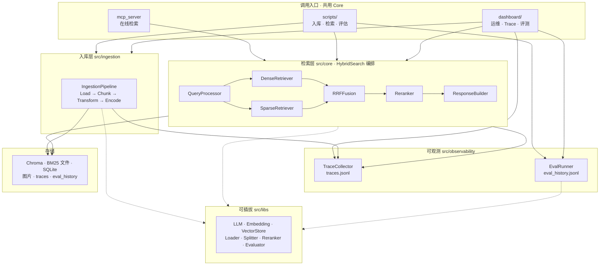

# rag-server 系统架构与模块选型

> 内部设计笔记 · 说明系统如何分层、各流程环节的技术选型及选型原因。

## 目录

- [TL;DR](#tldr)
- [1. 整体架构图](#1-整体架构图)
- [2. 入库链路选型](#2-入库链路选型)
- [3. 检索链路选型](#3-检索链路选型)
- [4. 可观测链路选型](#4-可观测链路选型)
- [5. 评估链路选型](#5-评估链路选型)
- [6. MCP 对外服务选型](#6-mcp-对外服务选型)
- [7. 可插拔架构](#7-可插拔架构)

---

## TL;DR

分层架构：**入库层 → 检索层 → 可观测**；数据落 **Chroma（Dense）+ 自研 BM25 文件索引（Sparse）+ SQLite**；检索编排为 **Hybrid Search（RRF）+ 可选 Rerank**（`HybridSearch`）；**MCP / CLI / Dashboard** 三条入口共用 Core；对外经 **MCP stdio** 暴露自定义三件套 Tool；可观测为 **Trace JSONL + Streamlit Dashboard**。

---

## 1. 整体架构图

**分层说明**

| 层            | 职责                                | 典型模块                                                                                 |
| ------------ | --------------------------------- | ------------------------------------------------------------------------------------ |
| **调用入口**     | 对外暴露能力；**不重复实现**检索/入库逻辑           | `mcp_server`、`scripts/`、`dashboard/`                                                 |
| **入库层**      | 文档 → chunk → 双路写入                 | `IngestionPipeline`                                                                  |
| **检索层**      | Query → 双路召回 → 融合 → 精排 → citation | `HybridSearch` 编排 `QueryProcessor` → Dense/Sparse → RRF → Rerank → `ResponseBuilder` |
| **可观测**      | 链路回放与评估历史                         | `TraceCollector`、`EvalRunner`、Dashboard                                              |
| **可插拔 libs** | 厂商/算法 Adapter                     | `*Factory` 按 `settings.yaml` 切换                                                      |
| **存储**       | 向量、稀疏索引、元数据与日志落盘                  | `data/db/`、`logs/`                                                                   |

**主数据流**

1. **入库**：调用入口 → `IngestionPipeline` → Chroma + 本项目 BM25 文件索引（按 `collection` 隔离）
2. **检索**：调用入口 → 检索层（Dense ∥ Sparse → RRF → 可选 Rerank → Citation）→ 返回 Top-K chunk（**不生成最终回答**）
3. **观测**：入库/检索各 stage 写入 Trace；评估写入 `eval_history.jsonl`；Dashboard 回放

更简版流程见 [整体设计和流程.md](../整体设计和流程.md)。

---

## 2. 入库链路选型

每项含 **目的**、**最终选型**（在本项目中的功能）、**备选及不足**。

### 2.1 文档加载（Loader）

| 项         | 内容                                                                                                                    |
| --------- | --------------------------------------------------------------------------------------------------------------------- |
| **目的**    | 把多格式源文件解析为统一 `Document`，供分块与入库                                                                                        |
| **最终选型**  | 按扩展名工厂路由：`PdfLoader`（正文+图片落盘）、`TxtLoader`、`MarkItDownLoader`（docx/md 等）→ `get_loader_for_path`；便于 Dashboard/CLI 同路径入库 |
| **备选及不足** | 纯 PyMuPDF：难统一抽图；Unstructured：重依赖、部署重；按格式写死脚本：每加格式改多处                                                                  |

### 2.2 完整性检查

| 项         | 内容                                                                                  |
| --------- | ----------------------------------------------------------------------------------- |
| **目的**    | 避免未变更文件重复 Embedding，并稳定 `doc_id`                                                    |
| **最终选型**  | `SQLiteIntegrityChecker`：文件 SHA256 作 `doc_id`；未 `--force` 时跳过已成功文件，与 chunk_id 前缀可追溯 |
| **备选及不足** | 每次全量重跑：浪费 API 与耗时；仅比文件名：重命名/拷贝会误判                                                   |

### 2.3 分块（Splitter / Chunker）

| 项         | 内容                                                                                                                                   |
| --------- | ------------------------------------------------------------------------------------------------------------------------------------ |
| **目的**    | 把长文档切成可检索 chunk，并生成项目元数据契约                                                                                                           |
| **最终选型**  | `RecursiveSplitter`（`langchain-text-splitters`）+ `DocumentChunker` 产出 `chunk_id`、metadata、`chunk_index`；与 libs 解耦，供检索与 Golden Set 对齐 |
| **备选及不足** | 定长切分：易断句；按页切：块大小不均；Semantic Chunking：需额外模型与延迟                                                                                        |

默认 `chunk_size=1000`、`chunk_overlap=200`（`settings.yaml` → `ingestion`）。

### 2.4 增强（Transform）

| 项         | 内容                                                                                           |
| --------- | -------------------------------------------------------------------------------------------- |
| **目的**    | 提升 chunk 可搜性与可解释性（可选，不阻断主链路）                                                                 |
| **最终选型**  | `ChunkRefiner`（去噪）、`MetadataEnricher`（标题/关键词）、`ImageCaptioner`（Vision LLM 将图写入文本）；配置开关，失败可降级 |
| **备选及不足** | 仅原文入库：PDF 图表不可搜；独立多模态向量库：架构分叉、运维成本高                                                          |

### 2.5 向量化（Embedding）

| 项         | 内容                                                                                       |
| --------- | ---------------------------------------------------------------------------------------- |
| **目的**    | 为 Dense 检索生成向量并批量写入 Chroma                                                               |
| **最终选型**  | `EmbeddingFactory` → OpenAI 兼容 API（百炼等）/ Azure / Ollama；`BatchProcessor` 批量请求，适配云 API 限流 |
| **备选及不足** | 本地 sentence-transformers 常驻：占内存、模型选型绑定机器；单条同步：入库慢、易触发限流                                  |

### 2.6 稀疏编码与 BM25 索引

| 项         | 内容                                                                                                          |
| --------- | ----------------------------------------------------------------------------------------------------------- |
| **目的**    | 为专名/关键词提供 Sparse 召回，与 Dense 互补                                                                              |
| **最终选型**  | `SparseEncoder`（jieba 分词）→ 本项目 `BM25Indexer` 落盘 `data/db/bm25/{collection}/`；与 Chroma 同 collection 隔离，无额外服务 |
| **备选及不足** | Elasticsearch：需独立集群；Chroma 内置稀疏：版本/能力不确定；仅 Dense：专名与缩写召回弱                                                   |

### 2.7 向量写入（Upsert）

| 项         | 内容                                                                                                                     |
| --------- | ---------------------------------------------------------------------------------------------------------------------- |
| **目的**    | 持久化 Dense 向量与图片资源，按 collection 隔离                                                                                      |
| **最终选型**  | `ChromaStore`（`data/db/chroma`）+ `VectorUpserter`；`ImageStorage`（`data/images/{collection}/`）；`BaseVectorStore` 抽象便于替换 |
| **备选及不足** | Milvus/Qdrant/pgvector：私有本地场景运维更重；本项目优先零端口嵌入式部署                                                                        |

### 2.8 入库历史

| 项         | 内容                                                                        |
| --------- | ------------------------------------------------------------------------- |
| **目的**    | 文档级列表/删除/重跑，与向量库职责分离                                                      |
| **最终选型**  | SQLite `ingestion_history.db` + Dashboard `DataService`；删除时可联动 BM25 目录与图片 |
| **备选及不足** | 仅 Chroma 元数据：文档级运维弱；无历史表：面板难以管理已入库文件                                      |

---

## 3. 检索链路选型

由 `HybridSearch` 编排下列环节；MCP、CLI、Dashboard **共用同一路径**。

### 3.1 Query 预处理

| 项         | 内容                                                          |
| --------- | ----------------------------------------------------------- |
| **目的**    | 为 BM25 路提供分词关键词，并统一 Query 结构                                |
| **最终选型**  | `QueryProcessor`：jieba 提关键词 + 可选 filter；输出供 Dense/Sparse 共用 |
| **备选及不足** | 原始 query 直接 embedding：Sparse 路无词项；LLM 查询改写：延迟与成本高，留作扩展      |

### 3.2 稠密检索（Dense）

| 项         | 内容                                                                                 |
| --------- | ---------------------------------------------------------------------------------- |
| **目的**    | 语义相似召回，覆盖换说法、同义表达                                                                  |
| **最终选型**  | `DenseRetriever`：query embedding → `VectorStore.query`（Chroma）；默认 `dense_top_k=20` |
| **备选及不足** | 本地暴力余弦：数据量大不可扩展；已保留 VectorStore 抽象以便换库                                             |

### 3.3 稀疏检索（Sparse）

| 项         | 内容                                                                |
| --------- | ----------------------------------------------------------------- |
| **目的**    | 专名、缩写、中英混排等 Dense 弱场景补足召回                                         |
| **最终选型**  | `SparseRetriever` + 本项目 `BM25Indexer.search`；默认 `sparse_top_k=20` |
| **备选及不足** | 仅 Dense：产品名/库名类 query 易漏召；外接 ES：多一跳运维                             |

### 3.4 融合（RRF）

| 项         | 内容                                                      |
| --------- | ------------------------------------------------------- |
| **目的**    | 合并 Dense/Sparse 两路排名，不依赖分数尺度一致                          |
| **最终选型**  | `RRFFusion`，`rrf_k=60`，输出 `fusion_top_k=10`；行业通用 RRF 算法 |
| **备选及不足** | 线性加权：两路分数量纲不同难调参；单路：丢失互补能力                              |

### 3.5 重排（Rerank）

| 项         | 内容                                                                                                       |
| --------- | -------------------------------------------------------------------------------------------------------- |
| **目的**    | 在粗排 Top-N 内提升最相关 chunk 的排序精度                                                                             |
| **最终选型**  | `CoreReranker` + `RerankerFactory`：`cross_encoder`（如 ms-marco-MiniLM）或 `llm`；`top_k=5`；`enabled` 可关以权衡延迟 |
| **备选及不足** | 仅粗排：Top-3 展示时常「沾边但排后」；Cohere API：额外 Key 与费用                                                              |

一路失败时 **降级**：`HybridSearch` 仅用另一路结果继续融合。

---

## 4. 可观测链路选型

### 4.1 Trace 模型与落盘

| 项         | 内容                                                                                                                  |
| --------- | ------------------------------------------------------------------------------------------------------------------- |
| **目的**    | 白盒回放每次入库/检索 stage，支撑调优与排障                                                                                           |
| **最终选型**  | 本项目 `TraceContext` + `TraceCollector`；检索 stage：dense / sparse / fusion / rerank；追加 `logs/traces.jsonl`，Dashboard 直读 |
| **备选及不足** | 仅应用日志：难对照阶段命中数；OpenTelemetry：RAG 字段需大量定制，过重                                                                         |

### 4.2 Dashboard

| 项         | 内容                                                                                                              |
| --------- | --------------------------------------------------------------------------------------------------------------- |
| **目的**    | 人工运维入口：入库、浏览、Trace 回放、跑评估                                                                                       |
| **最终选型**  | Streamlit 六页：`overview`、`data_browser`、`ingestion_manager`、`ingestion_traces`、`query_traces`、`evaluation_panel` |
| **备选及不足** | FastAPI+React：迭代慢；Grafana：难做 chunk 级回放与入库操作                                                                     |

评估与 Trace 衔接见 [评估体系设计.md](./评估体系设计.md)。

---

## 5. 评估链路选型

体系设计与指标定义见 [评估体系设计.md](./评估体系设计.md)；此处仅列组件选型。

### 5.1 Custom Evaluator

| 项         | 内容                                                                           |
| --------- | ---------------------------------------------------------------------------- |
| **目的**    | 廉价、可重复的检索回归（是否召回到标注 chunk）                                                   |
| **最终选型**  | 本项目 `CustomEvaluator`：对比 `expected_chunk_ids` 算 **hit_rate**、**MRR**；不调用 LLM |
| **备选及不足** | 纯人工 spot check：不可自动化；仅 Ragas：无法客观衡量「搜没搜到」                                    |

### 5.2 Ragas

| 项         | 内容                                                                                                         |
| --------- | ---------------------------------------------------------------------------------------------------------- |
| **目的**    | 衡量基于检索上下文的回答质量（忠实度、相关性等）                                                                                   |
| **最终选型**  | 社区库指标 `faithfulness` / `answer_relevancy` / `context_precision`；本项目 `RagasEvaluator` 包装 + 中文 prompt + 百炼兼容 |
| **备选及不足** | 自研 LLM 打分：指标口径难统一；DeepEval：生态与 Ragas 场景重叠，迁移收益小                                                            |

### 5.3 Composite

| 项         | 内容                                                                     |
| --------- | ---------------------------------------------------------------------- |
| **目的**    | 一次回归同时看检索与回答两类指标                                                       |
| **最终选型**  | 本项目 `CompositeEvaluator`：顺序跑 custom + ragas，合并 metrics；子失败写 `warnings` |
| **备选及不足** | 面板分两次手点：易漏跑、历史难对齐                                                      |

### 5.4 Golden Test Set

| 项         | 内容                                                                                                        |
| --------- | --------------------------------------------------------------------------------------------------------- |
| **目的**    | 固定 query 集 + 标注，支撑 PR 级检索/回答回归                                                                            |
| **最终选型**  | JSON `tests/fixtures/golden_test_set*.json`（`query`、`expected_chunk_ids`、`reference_answer`、`collection`） |
| **备选及不足** | 数据库维护：版本与 pytest 同步麻烦；无固定集：改配置后无法客观对比                                                                     |

### 5.5 评估执行与历史

| 项         | 内容                                                                        |
| --------- | ------------------------------------------------------------------------- |
| **目的**    | 批量跑 Golden Set 并保留历次结果曲线                                                  |
| **最终选型**  | `EvalRunner` + `scripts/evaluate.py` CLI + 面板写入 `logs/eval_history.jsonl` |
| **备选及不足** | 仅单次脚本：无历史对比、面板无法联动                                                        |

---

## 6. MCP 对外服务选型

### 6.1 协议与 SDK

| 项         | 内容                                                                           |
| --------- | ---------------------------------------------------------------------------- |
| **目的**    | 以行业标准协议暴露检索能力，零 HTTP 端口                                                      |
| **最终选型**  | 官方 Python `mcp` SDK；JSON-RPC 2.0；**stdio** 传输；与 Copilot/Claude 等 Client 默认对接 |
| **备选及不足** | 自研 JSON-RPC：与生态 Client 不兼容；MCP over HTTP/SSE：需端口与部署，非当前主路径                   |

### 6.2 进程与日志约束

| 项         | 内容                                                                        |
| --------- | ------------------------------------------------------------------------- |
| **目的**    | 子进程稳定运行 MCP，避免协议流被污染或首次调用卡死                                               |
| **最终选型**  | `python -m src.mcp_server.server`；stdout 仅协议消息；日志走 stderr；主线程预加载 chromadb |
| **备选及不足** | 同进程内嵌库调用：与 Agent 耦合、chromadb 懒加载易死锁                                       |

### 6.3 工具设计

以下为 rag-server 在 MCP（标准协议）上注册的**自定义 Tool**（项目内称三件套），非协议标准 API。

| 工具                     | 职责                                            |
| ---------------------- | --------------------------------------------- |
| `list_collections`     | 发现知识库及统计（Chroma 实库 + `collections.yaml`）      |
| `query_knowledge_hub`  | 调用检索层 HybridSearch + Rerank，返回本项目 citation 格式 |
| `get_document_summary` | 按本项目 `doc_id`（SHA256）取文档摘要与元信息                |

集成用法见 [外接集成设计.md](./外接集成设计.md)。

---

## 7. 可插拔架构

> 为了保证项目的易读性和快速配置，考虑项目架构的可插拔设计。「可插拔」= 开发时换后端（改配置或加 Adapter）。
>
> §1～§6 的设计是「每条链路**选什么技术**」；本节设计的是「代码**怎么组织**，换技术时少动主流程」。  
> **易变部分**（LLM、Embedding、向量库等）收进 `src/libs/`；**主链路**（`IngestionPipeline`、`HybridSearch`、MCP Tool）保持稳定。

**建议阅读顺序**：§7.1 四条机制一览 → §7.2 实操三张表 → §7.3 目录分层（查代码位置时用）。

### 7.1 四条机制一览

| 机制       | 解决什么                      | 本项目怎么做                                                                                                                                                                                | §7.2 对应                         |
| -------- | ------------------------- | ------------------------------------------------------------------------------------------------------------------------------------------------------------------------------------- | ------------------------------- |
| **分层约定** | 换厂商别改整条入库/检索链路            | 易变 Adapter → `src/libs/`；主流程 → `src/ingestion/`、`src/core/` 等（目录见 §7.3）                                                                                                               | 第二表改 `libs/`；第三表目录**不能**只改 yaml |
| **工厂模式** | yaml 里 `provider` 谁翻译成具体类 | `*Factory.create(settings)`（`LLM` / `Embedding` / `VectorStore` / `Reranker` / `Evaluator` / `Splitter`）；新厂商：实现 `Base*` → `register_provider` → yaml 增 `provider`；主流程不 `import` 具体厂商类 | 第二表「怎么改」                        |
| **配置驱动** | 日常调参、换**已注册**厂商只动配置       | `config/settings.yaml` 为入口；改后**重启 MCP**（或 agents-master）；Dashboard `ConfigService` 可多 profile                                                                                         | **第一表**全部                       |
| **类型契约** | 换 Adapter 后上层调用方仍稳定       | `src/core/types.py`：`Document`、`Chunk`、`RetrievalResult` 等；入库出 `Chunk`，检索出 `RetrievalResult`，MCP 再组 citation                                                                          | 第二表「主流程不用改」的原因                  |

**串例（换 Embedding 为 Ollama）**：改 yaml `embedding.provider`（配置）→ `EmbeddingFactory.create`（工厂）→ 实现落在 `libs/embedding/`（分层）→ `DenseRetriever` 仍只调 `embed()`（类型契约）。

### 7.2 能改什么、在哪改、怎么改

下面三张表回答「支持改什么 → 改哪个文件/目录 → 典型操作」。**多数日常调优只动 `config/settings.yaml`，不必改 Python。**

#### 支持通过配置替换或调参（优先改 yaml）

| 想改什么                     | 改哪里                              | 怎么改                                                                                   |
| ------------------------ | -------------------------------- | ------------------------------------------------------------------------------------- |
| 主 LLM（分块精炼、元数据增强、LLM 重排） | `settings.yaml` → `llm`          | 改 `provider`（`openai` / `azure` / `deepseek` / `ollama`）、`model`、`base_url`、`api_key` |
| 向量 Embedding             | `settings.yaml` → `embedding`    | 改 `provider`（`openai` / `azure` / `ollama`）、`model`、`dimensions`                      |
| 视觉 LLM（PDF 图片描述）         | `settings.yaml` → `vision_llm`   | 改 `enabled`、`model` 等；实现由 `LLMFactory` 选 Vision Adapter                               |
| 向量库后端                    | `settings.yaml` → `vector_store` | 改 `provider`（当前注册 `**chroma`**）、`persist_directory`、`collection_name`                 |
| 重排模型 / 开关                | `settings.yaml` → `rerank`       | `enabled: true/false`；`provider`: `none` / `cross_encoder` / `llm`                    |
| 检索 Top-K、RRF             | `settings.yaml` → `retrieval`    | 改 `dense_top_k`、`sparse_top_k`、`fusion_top_k`、`rrf_k`                                 |
| 分块大小与策略                  | `settings.yaml` → `ingestion`    | 改 `chunk_size`、`chunk_overlap`；`splitter: recursive`（工厂已注册）                           |
| 评估后端与指标                  | `settings.yaml` → `evaluation`   | 改 `provider`（`custom` / `ragas` / `composite`）、`metrics`、`backends`                   |
| 开发时对比多套配置                | Dashboard「运行概览」或 `ConfigService` | 切换 profile，仍读 yaml 结构                                                                 |

改完 yaml 后：**重启 MCP 进程**（或重启 agents-master）使检索/入库侧重新 `load_settings()`；Dashboard 刷新即可。

#### 需写代码才能换/增（改 `src/libs/` + 工厂注册）

| 想改什么                                   | 改哪里                                                                                                              | 怎么改                                                                                 |
| -------------------------------------- | ---------------------------------------------------------------------------------------------------------------- | ----------------------------------------------------------------------------------- |
| **接入新的云厂商或本地模型**（yaml 里没有的 `provider`） | 1. `src/libs/<模块>/` 新建类，继承 `Base`* 2. `*_factory.py` 里 `register_provider` 3. `settings.yaml` 增加 `provider: xxx` | 参考 `OpenAIEmbedding`、`OllamaLLM`；主流程 `ingestion/`、`core/` **不用改**                   |
| 新增向量库（如 Qdrant）                        | `src/libs/vector_store/` + `VectorStoreFactory`                                                                  | 实现 `BaseVectorStore`，在 `vector_store/__init__.py` 注册；yaml 改 `vector_store.provider` |
| 新增评估器                                  | `src/libs/evaluator/` + `EvaluatorFactory`                                                                       | 实现 `BaseEvaluator` 并注册                                                              |

工厂入口：`EmbeddingFactory` / `LLMFactory` / `VectorStoreFactory` / `RerankerFactory` / `EvaluatorFactory` / `SplitterFactory`（均在 `src/libs/` 下）。

#### 不在「可插拔」范围内（改这些会动主链路）

| 内容                                 | 说明        | 若要改，大致动哪里                                |
| ---------------------------------- | --------- | ---------------------------------------- |
| BM25 文件索引、RRF 编排、`HybridSearch` 阶段 | 本项目固定检索实现 | `src/core/`、`src/ingestion/` 稀疏编码相关      |
| Trace stage 划分、`traces.jsonl` 格式   | 本项目可观测约定  | `src/core/trace`*、`observability/`       |
| MCP 三件套 Tool 名与参数                  | 项目自定义 API | `src/mcp_server/tools/`                  |
| Citation 返回格式                      | 项目自定义     | `src/core/response*`、`CitationGenerator` |
| Golden Set JSON 字段                 | 项目测试约定    | `tests/fixtures/`、`CustomEvaluator`      |

**决策口诀**：先查第一表能否只改 yaml → yaml 有 `provider` 但无实现则走第二表 → 动第三表内容则改主链路。

### 7.3 目录分层

查代码或判断「该改哪一层」时用下表（对应 §7.1 分层约定、§7.2 第二/三表的「改哪里」）。

| 目录                   | 职责                            | 换技术时   |
| -------------------- | ----------------------------- | ------ |
| `src/libs/`          | 厂商/算法 **Adapter**             | **常改** |
| `src/ingestion/`     | 入库流水线（调 libs，写 Chroma + BM25） | **少改** |
| `src/core/`          | 检索编排、Settings、Trace、Response  | **少改** |
| `src/mcp_server/`    | MCP 协议与 Tool                  | **少改** |
| `src/observability/` | Dashboard、评估编排                | **少改** |

---

