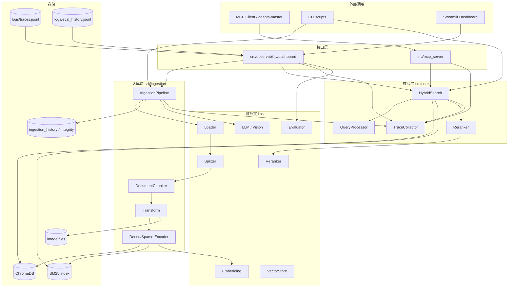

# rag-server 系统架构与模块选型

> 内部设计笔记 · 说明系统如何分层、各流程环节的技术选型及选型原因。

## 目录

- [TL;DR](#tldr)
- [1. 整体架构图](#1-整体架构图)
- [2. 入库链路选型](#2-入库链路选型)
- [3. 检索链路选型](#3-检索链路选型)
- [4. 可观测链路选型](#4-可观测链路选型)
- [5. 评估链路选型](#5-评估链路选型)
- [6. MCP 对外服务选型](#6-mcp-对外服务选型)
- [7. 可插拔架构](#7-可插拔架构)

---

## TL;DR

分层架构：**Ingestion → Core（检索）→ Observability / MCP 接口**；数据落 **Chroma（Dense，当前默认选型）+ 自研 BM25 文件索引（Sparse）+ SQLite（入库历史/完整性）**；检索编排为通用 **Hybrid Search（RRF）+ 可选 Rerank**，由本项目 `HybridSearch` 实现；对外经 **MCP stdio（标准协议）** 暴露 rag-server 自定义三件套 Tool；可观测为本项目 **Trace JSONL** + Streamlit Dashboard。

---

## 1. 整体架构图

**主数据流**

1. **入库**：文件 → Loader → Splitter/Chunker → Transform → Embedding → Chroma + 本项目 BM25 文件索引（按 `collection` 分目录）  
2. **检索**：Query → Dense ∥ Sparse → RRF（通用算法）→（可选）Rerank → Top-K + 本项目 Citation 组装  
3. **观测**：各 stage 写入**本项目 Trace**；Dashboard 读取展示；评估结果写入 `eval_history.jsonl`

更简版流程见 [整体设计和流程.md](../整体设计和流程.md)。

---

## 2. 入库链路选型

每项格式：**最终选型 → 备选 → 原因**。

### 2.1 文档加载（Loader）

| 项 | 内容 |
|----|------|
| **最终选型** | 按扩展名路由：`PdfLoader`（提取正文+图片）、`TxtLoader`、`MarkItDownLoader`（docx 等），工厂 `get_loader_for_path` |
| **备选** | 纯 PyMuPDF 文本抽取；Unstructured；单独为每种格式写死脚本 |
| **原因** | PDF 需图片落盘供 Caption；docx/md 用 MarkItDown 统一转文本；工厂便于后续加格式 |

### 2.2 完整性检查

| 项 | 内容 |
|----|------|
| **最终选型** | `SQLiteIntegrityChecker`，文件 SHA256 作为 `doc_id`，未 `--force` 时跳过未变更文件 |
| **备选** | 每次全量重跑；仅用文件名判断 |
| **原因** | 降低重复 Embedding 成本；doc_id 与 chunk_id 前缀可追溯 |

### 2.3 分块（Splitter / Chunker）

| 项 | 内容 |
|----|------|
| **最终选型** | `RecursiveSplitter`（`langchain-text-splitters`）+ `DocumentChunker` 生成业务 `Chunk`（chunk_id、metadata、chunk_index） |
| **备选** | 定长字符切分；按页切分；Semantic Chunking（需额外模型） |
| **原因** | 递归切分兼顾段落边界；Chunker 层统一 ID 与元数据契约，与 libs 层解耦 |

默认 `chunk_size=1000`、`chunk_overlap=200`（`settings.yaml` → `ingestion`）。

### 2.4 增强（Transform）

| 项 | 内容 |
|----|------|
| **最终选型** | 可选三路：`ChunkRefiner`（规则/可选 LLM 去噪）、`MetadataEnricher`（标题/关键词等）、`ImageCaptioner`（Vision LLM 描述图并写入 chunk 文本） |
| **备选** | 仅原始文本入库；多模态单独向量库 |
| **原因** | Image-to-Text 复用现有文本检索链路即可「搜文字出图」；LLM 增强配置开关，失败可降级不阻断流水线 |

### 2.5 向量化（Embedding）

| 项 | 内容 |
|----|------|
| **最终选型** | `EmbeddingFactory` → OpenAI 兼容 API（百炼 `text-embedding-v3` 等）/ Azure / Ollama；`BatchProcessor` 批量写入 |
| **备选** | 本地 sentence-transformers 常驻；单条同步请求 |
| **原因** | 与 LLM 同走 OpenAI 兼容协议，换 Provider 成本低；batch 适配云 API 限流 |

### 2.6 稀疏编码与 BM25 索引

| 项 | 内容 |
|----|------|
| **最终选型** | `SparseEncoder`（**jieba** 分词 + 词频统计）→ **本项目** `BM25Indexer` 落盘 `data/db/bm25/{collection}/`（通用 BM25 算法，**非** Chroma/Elasticsearch 内置稀疏检索） |
| **备选** | Elasticsearch / Whoosh；仅用 Chroma 内置稀疏（若版本支持） |
| **原因** | 中文场景 jieba 够用；本地文件索引与 Chroma 并列，无额外服务依赖；collection 级隔离与向量库对齐 |

### 2.7 向量写入（Upsert）

| 项 | 内容 |
|----|------|
| **最终选型** | `ChromaStore` 持久化目录 `data/db/chroma`；`VectorUpserter` 按 collection 写入；`ImageStorage` 存 `data/images/{collection}/` |
| **备选** | Milvus / Qdrant / pgvector |
| **原因** | Chroma 本地嵌入式、零运维，适合私有部署与本地运维；抽象 `BaseVectorStore` 保留替换空间 |

### 2.8 入库历史

| 项 | 内容 |
|----|------|
| **最终选型** | SQLite `ingestion_history.db` + Dashboard `DataService` 列表/删除 |
| **备选** | 仅 Chroma 元数据；无历史表 |
| **原因** | 文档级管理（列表、删除、重跑）与向量库职责分离，删除时可联动 BM25 与图片目录 |

---

## 3. 检索链路选型

### 3.1 Query 预处理

| 项 | 内容 |
|----|------|
| **最终选型** | `QueryProcessor`：提取关键词（jieba）、可选 filter |
| **备选** | 原始 query 直接 embedding；LLM 查询改写 |
| **原因** | 为 BM25 提供分词；改写留作后续扩展，控制延迟 |

### 3.2 稠密检索（Dense）

| 项 | 内容 |
|----|------|
| **最终选型** | `DenseRetriever`：query embedding → `VectorStore.query`，默认 `dense_top_k=20` |
| **备选** | 暴力余弦本地矩阵；多向量库抽象已支持替换 |
| **原因** | 标准 Bi-Encoder 语义召回，解决换说法、同义表达 |

### 3.3 稀疏检索（Sparse）

| 项 | 内容 |
|----|------|
| **最终选型** | `SparseRetriever` + `BM25Indexer.search`，默认 `sparse_top_k=20` |
| **备选** | 仅 Dense；Elasticsearch BM25 |
| **原因** | 专名、缩写、中英混排场景 Dense 弱，BM25 补足 |

### 3.4 融合（RRF）

| 项 | 内容 |
|----|------|
| **最终选型** | `RRFFusion`，`rrf_k=60`，输出 `fusion_top_k=10` |
| **备选** | 线性加权分数；仅取 Dense 或 Sparse 单路 |
| **原因** | RRF 不依赖两路分数尺度一致，工程上稳定；参数可配置 |

### 3.5 重排（Rerank）

| 项 | 内容 |
|----|------|
| **最终选型** | `CoreReranker` 门面 + `RerankerFactory`：`cross_encoder`（如 ms-marco-MiniLM）或 `llm` 重排，`top_k=5` |
| **备选** | 仅粗排；Cohere Rerank API |
| **原因** | Cross-Encoder 精排提升 Top 精度；LLM Rerank 复用已有 LLM 配置；`enabled` 开关便于对比延迟 |

Hybrid 一路失败时 **降级**：仅另一路结果继续融合（`HybridSearch` graceful degradation）。

---

## 4. 可观测链路选型

### 4.1 Trace 模型与落盘

| 项 | 内容 |
|----|------|
| **最终选型** | **本项目** `TraceContext` + `TraceCollector`；入库/检索各 stage（如 dense/sparse/fusion/rerank）记耗时与快照；追加写入 `logs/traces.jsonl`（**非** OpenTelemetry 等行业标准 schema） |
| **备选** | 仅应用日志；OpenTelemetry 全量接入 |
| **原因** | JSONL 轻量、可 grep、Dashboard 直接读；够支撑 RAG 调优阶段的定位需求 |

### 4.2 Dashboard

| 项 | 内容 |
|----|------|
| **最终选型** | **Streamlit** 多页：`overview`、`data_browser`、`ingestion_manager`、`ingestion_traces`、`query_traces`、`evaluation_panel` |
| **备选** | FastAPI + React 自研后台；Grafana 只看指标 |
| **原因** | Python 栈统一、迭代快；与 Trace 字段紧密结合的「记录回放」比通用 BI 更贴 RAG 排障 |

评估跑检索时的 Trace 衔接见 [评估体系设计.md](./评估体系设计.md)。

---

## 5. 评估链路选型

体系设计与指标定义见 [评估体系设计.md](./评估体系设计.md)；此处仅列组件选型。

### 5.1 Custom Evaluator

| 项 | 内容 |
|----|------|
| **最终选型** | **本项目** `CustomEvaluator`：对比 `expected_chunk_ids` 计算 **hit_rate**、**MRR**（MRR 为 IR 通用指标，命中判定规则为本项目定义） |
| **备选** | 纯人工 spot check；仅 Ragas |
| **原因** | 检索回归需要便宜、可重复的客观指标，不依赖 LLM 评判 |

### 5.2 Ragas

| 项 | 内容 |
|----|------|
| **最终选型** | **社区库** Ragas 的 `faithfulness` / `answer_relevancy` / `context_precision`；由本项目 `RagasEvaluator` 包装，含 `ragas_chinese_prompts`、百炼 JSON 模式兼容 |
| **备选** | 自研 LLM 打分 prompt；DeepEval 框架 |
| **原因** | Ragas 社区标准、指标口径清晰；中文场景下自研 prompt 层修正评判质量 |

### 5.3 Composite

| 项 | 内容 |
|----|------|
| **最终选型** | `CompositeEvaluator` 顺序跑 custom + ragas，合并 metrics，部分失败写 `warnings` |
| **备选** | 面板分两次手点 |
| **原因** | 一次回归同时看「搜没搜对」和「答得像不像」 |

### 5.4 Golden Test Set

| 项 | 内容 |
|----|------|
| **最终选型** | JSON 文件 `tests/fixtures/golden_test_set.json`（query、`expected_chunk_ids`、`reference_answer`、collection） |
| **备选** | 数据库维护用例；无固定集凭感觉 |
| **原因** | 版本可控、与 pytest/面板共用；便于 PR 级回归 |

### 5.5 评估执行与历史

| 项 | 内容 |
|----|------|
| **最终选型** | `EvalRunner` 批量跑集；`scripts/evaluate.py` CLI；面板写入 `logs/eval_history.jsonl` |
| **备选** | 仅单次脚本 |
| **原因** | 与 Dashboard 历史曲线联动，对比迭代效果 |

---

## 6. MCP 对外服务选型

### 6.1 协议与 SDK

| 项 | 内容 |
|----|------|
| **最终选型** | 官方 Python **`mcp`** SDK；JSON-RPC 2.0；**stdio** 传输 |
| **备选** | 自研 JSON-RPC；MCP over HTTP/SSE |
| **原因** | stdio 零端口、Copilot/Claude 默认支持；SDK 与协议版本同步 |

### 6.2 进程与日志约束

| 项 | 内容 |
|----|------|
| **最终选型** | 入口 `python -m src.mcp_server.server`；**stdout 仅协议消息**；日志与 `print` 走 **stderr**；主线程预加载 chromadb 等重依赖 |
| **备选** | 同进程内嵌库调用 |
| **原因** | 避免污染 MCP 流；减少工具线程首次 import 死锁 |

### 6.3 工具设计

以下为 rag-server 在 MCP（标准协议）上注册的**自定义 Tool**（项目内称三件套），非协议标准 API。

| 工具 | 职责 |
|------|------|
| `list_collections` | 发现可用知识库及统计（合并 Chroma 实库 + `collections.yaml`） |
| `query_knowledge_hub` | 调用本项目 HybridSearch + Rerank，返回**本项目 citation 格式** |
| `get_document_summary` | 单文档摘要与元信息（`doc_id` 为本项目 SHA256 约定） |

集成用法见 [外接集成设计.md](./外接集成设计.md)。

---

## 7. 可插拔架构

### 7.1 分层约定

| 目录 | 职责 |
|------|------|
| `src/libs/` | 面向厂商/算法的 **Adapter**（LLM、Embedding、VectorStore、Reranker、Loader、Splitter、Evaluator） |
| `src/ingestion/` | 入库流水线与存储编排 |
| `src/core/` | 检索引擎、类型、Settings、Trace、Response 组装 |
| `src/mcp_server/` | MCP 协议与 Tool 注册 |
| `src/observability/` | Dashboard、评估编排、日志 |

### 7.2 工厂模式

统一通过 `*Factory.create(settings)` 实例化：

- `LLMFactory` / `EmbeddingFactory` / `VectorStoreFactory` / `RerankerFactory` / `EvaluatorFactory` / `SplitterFactory`

新增 Provider：实现对应 `Base*` 接口 + 工厂注册 + `settings.yaml` 配置项。

### 7.3 配置驱动

`config/settings.yaml` 为单一真相源（Provider、top_k、chunk 参数、evaluation backends 等）。Dashboard `ConfigService` 支持多 profile 切换（开发时对比不同 Key/模型）。

### 7.4 核心类型契约

`src/core/types.py` 定义 `Document`、`Chunk`、`RetrievalResult`、`ProcessedQuery` 等，入库与检索、MCP 返回共用，减少层间胶合代码。

---

**文档状态**：✅ 已撰写
