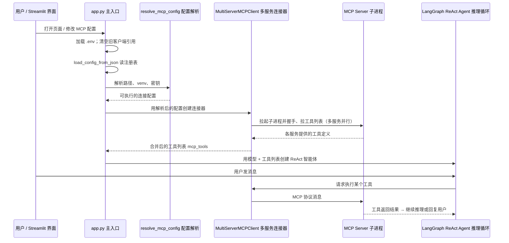

# MCP 设计与管理

> **TL;DR**：Host 用 `MultiServerMCPClient` 按 `config.json` 同时连接多个 MCP Server（默认 4 个：时间 / 文档导出 / rag-server / 高德），`resolve_mcp_config()` 在启动前把路径、venv 与密钥解析为可执行配置；**改 MCP 配置才重连，切模式或换模型只重建 Agent**。

> 文档版本：v1.1  
> 适用：`agents-master`（Streamlit 网页壳 + LangGraph 推理循环 + MCP 多服务客户端）  
> 定位：**MCP 设计说明 + MCP 服务注册表（`config.json`）权威来源**；安装与启动命令见 [README.md](../../agents-master/README.md)。

## 目录

- [TL;DR（面试 30 秒）](#tldr面试-30-秒)
- [1. MCP 流程设计](#1-mcp-流程设计)
- [2. MCP Server 注册表](#2-mcp-server-注册表)
- [3. MCP 配置方式](#3-mcp-配置方式)
- [4. stdio 与 HTTP/SSE](#4-stdio-与-httpsse)
- [5. 对话模式与 MCP 关系](#5-对话模式与-mcp-关系)
- [6. 性能与排障（简要）](#6-性能与排障简要)
- [7. 安全与禁区](#7-安全与禁区)
- [8. 相关文档](#8-相关文档)

---

## TL;DR（面试 30 秒）

ContextBridge 的主应用目录 `agents-master` 扮演 **MCP Host（宿主）**：主入口 `app.py` 同时承载 Streamlit 聊天界面与 LangGraph「推理—调工具—再推理」循环。**MCP Client（客户端）** 使用第三方库 `langchain-mcp-adapters` 提供的 `**MultiServerMCPClient`（多 MCP 服务统一连接器）**，按注册表 `config.json` 同时连接多个 **MCP Server（工具服务）**，把各服务暴露的能力合并成一张工具清单，供对话中的 Agent 按需调用。

- **配置权威**：`config.json`（登记要连哪些 MCP 服务）+ `config/mcp_config.py` 中的 `**resolve_mcp_config()`（启动前把路径、Python 解释器、密钥解析成可执行配置）**
- **生产传输**：全部为 **stdio**（标准输入输出管道；由客户端拉起子进程，不占用网络端口）
- **默认 4 个服务**：查时间、导出 Markdown、知识库检索（rag-server）、高德地图
- **与 rag-server 解耦**：主应用不直接 `import` rag-server 的 Python 代码，只通过 MCP 协议远程调用；rag 侧 API 细节见 [rag-server 外接集成设计](../20-rag/mcp-server.md)

---

## 1. MCP 流程设计

### 1.1 三角色


| 角色             | 是什么                            | 在本项目里对应什么                                                                                       | 常见类比                  |
| -------------- | ------------------------------ | ----------------------------------------------------------------------------------------------- | --------------------- |
| **MCP Host**   | 承载智能体的主应用                      | 主入口 `app.py` 里的 Streamlit 应用                                                                    | Cursor、Claude Desktop |
| **MCP Client** | 代表 Host 去连 Server、拉工具、转发调用的连接器 | `MultiServerMCPClient`：一次配置、并行连接多个 MCP 服务                                                       | 浏览器里的插件加载器            |
| **MCP Server** | 对外提供具体工具能力的服务进程                | `config.json` 里每一项启动的子进程或远程服务，例如时间脚本 `mcp_server_time.py`、同级目录 `../rag-server`、npm 包 `mcp-amap` | 独立的「查天气 API 服务」       |


**Tool（工具）** 是 Server 对外暴露的一条可调用能力（如「查当前时间」）；LangGraph ReAct Agent 把这些工具包装成 LangChain 可调用的工具对象，由大模型在对话中决定何时调用。

### 1.2 端到端时序（agents-master 侧编排）




**关键步骤与代码位置**：


| 步骤       | 做什么                                               | 代码位置                                                             |
| -------- | ------------------------------------------------- | ---------------------------------------------------------------- |
| 读取注册表    | 从磁盘加载 `config.json`；文件不存在则写入仅含「查时间」的默认项           | `config/mcp_config.py` → `**load_config_from_json()`**           |
| 启动前解析    | 把相对路径变绝对路径、选对 Python 虚拟环境、把 `.env` 里的 Key 注入子进程环境 | `**resolve_mcp_config()`**（同上文件）                                 |
| 连接并拉工具   | 清空旧连接 → 创建多服务客户端 → 并行连接各 MCP 并合并工具列表              | `app.py` → `**initialize_session()**` → `**client.get_tools()**` |
| 组装智能体    | 用当前模型 + 工具列表创建 LangGraph ReAct Agent              | `app.py` → `**_build_agent_from_tools()**`                       |
| 界面增删 MCP | 用户在侧边栏改配置后触发全量重连                                  | `ui/sidebar.py` → `**reconnect_agent()**`                        |


### 1.3 页面会话里缓存的状态

以下键保存在 Streamlit 的 `**st.session_state`（当前浏览器会话的状态仓库）** 中：


| 状态键                      | 存的是什么                                                   |
| ------------------------ | ------------------------------------------------------- |
| `pending_mcp_config`     | 当前内存里生效的 MCP 注册表（可能与磁盘 `config.json` 已同步，也可能刚在侧边栏改过待重连） |
| `mcp_client`             | 多服务连接器 `MultiServerMCPClient` 的实例                       |
| `mcp_tools`              | 已从各 MCP 拉取并合并好的工具列表（缓存，切换模式时可复用）                        |
| `tool_count`             | 工具总数，供侧边栏展示                                             |
| `applied_mcp_config_sig` | 当前已应用配置的指纹，用来判断配置是否变化、要不要重连                             |
| `session_initialized`    | 标记 MCP 与 Agent 是否已完成首次初始化                               |


### 1.4 什么时候要「重连 MCP」


| 用户操作               | 调用的逻辑                                                  | 是否重连 MCP | 说明                                    |
| ------------------ | ------------------------------------------------------ | -------- | ------------------------------------- |
| 首次打开页面             | `**ensure_session_ready()`** → `**reconnect_agent()`** | ✅        | 全量重新连接各服务并 `**get_tools()**` 拉工具      |
| 侧边栏增删/改 MCP        | `**reconnect_agent()**`                                | ✅        | 配置有变时写回 `config.json`                 |
| 切换对话模式（通用/旅行/知识库）  | `**rebuild_agent_only()**`                             | ❌        | 只换系统提示词与模式处理逻辑，**复用**已缓存的 `mcp_tools` |
| 切换 LLM 并点「应用模型」    | `**rebuild_agent_only()`**                             | ❌        | 同上，不换 MCP                             |
| 需要重建 Agent 但工具列表还在 | `**rebuild_agent_only()`**                             | ❌        | 若缓存里没有工具，才回退为全量重连                     |


`**cleanup_mcp_client()**` 的作用：断开前清空会话里的客户端引用（不负责杀远程进程细节）。当前使用的 `langchain-mcp-adapters` 新版本不再支持 `async with client` 这种写法；具体某次工具调用时的连接由库内部自行建立。

### 1.5 与 rag-server 的边界

- 主应用 **不内嵌** RAG 检索实现；知识库服务 `rag-server` 以**独立子进程**运行（工作目录 `cwd: ../rag-server`）。
- **编排**发生在 agents-master：何时拉工具列表、哪些工具进入 Agent、旅行模式下 **Python 编排层预取** 与 **Agent 自行选工具** 的分工——都在本仓库完成。
- rag-server 侧「列库 / 检索 / 摘要」三件套的含义、返回格式、CLI 运维 → [外接集成设计.md](../20-rag/mcp-server.md)。

---

## 2. MCP Server 注册表

### 2.1 结构约定

- **顶层 key**（如 `rag-server`）= 该 MCP 服务的逻辑名称，传给 `MultiServerMCPClient` 作区分各连接的标识。
- **每个 value** = 描述**如何连上**这个服务（本地子进程用 `command`/`args`，远程服务用 `url`）。
- **Agent 实际看到的**是扁平的工具名（如 `query_knowledge_hub`），由各服务在握手后的「工具列表」协议里上报。

### 2.2 注册表字段说明


| 字段          | 适用传输  | 更直观的理解（你在配置什么）                                                                                                                                                  |
| ----------- | ----- | --------------------------------------------------------------------------------------------------------------------------------------------------------------- |
| `command`   | stdio | **用什么程序启动这个 MCP 服务**（例如 `python` / `mcp-amap`）。写成 `python` 时，启动前会被 `resolve_mcp_config()` 替换为「实际要用的 Python 路径」（普通脚本用当前 venv；rag-server 优先用 `rag-server/.venv`）。 |
| `args`      | stdio | **启动参数（数组）**，等同于终端里跟在 `command` 后面的那串参数（例如 `["-m", "src.mcp_server.server"]`）。字符串里可写 `${VAR}`，启动前会替换成环境变量值。                                                     |
| `cwd`       | stdio | **在什么目录下启动子进程**（影响相对路径解析与模块运行目录）。相对路径会自动基于 `agents-master/` 转成绝对路径。`rag-server` 通常需要 `cwd: "../rag-server"` 指向工程根目录。                                            |
| `transport` | 全部    | **客户端和服务怎么“连”**：本项目默认是 `stdio`（子进程 + 管道）。若你配置了 `url`，通常会用 `sse`（远程事件流）这类 HTTP 传输。                                                                               |
| `url`       | 远程    | **远程 MCP 服务地址**（有 `url` 就不需要 `command/args/cwd` 去拉起子进程了）。侧边栏检测到 `url` 时会自动把 `transport` 设为 `sse`。                                                               |
| `env`       | stdio | **给子进程额外注入哪些环境变量**（只影响该 MCP 子进程，不影响主应用）。不写也可以：例如高德 Key 通常放在 `.env`，启动前会由解析逻辑按需注入到子进程。                                                                           |


### 2.3 `resolve_mcp_config()` 在启动前会改什么


| 场景                                | 解析后的行为                                                                                         |
| --------------------------------- | ---------------------------------------------------------------------------------------------- |
| `command` 写成 `python` / `python3` | 普通脚本 → 用当前 Streamlit 进程的 Python；**rag-server** → 优先用 `rag-server/.venv/bin/python`             |
| `cwd` 为相对路径                       | 转为基于应用根目录 `APP_DIR` 的绝对路径                                                                      |
| 服务名 `amap-maps`                   | 尽量解析为本地 `node_modules/.bin/mcp-amap`，避免每次 `npx` 冷启动；找不到再回退 `npx -y @amap/amap-maps-mcp-server` |
| 高德子进程环境                           | 若注册表未写 `AMAP_MAPS_API_KEY`，从主进程环境变量（通常来自 `.env`）注入                                             |
| `args` / `env` 里的字符串              | 把 `${VAR}` 替换成 `os.environ` 中的值                                                                |


实现文件：`**config/mcp_config.py`**（MCP 配置的读取、保存与启动前解析）。

### 2.4 已注册的 4 个默认服务


| 注册名                | 实际跑的是什么                                                     | 主要工具（能力）                                                        | 典型场景             | 密钥 / 依赖                                       |
| ------------------ | ----------------------------------------------------------- | --------------------------------------------------------------- | ---------------- | --------------------------------------------- |
| `get_current_time` | 本仓库脚本 `**mcp_server_time.py`**（轻量时间 MCP）                    | `get_current_time`：查指定时区当前时间                                    | 解析「明天」「下周末」；旅行模式 | 无                                             |
| `document-export`  | 本仓库脚本 `**mcp_server_export.py**`（Markdown 写盘 MCP）           | `write_markdown_document`：把正文写入 `data/outputs/`                 | 通用模式长文导出         | 无                                             |
| `rag-server`       | 同级工程 `**../rag-server**` 子进程（知识库 MCP）                       | `list_collections`、`query_knowledge_hub`、`get_document_summary` | 知识库问答、旅行本地贴士     | `rag-server/config/settings.yaml`             |
| `amap-maps`        | npm 包 `**@amap/amap-maps-mcp-server**` 提供的 `mcp-amap` 可执行文件 | `maps_geo`、`maps_weather`、`maps_direction_*` 等地图类工具             | 旅行：POI、路线、天气     | `.env` 中 `AMAP_MAPS_API_KEY`；需先 `npm install` |


### 2.5 当前 `config.json` 示例

以下为仓库内**权威注册表**内容（路径：`agents-master/config.json`）：

```json
{
  "get_current_time": {
    "command": "python",
    "args": ["./mcp_server_time.py"],
    "transport": "stdio"
  },
  "document-export": {
    "command": "python",
    "args": ["./mcp_server_export.py"],
    "transport": "stdio"
  },
  "rag-server": {
    "command": "python",
    "args": ["-m", "src.mcp_server.server"],
    "cwd": "../rag-server",
    "transport": "stdio"
  },
  "amap-maps": {
    "command": "mcp-amap",
    "args": [],
    "transport": "stdio"
  }
}
```

---

## 3. MCP 配置方式

### 3.1 文件配置（默认）


| 环节    | 说明                                                                   |
| ----- | -------------------------------------------------------------------- |
| 注册表文件 | `agents-master/config.json`                                          |
| 读取注册表 | `**load_config_from_json()**`：从磁盘加载；                                 |
| 写回磁盘  | `**save_config_to_json()**`；`**reconnect_agent()**` 在内存配置与磁盘不一致时自动保存 |


### 3.2 运行时与侧边栏 UI


| 机制                   | 说明                                                     |
| -------------------- | ------------------------------------------------------ |
| `pending_mcp_config` | 侧边栏编辑后、重连前暂存的注册表；重连成功后即为当前生效配置                         |
| 侧边栏「添加 MCP 工具」       | 粘贴 JSON 即可注册新服务；若外层包了 Smithery 的 `mcpServers` 字段会自动剥掉  |
| 条目里带 `url`           | 视为远程 MCP，自动设 `transport: sse`（逻辑在 `**ui/sidebar.py**`） |
| 增删服务后                | 立即调用 `**reconnect_agent()**` 全量重连                      |


### 3.3 环境变量

- `**agents-master/.env**`：放 LLM Key、高德 `AMAP_MAPS_API_KEY` 等（不提交 Git）。
- 应用启动时 `**load_dotenv(override=True)**` 载入环境变量；`**resolve_mcp_config()**` 再把需要的 Key 注入对应 MCP 子进程的 `env`，**不必**在 `config.json` 里明文写 Key。

---

## 4. stdio 与 HTTP/SSE

> 本节为**技术对比与面试讲解**；本项目生产路径为 **stdio**，无改为 HTTP 的改造计划。


| 维度         | stdio（本项目）                                        | HTTP / SSE（概念对比）                           |
| ---------- | ------------------------------------------------- | ------------------------------------------ |
| 谁启动 Server | 客户端 `**MultiServerMCPClient`** 按注册表 **spawn 子进程** | 运维或开发者**事先**单独启动服务进程                       |
| 配置字段       | `command` + `args` + `cwd`                        | `url` + `transport`（如 `sse`）               |
| 进程生命周期     | 与 Host 会话绑定，重连时重新握手                               | Server 可长期驻留，重启 Streamlit 不一定停掉 rag-server |
| 部署         | monorepo 本地一键联调简单                                 | 适合多客户端共享、Docker/K8s 拆服务                    |
| 网络         | 无端口，本机管道通信                                        | 需开端口、健康检查；生产常加 TLS/鉴权                      |
| 日志         | rag-server 的 stdio 要求 **stdout 只能走协议**，日志打 stderr | HTTP 下日志约束相对宽松                             |


**本项目为何选 stdio（面试可讲）**：monorepo 里执行 `streamlit run app.py` 即可自动拉起 4 个 MCP；`cwd` 指向同级 `rag-server`，`**resolve_mcp_config()`** 自动选对虚拟环境，本地联调成本最低。

远程 MCP 的动手实验见教程笔记本 `**MCP-HandsOn-ENG.ipynb`**（含 SSE、Smithery 示例，非默认部署方式）。

---

## 5. 对话模式与 MCP 关系

三种对话模式共用**同一套**已拉取的 `mcp_tools`（注册表仍是全量 4 服务）；差异在 **系统提示词、意图路由与是否由 Python 预调工具**，详见 [多模式Agent架构选型.md](./modes.md)。


| 模式        | 内部 id          | 怎么用 MCP                             | 常用服务 / 工具                                                                                                                   |
| --------- | -------------- | ----------------------------------- | --------------------------------------------------------------------------------------------------------------------------- |
| **通用**    | `general`      | 大模型从**全工具池**按需挑选                    | 4 个服务均可；长文可让 Agent 调 `write_markdown_document`                                                                              |
| **旅行规划**  | `travel`       | **两层**：Python 编排层先预取 + Agent 对话中可补调 | 时间 `get_current_time`；高德 `amap-maps`；知识库 `rag-server`；成品 Markdown 由 `**export_service`** 服务端写盘，一般**不必**再调 `document-export` |
| **知识库问答** | `knowledge_qa` | Agent 聚焦 RAG 三件套                    | 先 `list_collections`，再 `query_knowledge_hub` / `get_document_summary`                                                       |


**旅行模式的「两层编排」**（面试可强调）：

1. **编排层预取**（`**modes/travel/pipeline.py`**：旅行专用「在进模型前先调工具」脚本）：进入生成阶段前，由 Python 直接调用已连接的工具（`tool.ainvoke`），把 RAG/高德结果写入结构化事实 `**travel_facts`**，减少模型乱序或漏调工具。
2. **Agent ReAct 循环**：用户对话过程中仍可补调 MCP；系统提示词约束工具顺序与「有依据才写死」等可信度规则。

切换模式时调用 `**rebuild_agent_only()`**：不重连 MCP，只更换提示词与各模式的 `**modes/*/handler`** 处理逻辑。

---

## 6. 性能与排障（简要）

### 6.1 性能要点

- `**get_tools()**`（向所有 MCP 拉工具列表）会**并行**连接各服务，总等待时间 ≈ **最慢的那一个**。
- 历史瓶颈多在 **高德**：若每次走 `npx -y` 冷启动约 15 秒；本地安装 `**mcp-amap`**（`npm install`）后可降到毫秒级。
- 仅切换对话模式或 LLM **不应**触发全量 MCP 重连；若仍很慢，检查是否误改了注册表或点了会触发 `**reconnect_agent()`** 的操作。

深入分析见：[MCP初始化性能分析与优化.md](../50-analysis/mcp-init-performance.md)。

### 6.2 连接失败快速检查


| 现象                            | 优先检查                                                                               |
| ----------------------------- | ---------------------------------------------------------------------------------- |
| 初始化失败 / 无法连接 MCP              | `config.json` JSON 是否合法；`cwd` 是否指向 **rag-server 工程根目录**                            |
| 报错 `No module named chromadb` | rag-server 是否已 `pip install -e ".[dev]"`；`**resolve_mcp_config()`** 是否用上了其 `.venv` |
| 高德工具不可用                       | 是否执行 `npm install`；`.env` 是否配置 `AMAP_MAPS_API_KEY`                                 |
| RAG 检索无结果                     | 是否做过文档入库 ingest；查询的 `collection` 是否与入库一致（可先调 `list_collections`）                   |
| Embedding / LLM 报错            | `rag-server/config/settings.yaml` 中 Key 与模型名是否与百炼控制台一致                             |


工具调用失败的分型与处理原则：[工具调用失败案例与处理准则.md](../50-analysis/tool-failures.md)。

---

## 7. 安全与禁区


| 规则                                                  | 说明                                                                                 |
| --------------------------------------------------- | ---------------------------------------------------------------------------------- |
| **禁止**在 `config.json` 明文长期存放生产 API Key              | Key 放在 `.env` 或 rag-server 的 `settings.yaml`，由 `**resolve_mcp_config()`** 启动时注入子进程 |
| **禁止**提交含真实 Key 的 `rag-server/config/settings.yaml` | 从 example 模板复制后在本地填写                                                               |
| 提交前检查 `config.json` 里 MCP 的 `env` 段                 | 不得含明文 Key（项目 Git 工作流约定）                                                            |
| rag-server 走 stdio 时                                | 标准输出只能输出 MCP 协议消息；日志必须走 stderr，否则会破坏管道通信                                           |


---

## 8. 相关文档


| 文档                                                                        | 说明                            |
| ------------------------------------------------------------------------- | ----------------------------- |
| [agents-master/README.md](../../agents-master/README.md)                                | 安装、启动、RAG 四步联调                |
| [根 README.md](../../README.md)                                         | monorepo 结构与密钥约定              |
| [rag-server/外接集成设计.md](../20-rag/mcp-server.md) | rag-server MCP API、三件套、CLI 分工 |
| [多模式Agent架构选型.md](./modes.md)                                      | 三模式 + 模式注册表                   |
| [app.py架构说明与拆分建议.md](./architecture.md)                                | 主入口里 MCP 生命周期所在位置             |
| [旅行规划-需求与架构(产品).md](./travel-product.md)                                  | 旅行模式对工具与可信度的产品要求              |
| [MCP初始化性能分析与优化.md](../50-analysis/mcp-init-performance.md)                     | 初始化耗时与优化                      |
| [工具调用失败案例与处理准则.md](../50-analysis/tool-failures.md)                     | 工具失败分类                        |
| [MCP-HandsOn-ENG.ipynb](../../agents-master/MCP-HandsOn-ENG.ipynb)                      | SSE / Smithery 实验             |
| [QA/integration-qa.md](../../QA/integration-qa.md)                     | 全栈串联（C 轨）                     |

---

## 关联

- 相关：[[integration/mcp-lifecycle]]
- 相关：[[host/modes]]
- 相关：[[rag/mcp-server]]
