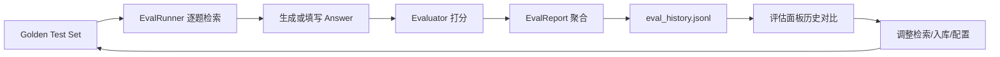

# rag-server 评估体系设计

> **TL;DR**：评估体系用三种 Evaluator（Custom 精确指标 / Ragas LLM 评判 / Composite 组合）配合 Golden Test Set，实现可量化的检索质量回归与迭代。

> 内部设计笔记 · 说明如何量化检索与回答质量、如何形成评估闭环并支撑迭代。

## 目录

- [TL;DR](#tldr)
- [1. 评估体系总览](#1-评估体系总览)
- [2. 需求设计](#2-需求设计)
- [3. 代码设计](#3-代码设计)
  - [3.1 调用链](#31-调用链)
  - [3.2 Golden Test Set](#32-golden-test-set)
  - [3.3 三种 Evaluator](#33-三种-evaluator)
  - [3.4 配置入口](#34-配置入口)
- [4. 可观测表现（Trace 衔接）](#4-可观测表现trace-衔接)
- [5. 界面重点设计](#5-界面重点设计)
- [6. 指标定义](#6-指标定义)
- [7. 回归与迭代节奏](#7-回归与迭代节奏)

---

## TL;DR

**本项目 Golden Test Set → `HybridSearch` 检索 →（可选）填写 Answer → Evaluator 打分 → 写入 `eval_history.jsonl` → 面板对比迭代。**

| 组件 | 性质 |
|------|------|
| **Golden Test Set**（`tests/fixtures/*.json`） | 本项目测试集格式（`expected_chunk_ids` 等） |
| **Custom**（`hit_rate` / `mrr`） | 本项目检索评估器 |
| **Ragas**（`faithfulness` 等） | 社区评估库指标；本项目包装 + 中文 prompt |
| **Composite** | 本项目编排，一次跑 Custom + Ragas |

---

## 1. 评估体系总览

### 1.1 要解决的问题

| 维度 | 问题 | 评估手段 |
|------|------|----------|
| **检索** | 期望 chunk 有没有被召回到 Top-K | Custom：`hit_rate`、`mrr` |
| **回答** | 基于检索内容的回答是否忠实、相关、上下文排序是否合理 | Ragas：LLM-as-Judge 三项指标 |
| **迭代** | 改分块/模型/融合策略后是否变好 | 固定 Golden Set 反复跑，对比 `eval_history` |

### 1.2 闭环流程



选型背景见 [系统架构与模块选型.md](./architecture.md) §5；踩坑与排障见 [RAG评估调优专题.md](../50-analysis/rag-evaluation-tuning.md)。

---

## 2. 需求设计

### 2.1 谁触发、输入输出

| 触发方 | 入口 | 输入 | 输出 |
|--------|------|------|------|
| **开发者** | Dashboard「效果评测」 | backend、golden 文件路径、collection、top_k、每题可选 Answer | 聚合指标 + 单题明细 + 历史记录 |
| **开发者** | `scripts/evaluate.py` | 同上（CLI） | 终端报告或 `--json` |
| **开发者** | 「检索记录」单条 Trace | 用户输入 Answer | 单题 Ragas 三分（faithfulness 等） |

### 2.2 Custom 与 Ragas 的分工

| | **Custom Evaluator**（本项目） | **Ragas Evaluator**（社区库 + 本项目包装） |
|--|----------------------|---------------------|
| **评什么** | 检索是否命中标注 chunk | 回答相对检索上下文的质量 |
| **依赖标注** | `expected_chunk_ids`（必填才有意义） | `reference_answer` 可选；**生成 Answer 必填才有意义** |
| **成本** | 低（纯计算） | 高（每题多次 LLM 调用） |
| **典型用途** | 检索策略回归、调 Hybrid / BM25 | 中文问答质量、Prompt 与生成链路验证 |

**Composite**（本项目编排）：默认子后端 `custom + ragas`，合并 metrics；某一子后端失败时写入 `warnings`，其余指标仍保留。

---

## 3. 代码设计

### 3.1 调用链

面板或 CLI 触发后，主路径如下（`scripts/evaluate.py` 跳过面板步骤，直接走 Factory → EvalRunner）：

```
evaluation_panel._execute_evaluation()          # 面板入口：读表单参数，触发一次批量评估
  → EvaluatorFactory.create(settings)         # 按 settings / 面板选择实例化 custom | ragas | composite
  → _try_create_hybrid_search(collection)      # 构建与 MCP、query.py 同源的 HybridSearch
  → EvalRunner.run(golden_path)               # 逐条读取 Golden Test Set
       对每题：
         hybrid_search.search(query)          # 检索 Top-K chunk（含可选 rerank）
         answer = 面板覆盖 | 拼接 chunk       # Ragas 用；默认拼接 chunk 作占位，非 LLM 生成
         evaluator.evaluate(...)              # 算 hit_rate/mrr 或 Ragas 三分等
  → EvalReport.to_dict()                      # 聚合为可序列化报告
  → _save_to_history()                        # 追加 logs/eval_history.jsonl
```

核心模块：

| 模块 | 路径 | 作用 |
|------|------|------|
| 批跑编排 | `src/observability/evaluation/eval_runner.py` | 遍历 Golden Set：检索 → 取 Answer → 调 Evaluator → 汇总 `EvalReport` |
| 工厂 | `src/libs/evaluator/evaluator_factory.py` | 按 `evaluation.provider` 创建 Custom / Ragas / Composite 实例 |
| Custom | `src/libs/evaluator/custom_evaluator.py` | 对比 `expected_chunk_ids` 计算 **hit_rate**、**mrr**（纯计算，不调 LLM） |
| Ragas | `src/observability/evaluation/ragas_evaluator.py` | 包装社区 Ragas，用 LLM 评判 faithfulness 等回答质量指标 |
| 中文 Prompt | `src/observability/evaluation/ragas_zh_prompts.py` | 中文场景下的 Ragas 评判 prompt 与 Answer 归一化 |
| Composite | `src/observability/evaluation/composite_evaluator.py` | 顺序跑多个子 Evaluator，合并 metrics，失败写 `warnings` |
| 面板 | `src/observability/dashboard/pages/evaluation_panel.py` | 效果评测页：配置 backend、触发 `EvalRunner`、展示历史与单题明细 |

### 3.2 Golden Test Set

默认路径：`tests/fixtures/golden_test_set.json`（**本项目 JSON 结构**，非 Ragas 等行业标准格式）。

**顶层字段**

| 字段 | 说明 |
|------|------|
| `description` / `version` | 说明与版本 |
| `collection` | 建议评测使用的知识库（面板可覆盖） |
| `test_cases` | 用例数组 |

**单条 `test_cases[]`**

| 字段 | 用途 |
|------|------|
| `query` | 评测查询（必填） |
| `expected_chunk_ids` | Custom 的 ground truth chunk ID |
| `expected_sources` | 人工核对用来源描述（不参与自动算分） |
| `reference_answer` | 参考回答（Ragas 上下文；面板可展示对照） |

**维护约定**

- 入库或重新 ingest 后，文档哈希前缀变化会导致 `expected_chunk_ids` 失效，需对照 live 检索**重新校准**（文件中 `version` 与说明字段记录校准日期）。  
- 扩充用例时保持与真实业务 query 分布接近；检索类回归至少保证 `expected_chunk_ids` 完整。

### 3.3 三种 Evaluator

**Custom**

- 指标：`hit_rate`（是否命中任一 ground truth）、`mrr`（首个命中排名的倒数）。  
- `settings.evaluation.metrics` 可列 ragas 指标名，Custom 实现会**自动过滤**，只跑自身支持的项。

**Ragas**

- 指标：`faithfulness`、`answer_relevancy`、`context_precision`（可在 `settings` 配置子集）。  
- `ragas_chinese_prompts: true` 时走 `ragas_zh_prompts.py` 中文评判；评测前剥离「根据知识库检索结果…」等套话（`_normalize_answer`）。  
- `ragas_max_context_chunks`：评判时只用前 N 条检索块，降低噪声与 Token。  
- 评判 LLM 使用 `evaluation.llm_model`（与主 LLM 可不同）；百炼场景需非 thinking 模型，错误信息经 `format_ragas_error()` 转为可读中文提示。

**Composite**

- 按 `evaluation.backends`（默认 `custom`、`ragas`）实例化子 Evaluator，合并 metrics。  
- 子 Evaluator 异常不拖垮整题：记录到 `last_errors` / report `warnings`。

### 3.4 配置入口

`config/settings.yaml` → `evaluation` 段：

| 配置项 | 作用 |
|--------|------|
| `enabled` | 是否启用评估器 |
| `provider` | `custom` / `ragas` / `composite`（面板选择会覆盖本次运行） |
| `llm_model` | Ragas 评判模型 |
| `ragas_chinese_prompts` | 中文 prompt 开关 |
| `ragas_max_context_chunks` | 送入 Ragas 的 context 条数上限 |
| `backends` | composite 子后端列表 |
| `metrics` | 指标列表（custom 与 ragas 共用配置项，各自过滤） |

---

## 4. 可观测表现（Trace 衔接）

评估与日常检索的观测数据**分工不同**：

| 场景 | 主要沉淀 | 说明 |
|------|----------|------|
| **MCP / 手动 query** | `logs/traces.jsonl` + 「检索记录」 | **本项目** Trace：dense / sparse / fusion / rerank 各 stage |
| **批量 Golden Set 评估** | `logs/eval_history.jsonl` + 评估面板 | **本项目** `EvalReport`：每题 `retrieved_chunk_ids`、metrics、warnings |
| **检索记录页单题 Ragas** | 页面内即时展示分数 | 按 trace 中 query **重跑检索**再评判；需用户填写 Answer |

**对照检索阶段时**

1. 看 `EvalReport` 单题的 `retrieved_chunk_ids` 是否包含 `expected_chunk_ids`。  
2. 若需 stage 级细节，用**同一 query + collection** 走 MCP 或 `scripts/query.py --verbose`，在「检索记录」里看 Trace。  
3. 批量评估路径当前**不向** `traces.jsonl` 写入每题 Trace（`EvalRunner` 调用 `hybrid_search.search` 时未挂 `TraceContext`）。

---

## 5. 界面重点设计

页面：**效果评测**（`evaluation_panel.py`）。操作步骤见 [管理面板指南.md](./observability.md)。

### 5.1 配置区要呈现的信息

| 控件 | 支撑的判断 |
|------|------------|
| **评估后端** custom / ragas / composite | 本次评检索还是评回答，或两者都要 |
| **Golden 文件路径** | 用哪套回归集 |
| **Collection 下拉** | 与入库库名一致，避免评错库 |
| **Top-K** | 与线上检索设置对齐，便于对比 |
| **每题 Answer 输入**（Ragas / composite） | 无 Answer 时 Ragas 分无参考价值 |

后端说明文案区分：custom → 检索回归；ragas → 回答质量；composite → 两类合并。

### 5.2 结果区要呈现的信息

| 区块 | 支撑的判断 |
|------|------------|
| **聚合指标卡片** | 本次整体是否优于历史 |
| **指标图例** | 英文 key + 中文名 + 简短释义（`METRIC_INFO`） |
| **单题 expander** | 每题 metrics、retrieved_chunk_ids、warnings |
| **评测历史表** | 近 30 条 `eval_history` 趋势对比 |
| **warnings** | composite 子后端失败、额度等问题 |

### 5.3 检索记录页的评估补充

「检索记录」中对单条 query Trace 提供 **Ragas 单题评估**：用户输入 Answer 后重跑检索并打分，用于**线上真实 query** 的 spot-check，与 Golden Set 批量回归互补。

---

## 6. 指标定义

| 指标 | 类型 | 含义（本项目） | 解读提示 |
|------|------|----------------|----------|
| **hit_rate** | Custom | 检索结果中是否出现任一 `expected_chunk_ids` | 0/1  per query，聚合为平均命中率 |
| **mrr** | Custom | 第一个命中 chunk 的排名倒数 | 越靠前越高，最高 1.0 |
| **faithfulness** | Ragas | 回答陈述是否可被检索上下文支持 | 低 → 编造或与 context 不符 |
| **answer_relevancy** | Ragas | 回答与问题的相关程度 | 需有效 Answer；长期为 0 多为未填 Answer |
| **context_precision** | Ragas | 相关分块在检索结果中的排序质量 | 低 → Top-K 噪声多或排序差 |

**勿混用**：Ragas 分数回答「生成质量」，不能代替 hit_rate 判断「有没有搜到 chunk」。

---

## 7. 回归与迭代节奏

### 7.1 何时更新 Golden Set

- 新领域文档入库并稳定分块后，补充代表性 query + 校准 `expected_chunk_ids`。  
- **重新 ingest** 或修改分块策略后，复核已有 ID。  
- 文件 `version` 递增，并在 `description` 注明校准说明。

### 7.2 何时跑评估

| 时机 | 建议 backend |
|------|----------------|
| 改检索参数 / Hybrid / BM25 / Rerank | custom（或 composite） |
| 改中文 prompt、生成链路、Answer 策略 | ragas |
| 发版前回归 | composite + 全量 Golden Set |
| 日常调试 | 先 1 题，再全量（Ragas 全量耗时长） |

### 7.3 如何判断「变好了」

1. **Custom**：`hit_rate`、`mrr` 相对 `eval_history` 同 backend、同 collection **上升或持平**。  
2. **Ragas**：三项均提升，且单题无大量 warnings。  
3. **个案**：单题 expander 中 `retrieved_chunk_ids` 与 `expected_chunk_ids` 对齐。  
4. **线上抽查**：检索记录 Trace + 单题 Ragas 与 Golden Set 结论不矛盾。

排障顺序见 [RAG评估调优专题.md](../50-analysis/rag-evaluation-tuning.md) §排障路径。

---

## 关联

- 相关：[[rag/observability]]
- 相关：[[rag/architecture]]
- 相关：[[analysis/rag-evaluation-tuning]]
